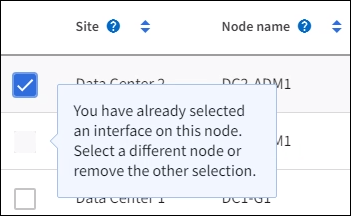

= 고가용성 그룹을 구성합니다
:allow-uri-read: 
:icons: font
:imagesdir: ../media/

[role="lead"]
고가용성(HA) 그룹을 구성하여 관리 노드 또는 게이트웨이 노드의 서비스에 대한 고가용성 액세스를 제공할 수 있습니다.

NOTE: StorageGRID 시스템은 최대 255개의 HA 그룹을 가질 수 있습니다.

.시작하기 전에
* 을 사용하여 그리드 관리자에 로그인되어 있습니다.link:../admin/web-browser-requirements.html["지원되는 웹 브라우저"]
* 이 link:admin-group-permissions.html["루트 액세스 권한"]있습니다.
* HA 그룹에서 VLAN 인터페이스를 사용하려는 경우 VLAN 인터페이스를 만들었습니다. 을 link:../admin/configure-vlan-interfaces.html["VLAN 인터페이스를 구성합니다"]참조하십시오.
* HA 그룹의 노드에 액세스 인터페이스를 사용하려는 경우 인터페이스를 생성했습니다.
+
** *Linux(노드 설치 전)*:link:../swnodes/creating-node-configuration-files.html["노드 구성 파일을 생성합니다"]
** *Linux(노드 설치 후)*:link:../maintain/linux-adding-trunk-or-access-interfaces-to-node.html["노드에 트렁크 또는 액세스 인터페이스 추가"]
** *VMware(노드 설치 후)*:link:../maintain/vmware-adding-trunk-or-access-interfaces-to-node.html["노드에 트렁크 또는 액세스 인터페이스 추가"]

NOTE: "Linux"는 RHEL, Ubuntu 또는 Debian 배포를 의미합니다.  지원되는 버전 목록은 다음을 참조하세요. https://imt.netapp.com/matrix/#welcome["NetApp 상호 운용성 매트릭스 툴(IMT)"^] .

== 고가용성 그룹을 생성합니다

고가용성 그룹을 만들 때 하나 이상의 인터페이스를 선택하고 우선 순위에 따라 구성합니다. 그런 다음 그룹에 하나 이상의 VIP 주소를 할당합니다.

HA 그룹에 포함되려면 게이트웨이 노드 또는 관리 노드에 대한 인터페이스가 있어야 합니다. HA 그룹은 특정 노드에 대해 하나의 인터페이스만 사용할 수 있지만, 동일한 노드에 대한 다른 인터페이스는 다른 HA 그룹에서 사용할 수 있습니다.

=== 마법사에 액세스합니다

.단계
. *구성* > *네트워크* > *고가용성 그룹*을 선택합니다.
. Create * 를 선택합니다.

=== HA 그룹에 대한 세부 정보를 입력합니다

.단계
. HA 그룹에 고유한 이름을 제공하십시오.
. 필요에 따라 HA 그룹에 대한 설명을 입력합니다.
. Continue * 를 선택합니다.

=== HA 그룹에 인터페이스를 추가합니다

.단계
. 이 HA 그룹에 추가할 인터페이스를 하나 이상 선택하십시오.
+
열 머리글을 사용하여 행을 정렬하거나 검색어를 입력하여 인터페이스를 보다 빠르게 찾을 수 있습니다.

+
image::../media/ha_group_add_interfaces.png[HA 그룹 인터페이스 추가]

+

NOTE: VLAN 인터페이스를 생성한 후 새 인터페이스가 테이블에 나타날 때까지 최대 5분 정도 기다립니다.

+
.인터페이스 선택을 위한 지침
** 인터페이스를 하나 이상 선택해야 합니다.
** 한 노드에 대해 하나의 인터페이스만 선택할 수 있습니다.
** HA 그룹이 그리드 관리자 및 테넌트 관리자를 포함하는 관리 노드 서비스의 HA 보호를 위한 경우 관리 노드에서만 인터페이스를 선택합니다.
** HA 그룹이 S3 클라이언트 트래픽의 HA 보호를 지원하는 경우 관리 노드, 게이트웨이 노드 또는 둘 다에 있는 인터페이스를 선택합니다.
** 다른 유형의 노드에서 인터페이스를 선택하면 정보 참고 사항이 나타납니다. 페일오버가 발생하면 이전에 활성 노드에서 제공하는 서비스를 새로 활성 노드에서 사용하지 못할 수 있습니다. 예를 들어 백업 게이트웨이 노드는 관리 노드 서비스의 HA 보호를 제공할 수 없습니다. 마찬가지로 백업 관리 노드는 기본 관리 노드가 제공할 수 있는 모든 유지 관리 절차를 수행할 수 없습니다.
** 인터페이스를 선택할 수 없는 경우 해당 확인란이 비활성화됩니다. 자세한 내용은 툴 팁을 참조하십시오.
+

** 서브넷 값 또는 게이트웨이가 선택한 다른 인터페이스와 충돌하는 경우 인터페이스를 선택할 수 없습니다.
** 정적 IP 주소가 없는 경우 구성된 인터페이스를 선택할 수 없습니다.

. Continue * 를 선택합니다.

=== 우선 순위 순서를 결정합니다

HA 그룹에 둘 이상의 인터페이스가 포함된 경우 운영 인터페이스인지, 백업(페일오버) 인터페이스인지 확인할 수 있습니다. 기본 인터페이스에 장애가 발생하면 VIP 주소가 사용 가능한 가장 높은 우선 순위 인터페이스로 이동합니다. 이 인터페이스에 장애가 발생하면 VIP 주소는 사용 가능한 다음 우선 순위 인터페이스로 이동합니다.

.단계
. Priority order* 열의 행을 끌어서 기본 인터페이스와 백업 인터페이스를 결정합니다.
+
목록의 첫 번째 인터페이스는 기본 인터페이스입니다. Primary 인터페이스는 장애가 발생하지 않는 한 Active 인터페이스입니다.

+
image::../media/ha_group_determine_failover.png[HA 그룹이 우선 순위 순서를 결정합니다]

+

TIP: HA 그룹이 Grid Manager에 대한 액세스를 제공하는 경우 기본 관리 노드에서 기본 인터페이스로 사용할 인터페이스를 선택해야 합니다. 일부 유지 보수 절차는 기본 관리 노드에서만 수행할 수 있습니다.

. Continue * 를 선택합니다.

=== IP 주소를 입력합니다

.단계
. 서브넷 CIDR* 필드에서 CIDR 표시법으로 VIP 서브넷을 지정합니다. IPv4 주소 다음에 슬래시와 서브넷 길이(0-32)를 입력합니다.
+
네트워크 주소에는 호스트 비트가 설정되어 있지 않아야 합니다.  `192.16.0.0/22`예를 들어,

+

NOTE: 32비트 접두사를 사용하는 경우 VIP 네트워크 주소는 게이트웨이 주소 및 VIP 주소로도 사용됩니다.

+
image::../media/ha_group_select_virtual_ips.png[HA 그룹은 VIP를 입력합니다]

. 원하는 경우 S3 관리 또는 테넌트 클라이언트가 다른 서브넷에서 이러한 VIP 주소에 액세스하는 경우 * 게이트웨이 IP 주소 * 를 입력합니다. 게이트웨이 주소는 VIP 서브넷 내에 있어야 합니다.
+
클라이언트 및 관리자 사용자는 이 게이트웨이를 사용하여 가상 IP 주소에 액세스합니다.

. HA 그룹에 액티브 인터페이스에 대한 VIP 주소는 하나 이상, 10개 이하로 입력하십시오. 모든 VIP 주소는 VIP 서브넷 내에 있어야 하며 모든 주소는 활성 인터페이스에서 동시에 활성화됩니다.
+
IPv4 주소를 하나 이상 입력해야 합니다. 선택적으로 추가 IPv4 및 IPv6 주소를 지정할 수 있습니다.

. HA 그룹 생성 * 을 선택하고 * 마침 * 을 선택합니다.
+
HA 그룹이 생성되고 이제 구성된 가상 IP 주소를 사용할 수 있습니다.

=== 다음 단계

이 HA 그룹을 로드 밸런싱에 사용하려면 로드 밸런서 엔드포인트를 생성하여 포트 및 네트워크 프로토콜을 결정하고 필요한 인증서를 연결합니다. 을 link:configuring-load-balancer-endpoints.html["로드 밸런서 엔드포인트를 구성합니다"]참조하십시오.

== High Availability 그룹을 편집합니다

HA(고가용성) 그룹을 편집하여 이름과 설명을 변경하거나, 인터페이스를 추가 또는 제거하거나, 우선 순위 순서를 변경하거나, 가상 IP 주소를 추가 또는 업데이트할 수 있습니다.

예를 들어, 사이트 또는 노드 사용 중단 절차에서 선택한 인터페이스에 연결된 노드를 제거하려면 HA 그룹을 편집해야 할 수 있습니다.

.단계
. *구성* > *네트워크* > *고가용성 그룹*을 선택합니다.
+
고가용성 그룹 페이지에는 기존의 모든 HA 그룹이 표시됩니다.

. 편집할 HA 그룹의 확인란을 선택합니다.
. 업데이트할 항목을 기준으로 다음 중 하나를 실행합니다.
+
** VIP 주소를 추가하거나 제거하려면 * Actions * > * Edit virtual IP address * 를 선택합니다.
** 작업 * > * HA 그룹 편집 * 을 선택하여 그룹의 이름 또는 설명을 업데이트하거나, 인터페이스를 추가 또는 제거하거나, 우선 순위 순서를 변경하거나, VIP 주소를 추가 또는 제거합니다.

. Edit virtual IP address * 를 선택한 경우:
+
.. HA 그룹의 가상 IP 주소를 업데이트합니다.
.. 저장 * 을 선택합니다.
.. 마침 * 을 선택합니다.

. HA 그룹 편집 * 을 선택한 경우:
+
.. 필요에 따라 그룹의 이름 또는 설명을 업데이트합니다.
.. 선택적으로 확인란을 선택하거나 선택 취소하여 인터페이스를 추가하거나 제거합니다.
+

NOTE: HA 그룹이 Grid Manager에 대한 액세스를 제공하는 경우 기본 관리 노드에서 기본 인터페이스로 사용할 인터페이스를 선택해야 합니다. 일부 유지 보수 절차는 기본 관리 노드에서만 수행할 수 있습니다

.. 필요에 따라 행을 끌어서 운영 인터페이스 및 이 HA 그룹에 대한 백업 인터페이스의 우선 순위를 변경합니다.
.. 필요에 따라 가상 IP 주소를 업데이트합니다.
.. Save * 를 선택한 다음 * Finish * 를 선택합니다.

== High Availability 그룹을 제거합니다

HA(고가용성) 그룹을 한 번에 하나 이상 제거할 수 있습니다.

TIP: HA 그룹이 로드 밸런서 끝점에 바인딩되어 있으면 제거할 수 없습니다. HA 그룹을 삭제하려면 해당 그룹을 사용하는 모든 로드 밸런싱 장치 끝점에서 HA 그룹을 제거해야 합니다.

클라이언트 중단을 방지하려면 HA 그룹을 제거하기 전에 영향을 받는 S3 클라이언트 애플리케이션을 모두 업데이트하십시오. 다른 IP 주소(예: 다른 HA 그룹의 가상 IP 주소 또는 설치 중 인터페이스에 대해 구성된 IP 주소)를 사용하여 연결할 각 클라이언트를 업데이트합니다.

.단계
. *구성* > *네트워크* > *고가용성 그룹*을 선택합니다.
. 제거하려는 각 HA 그룹에 대해 * 로드 밸런서 엔드포인트 * 열을 검토합니다. 로드 밸런서 끝점이 나열되어 있는 경우:
+
.. *구성* > *네트워크* > *로드 밸런서 엔드포인트*로 이동합니다.
.. 끝점의 확인란을 선택합니다.
.. 작업 * > * 끝점 바인딩 모드 편집 * 을 선택합니다.
.. 바인딩 모드를 업데이트하여 HA 그룹을 제거합니다.
.. 변경 내용 저장 * 을 선택합니다.

. 로드 밸런싱 장치 엔드포인트가 나열되지 않은 경우 제거할 각 HA 그룹에 대한 확인란을 선택합니다.
. Actions * > * Remove HA group * 을 선택합니다.
. 메시지를 검토하고 * Delete HA group * 을 선택하여 선택 사항을 확인합니다.
+
선택한 모든 HA 그룹이 제거됩니다. High Availability Groups 페이지에 녹색 성공 배너가 나타납니다.

