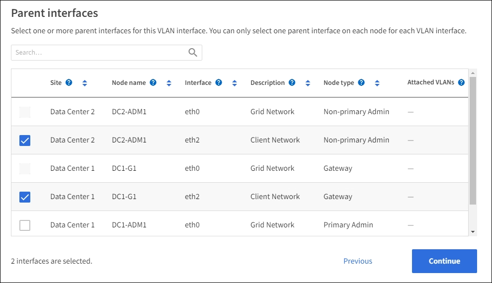

= VLAN 인터페이스를 구성합니다
:allow-uri-read: 
:icons: font
:imagesdir: ../media/

[role="lead"]
관리 노드와 게이트웨이 노드에서 VLAN(가상 LAN) 인터페이스를 생성하고 HA 그룹 및 로드 밸런서 끝점에서 사용하여 트래픽을 격리하고 파티셔닝하여 보안, 유연성 및 성능을 확보할 수 있습니다.

== VLAN 인터페이스에 대한 고려 사항

* VLAN ID를 입력하고 하나 이상의 노드에서 상위 인터페이스를 선택하여 VLAN 인터페이스를 생성합니다.
* 상위 인터페이스는 스위치에서 트렁크 인터페이스로 구성되어야 합니다.
* 상위 인터페이스는 Grid Network(eth0), Client Network(eth2) 또는 VM 또는 베어 메탈 호스트(예: ens256)용 추가 트렁크 인터페이스가 될 수 있습니다.
* 각 VLAN 인터페이스에 대해 특정 노드에 대해 하나의 상위 인터페이스만 선택할 수 있습니다. 예를 들어 동일한 VLAN에 대한 상위 인터페이스와 동일한 게이트웨이 노드에서 그리드 네트워크 인터페이스와 클라이언트 네트워크 인터페이스를 모두 사용할 수 없습니다.
* VLAN 인터페이스가 그리드 관리자 및 테넌트 관리자와 관련된 트래픽을 포함하는 관리 노드 트래픽용 VLAN인 경우 관리 노드에서만 인터페이스를 선택합니다.
* VLAN 인터페이스가 S3 클라이언트 트래픽용 인터페이스인 경우 관리 노드 또는 게이트웨이 노드에서 인터페이스를 선택합니다.
* 트렁크 인터페이스를 추가해야 하는 경우 자세한 내용은 다음을 참조하십시오.
+
** * VMware(노드 설치 후) *: link:../maintain/vmware-adding-trunk-or-access-interfaces-to-node.html["VMware: 노드에 트렁크 또는 액세스 인터페이스를 추가합니다"]
** * RHEL(노드 설치 전) *: link:../rhel/creating-node-configuration-files.html["노드 구성 파일을 생성합니다"]
** * Ubuntu 또는 Debian (노드를 설치하기 전에) *: link:../ubuntu/creating-node-configuration-files.html["노드 구성 파일을 생성합니다"]
** * RHEL, Ubuntu 또는 Debian(노드 설치 후) *: link:../maintain/linux-adding-trunk-or-access-interfaces-to-node.html["Linux: 노드에 트렁크 또는 액세스 인터페이스를 추가합니다"]

== VLAN 인터페이스를 생성합니다

.시작하기 전에
* 을 사용하여 그리드 관리자에 로그인되어 있습니다.link:../admin/web-browser-requirements.html["지원되는 웹 브라우저"]
* 이 link:admin-group-permissions.html["루트 액세스 권한"]있습니다.
* 트렁크 인터페이스가 네트워크에서 구성되었으며 VM 또는 Linux 노드에 연결되었습니다. 트렁크 인터페이스의 이름을 알고 있습니다.
* 구성하려는 VLAN의 ID를 알고 있습니다.

.이 작업에 대해
네트워크 관리자가 하나 이상의 트렁크 인터페이스와 하나 이상의 VLAN을 구성하여 다른 애플리케이션이나 테넌트에 속한 클라이언트 또는 관리 트래픽을 분리했을 수 있습니다. 각 VLAN은 숫자 ID 또는 태그로 식별됩니다. 예를 들어 네트워크에서 FabricPool 트래픽에는 VLAN 100을 사용하고 아카이브 애플리케이션에는 VLAN 200을 사용할 수 있습니다.

그리드 관리자를 사용하여 클라이언트가 특정 VLAN에서 StorageGRID에 액세스할 수 있도록 하는 VLAN 인터페이스를 생성할 수 있습니다. VLAN 인터페이스를 생성할 때 VLAN ID를 지정하고 하나 이상의 노드에서 상위(트렁크) 인터페이스를 선택합니다.

=== 마법사에 액세스합니다

.단계
. 구성 * > * 네트워크 * > * VLAN 인터페이스 * 를 선택합니다.
. Create * 를 선택합니다.

=== VLAN 인터페이스에 대한 세부 정보를 입력합니다

.단계
. 네트워크에 있는 VLAN의 ID를 지정합니다. 1에서 4094 사이의 값을 입력할 수 있습니다.
+
VLAN ID는 고유하지 않아도 됩니다. 예를 들어 한 사이트의 관리 트래픽에는 VLAN ID 200을 사용하고 다른 사이트의 클라이언트 트래픽에는 동일한 VLAN ID를 사용할 수 있습니다. 각 사이트에서 서로 다른 상위 인터페이스 집합을 사용하여 별도의 VLAN 인터페이스를 만들 수 있습니다. 그러나 동일한 ID를 가진 두 VLAN 인터페이스가 노드에서 동일한 인터페이스를 공유할 수 없습니다. 이미 사용된 ID를 지정하면 메시지가 나타납니다.

. 선택적으로 VLAN 인터페이스에 대한 간단한 설명을 입력합니다.
. Continue * 를 선택합니다.

=== 상위 인터페이스를 선택합니다

표에는 그리드의 각 사이트에 있는 모든 관리 노드 및 게이트웨이 노드에 대해 사용 가능한 인터페이스가 나열됩니다. 관리 네트워크(eth1) 인터페이스는 상위 인터페이스로 사용할 수 없으며 표시되지 않습니다.

.단계
. 이 VLAN을 연결할 상위 인터페이스를 하나 이상 선택하십시오.
+
예를 들어, 게이트웨이 노드 및 관리 노드에 대한 클라이언트 네트워크(eth2) 인터페이스에 VLAN을 연결할 수 있습니다.

+

. Continue * 를 선택합니다.

=== 설정을 확인합니다

.단계
. 구성을 검토하고 변경합니다.
+
** VLAN ID 또는 설명을 변경해야 하는 경우 페이지 맨 위에서 * VLAN 세부 정보 입력 * 을 선택합니다.
** 상위 인터페이스를 변경해야 하는 경우 페이지 맨 위에서 * 상위 인터페이스 선택 * 을 선택하거나 * 이전 * 을 선택합니다.
** 상위 인터페이스를 제거해야 하는 경우 휴지통을 image:../media/icon-trash-can.png["휴지통 아이콘"]선택합니다.

. 저장 * 을 선택합니다.
. 새 인터페이스가 High Availability 그룹 페이지에서 선택 항목으로 표시되고 해당 노드에 대한 * Network interfaces * 표에 나열될 때까지 최대 5분 정도 기다립니다(* nodes * > *_parent interface node_ * > * Network *).

== VLAN 인터페이스를 편집합니다

VLAN 인터페이스를 편집할 때 다음과 같은 유형의 변경을 수행할 수 있습니다.

* VLAN ID 또는 설명을 변경합니다.
* 부모 인터페이스를 추가하거나 제거합니다.

예를 들어, 연결된 노드의 서비스를 해제하려는 경우 VLAN 인터페이스에서 상위 인터페이스를 제거할 수 있습니다.

다음 사항에 유의하십시오.

* VLAN 인터페이스가 HA 그룹에서 사용되는 경우 VLAN ID를 변경할 수 없습니다.
* 상위 인터페이스가 HA 그룹에서 사용되는 경우에는 상위 인터페이스를 제거할 수 없습니다.
+
예를 들어, VLAN 200이 노드 A 및 B의 상위 인터페이스에 연결되어 있다고 가정합니다. HA 그룹이 노드 A의 VLAN 200 인터페이스와 노드 B의 eth2 인터페이스를 사용하는 경우 노드 B의 사용되지 않는 상위 인터페이스를 제거할 수는 있지만 노드 A에서 사용된 상위 인터페이스를 제거할 수는 없습니다

.단계
. 구성 * > * 네트워크 * > * VLAN 인터페이스 * 를 선택합니다.
. 편집할 VLAN 인터페이스의 확인란을 선택합니다. 그런 다음 * Actions * > * Edit * 를 선택합니다.
. 필요에 따라 VLAN ID 또는 설명을 업데이트합니다. 그런 다음 * 계속 * 을 선택합니다.
+
VLAN이 HA 그룹에서 사용되는 경우 VLAN ID를 업데이트할 수 없습니다.

. 필요에 따라 확인란을 선택하거나 선택 취소하여 부모 인터페이스를 추가하거나 사용하지 않는 인터페이스를 제거합니다. 그런 다음 * 계속 * 을 선택합니다.
. 구성을 검토하고 변경합니다.
. 저장 * 을 선택합니다.

== VLAN 인터페이스를 제거합니다

하나 이상의 VLAN 인터페이스를 제거할 수 있습니다.

VLAN 인터페이스가 현재 HA 그룹에서 사용되고 있으면 제거할 수 없습니다. VLAN 인터페이스를 제거하려면 먼저 HA 그룹에서 VLAN 인터페이스를 제거해야 합니다.

클라이언트 트래픽의 중단을 방지하려면 다음 중 하나를 수행하는 것이 좋습니다.

* 이 VLAN 인터페이스를 제거하기 전에 HA 그룹에 새 VLAN 인터페이스를 추가하십시오.
* 이 VLAN 인터페이스를 사용하지 않는 새 HA 그룹을 생성합니다.
* 제거하려는 VLAN 인터페이스가 현재 활성 인터페이스인 경우 HA 그룹을 편집합니다. 제거하려는 VLAN 인터페이스를 우선 순위 목록의 맨 아래로 이동합니다. 새 기본 인터페이스에 통신이 설정될 때까지 기다린 다음 HA 그룹에서 이전 인터페이스를 제거합니다. 마지막으로 해당 노드에서 VLAN 인터페이스를 삭제합니다.

.단계
. 구성 * > * 네트워크 * > * VLAN 인터페이스 * 를 선택합니다.
. 제거할 각 VLAN 인터페이스의 확인란을 선택합니다. 그런 다음 * 작업 * > * 삭제 * 를 선택합니다.
. 예 * 를 선택하여 선택을 확인합니다.
+
선택한 모든 VLAN 인터페이스가 제거됩니다. VLAN 인터페이스 페이지에 녹색 성공 배너가 나타납니다.

