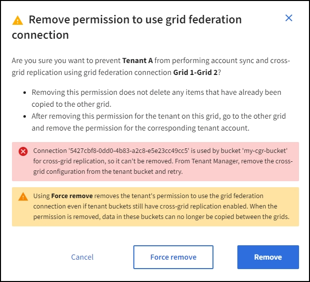

= 그리드 페더레이션을 위해 허용된 테넌트를 관리합니다
:allow-uri-read: 
:icons: font
:imagesdir: ../media/

[role="lead"]
S3 테넌트 계정에서 두 StorageGRID 시스템 간의 그리드 페더레이션 연결을 사용하도록 허용할 수 있습니다. 테넌트가 연결을 사용할 수 있는 경우 테넌트 세부 정보를 편집하거나 연결을 사용할 테넌트의 권한을 영구적으로 제거하려면 특별한 단계가 필요합니다.

.시작하기 전에
* 를 사용하여 그리드 관리자에 로그인되어 link:../admin/web-browser-requirements.html["지원되는 웹 브라우저"]있습니다.
* 로그인한 그리드에 대한 가 link:admin-group-permissions.html["루트 액세스 권한"]있습니다.
* link:grid-federation-create-connection.html["그리드 페더레이션 연결을 만들었습니다"]두 그리드 사이에 있습니다.
* 및 에 대한 워크플로를 검토했습니다.link:grid-federation-what-is-account-clone.html["계정 클론"]link:grid-federation-what-is-cross-grid-replication.html["교차 그리드 복제"]
* 필요한 경우 이미 SSO(Single Sign-On)를 구성했거나 연결의 두 그리드에 대한 페더레이션을 식별했습니다. 을 link:grid-federation-what-is-account-clone.html["계정 클론이란 무엇입니까"]참조하십시오.

== 허용된 테넌트를 생성합니다

새 테넌트 계정이나 기존 테넌트 계정에서 계정 클론 생성 및 교차 그리드 복제에 그리드 페더레이션 연결을 사용하도록 허용하려면 또는 link:editing-tenant-account.html["테넌트 계정을 편집합니다"]의 일반 지침을 link:creating-tenant-account.html["새 S3 테넌트를 생성합니다"]따르고 다음 사항에 유의하십시오.

* 연결의 두 그리드 중 하나에서 테넌트를 생성할 수 있습니다. 테넌트가 생성되는 그리드는 _ 테넌트의 소스 그리드 _ 입니다.
* 연결 상태는 * 연결됨 * 이어야 합니다.
* 테넌트를 만들거나 편집하여 * 그리드 페더레이션 연결 사용 * 권한을 활성화한 다음 첫 번째 그리드에 저장하면 동일한 테넌트가 자동으로 다른 그리드에 복제됩니다. 테넌트가 복제되는 그리드는 _ 테넌트의 대상 그리드 _ 입니다.
* 두 그리드의 테넌트는 동일한 20자리 계정 ID, 이름, 설명, 할당량 및 권한을 갖습니다. 선택적으로 * Description * 필드를 사용하여 소스 테넌트와 대상 테넌트를 식별할 수 있습니다. 예를 들어 그리드 1에서 생성된 테넌트에 대한 이 설명은 그리드 2에 복제된 테넌트에 대해서도 나타납니다. "이 테넌트는 그리드 1에 생성되었습니다."
* 보안상의 이유로 로컬 루트 사용자의 암호는 대상 그리드에 복사되지 않습니다.
+

TIP: 로컬 루트 사용자가 대상 그리드에서 복제된 테넌트에 로그인하려면 먼저 해당 그리드의 그리드 관리자가 있어야 link:changing-password-for-tenant-local-root-user.html["로컬 루트 사용자의 암호를 변경합니다"]합니다.

* 두 그리드 모두에서 새 테넌트 또는 편집된 테넌트를 사용할 수 있게 되면 테넌트 사용자는 다음 작업을 수행할 수 있습니다.
+
** 테넌트의 소스 그리드에서 그룹과 로컬 사용자를 생성합니다. 이 그룹은 테넌트의 대상 그리드에 자동으로 복제됩니다. 을 link:../tenant/grid-federation-account-clone.html["클론 테넌트 그룹 및 사용자"]참조하십시오.
** 필요에 따라 테넌트의 대상 그리드에 클론 복제할 수 있는 새 S3 액세스 키를 생성합니다. 을 link:../tenant/grid-federation-clone-keys-with-api.html["API를 사용하여 S3 액세스 키의 클론을 생성합니다"]참조하십시오.
** 연결의 두 그리드에 동일한 버킷을 생성하고 한 방향 또는 양쪽 방향에서 크로스 그리드 복제를 가능하게 합니다. 을 link:../tenant/grid-federation-manage-cross-grid-replication.html["교차 그리드 복제 관리"]참조하십시오.

== 허용된 테넌트를 봅니다

그리드 페더레이션 연결을 사용하도록 허용된 테넌트에 대한 세부 정보를 볼 수 있습니다.

.단계
. Tenants * 를 선택합니다.
. 테넌트 페이지에서 테넌트 이름을 선택하여 테넌트 세부 정보 페이지를 표시합니다.
+
테넌트의 소스 그리드(즉, 테넌트가 이 그리드에 생성된 경우)인 경우 테넌트가 다른 그리드에 클론 생성되었다는 배너가 나타납니다. 이 테넌트를 편집하거나 삭제하면 변경 내용이 다른 눈금에 동기화되지 않습니다.

+
image::../media/grid-federation-tenant-detail.png[Tenant Details 페이지의 Grid Federation 탭]

. 필요에 따라 에 * Grid Federation * 탭을 선택합니다link:../monitor/grid-federation-monitor-connections.html["그리드 페더레이션 연결을 모니터링합니다"].

== 허용된 테넌트를 편집합니다

그리드 페더레이션 연결 사용* 권한이 있는 테넌트를 편집해야 하는 경우 에 대한 일반 지침을 link:editing-tenant-account.html["테넌트 계정 편집"]따르고 다음 사항에 유의하십시오.

* 테넌트에 * 그리드 페더레이션 연결 사용 * 권한이 있는 경우 연결의 각 그리드에서 테넌트 세부 정보를 편집할 수 있습니다. 그러나 변경한 내용은 다른 눈금에 복사되지 않습니다. 테넌트 세부 정보를 그리드 간에 동기화된 상태로 유지하려면 두 그리드에 대해 동일한 편집 작업을 수행해야 합니다.
* 테넌트를 편집할 때 * 그리드 페더레이션 연결 사용 * 권한을 지울 수 없습니다.
* 테넌트를 편집할 때는 다른 그리드 페더레이션 연결을 선택할 수 없습니다.

== 허용된 테넌트를 삭제합니다

그리드 페더레이션 연결 사용* 권한이 있는 테넌트를 제거해야 하는 경우 에 대한 일반 지침을 link:deleting-tenant-account.html["테넌트 계정을 삭제하는 중입니다"]따르고 다음 사항에 유의하십시오.

* 소스 그리드에서 원래 테넌트를 제거하려면 먼저 소스 그리드에서 해당 계정에 대한 모든 버킷을 제거해야 합니다.
* 대상 그리드에서 복제된 테넌트를 제거하려면 먼저 대상 그리드에서 계정에 대한 모든 버킷을 제거해야 합니다.
* 원래 테넌트 또는 복제된 테넌트를 제거하면 해당 계정을 더 이상 교차 그리드 복제에 사용할 수 없습니다.
* 소스 그리드에서 원래 테넌트를 제거하는 경우 대상 그리드에 클론 복제된 테넌트 그룹, 사용자 또는 키는 영향을 받지 않습니다. 클론 생성된 테넌트를 삭제하거나 해당 테넌트가 자신의 그룹, 사용자, 액세스 키 및 버킷을 관리하도록 허용할 수 있습니다.
* 대상 그리드에서 복제된 테넌트를 제거하는 경우 새 그룹 또는 사용자가 원래 테넌트에 추가되면 클론 오류가 발생합니다.
+
이러한 오류를 방지하려면 이 그리드에서 테넌트를 삭제하기 전에 그리드 페더레이션 연결을 사용하도록 테넌트의 권한을 제거합니다.

== [[remove-grid-federation-connection-permission]] 그리드 페더레이션 연결 사용 권한을 제거합니다

테넌트가 그리드 페더레이션 연결을 사용하지 않도록 하려면 * 그리드 페더레이션 연결 사용 * 권한을 제거해야 합니다.

image::../media/grid-federation-remove-permission.png[그리드 페더레이션 연결을 제거하는 단계입니다]

그리드 페더레이션 연결을 사용하는 테넌트의 권한을 제거하기 전에 다음 사항에 유의하십시오.

* 테넌트의 버킷에서 교차 그리드 복제가 활성화된 경우 * 그리드 페더레이션 연결 사용 * 권한을 제거할 수 없습니다. 테넌트 계정은 먼저 모든 버킷에 대해 교차 그리드 복제를 비활성화해야 합니다.
* 그리드 통합 연결 사용 * 권한을 제거해도 그리드 간에 이미 복제된 항목은 삭제되지 않습니다. 예를 들어, 테넌트의 사용 권한이 제거되면 두 그리드에 있는 테넌트 사용자, 그룹 및 객체가 두 그리드 모두에서 삭제되지 않습니다. 이러한 항목을 삭제하려면 두 그리드 모두에서 수동으로 삭제해야 합니다.
* 동일한 그리드 페더레이션 연결을 사용하여 이 권한을 다시 활성화하려면 먼저 대상 그리드에서 이 테넌트를 삭제하십시오. 그렇지 않으면 이 권한을 다시 설정하면 오류가 발생합니다.

NOTE: 그리드 페더레이션 연결 사용 * 권한을 다시 활성화하면 로컬 그리드가 소스 그리드로 바뀌고 선택한 그리드 페더레이션 연결에 지정된 원격 그리드에 대한 복제가 트리거됩니다. 테넌트 계정이 이미 원격 그리드에 있는 경우 클론 생성으로 인해 충돌 오류가 발생합니다.

.시작하기 전에
* 을 사용하고 link:../admin/web-browser-requirements.html["지원되는 웹 브라우저"]있습니다.
* 두 그리드 모두에 대한 가 link:admin-group-permissions.html["루트 액세스 권한"]있습니다.

=== 테넌트 버킷에 대한 복제를 비활성화합니다

첫 번째 단계로 모든 테넌트 버킷에 대해 교차 그리드 복제를 비활성화합니다.

.단계
. 두 그리드 중 하나에서 시작하여 기본 관리 노드에서 그리드 관리자에 로그인합니다.
. 구성 * > * 시스템 * > * 그리드 페더레이션 * 을 선택합니다.
. 세부 정보를 표시할 연결 이름을 선택합니다.
. 허용된 테넌트 * 탭에서 테넌트가 연결을 사용 중인지 확인합니다.
. 테넌트가 나열되면 연결의 두 그리드에 있는 모든 버킷을 에 대해 으로 link:../tenant/grid-federation-manage-cross-grid-replication.html["크로스 그리드 복제를 비활성화합니다"]안내합니다.
+

TIP: 테넌트 버킷에 교차 그리드 복제가 활성화된 경우 * 그리드 통합 연결 사용 * 권한을 제거할 수 없습니다. 테넌트는 두 그리드의 해당 버킷에 대해 교차 그리드 복제를 비활성화해야 합니다.

=== 테넌트에 대한 권한을 제거합니다

테넌트 버킷에 대해 교차 그리드 복제를 비활성화한 후 그리드 페더레이션 연결을 사용할 수 있는 테넌트의 권한을 제거할 수 있습니다.

.단계
. 기본 관리자 노드에서 그리드 관리자에 로그인합니다.
. 그리드 페더레이션 페이지 또는 테넌트 페이지에서 권한을 제거합니다.
+
[role="tabbed-block"]
====
.그리드 페더레이션 페이지
--
.. 구성 * > * 시스템 * > * 그리드 페더레이션 * 을 선택합니다.
.. 세부 정보 페이지를 표시하려면 연결 이름을 선택합니다.
.. 허용된 테넌트 * 탭에서 테넌트에 대한 라디오 버튼을 선택합니다.
.. 권한 제거 * 를 선택합니다.

--
.Tenants 페이지
--
.. Tenants * 를 선택합니다.
.. 세부 정보 페이지를 표시하려면 테넌트 이름을 선택합니다.
.. Grid Federation * (그리드 통합 *) 탭에서 연결에 대한 라디오 버튼을 선택합니다.
.. 권한 제거 * 를 선택합니다.

--
====
. 확인 대화 상자에서 경고를 검토하고 * 제거 * 를 선택합니다.
+
** 권한을 제거할 수 있는 경우 세부 정보 페이지로 돌아가며 성공 메시지가 표시됩니다. 이 테넌트는 더 이상 그리드 페더레이션 연결을 사용할 수 없습니다.
** 하나 이상의 테넌트 버킷에서 교차 그리드 복제가 활성화된 경우 오류가 표시됩니다.
+

+
다음 중 하나를 수행할 수 있습니다.

+
*** (권장) 테넌트 관리자에 로그인하고 각 테넌트의 버킷에 대한 복제를 비활성화합니다. 을 link:../tenant/grid-federation-manage-cross-grid-replication.html["교차 그리드 복제 관리"]참조하십시오. 그런 다음 단계를 반복하여 * 그리드 연결 사용 * 권한을 제거합니다.
*** 권한을 강제로 제거합니다. 다음 섹션을 참조하십시오.

. 다른 그리드로 이동하여 이 단계를 반복하여 다른 그리드에서 동일한 테넌트에 대한 권한을 제거합니다.

== [[force_remove_permission]] 권한을 강제로 제거합니다

필요한 경우 테넌트 버킷에 교차 그리드 복제가 활성화되어 있는 경우에도 테넌트의 권한 제거를 통해 그리드 페더레이션 연결을 사용하도록 할 수 있습니다.

테넌트의 권한을 강제로 제거하기 전에 에 대한 일반적인 고려 사항 및 다음과 같은 추가 고려 사항에 <<remove-grid-federation-connection-permission,권한을 제거합니다>>유의하십시오.

* 그리드 페더레이션 연결 사용 * 권한을 강제로 제거하면 다른 그리드(수집되었지만 아직 복제되지 않음)로 복제 보류 중인 모든 객체가 계속 복제됩니다. 이러한 처리 중인 객체가 대상 버킷에 도달하지 않도록 하려면 다른 그리드에 대한 테넌트의 권한도 제거해야 합니다.
* 그리드 통합 연결 사용 * 권한을 제거한 후 소스 버킷으로 인제된 모든 오브젝트는 대상 버킷에 복제되지 않습니다.

.단계
. 기본 관리자 노드에서 그리드 관리자에 로그인합니다.
. 구성 * > * 시스템 * > * 그리드 페더레이션 * 을 선택합니다.
. 세부 정보 페이지를 표시하려면 연결 이름을 선택합니다.
. 허용된 테넌트 * 탭에서 테넌트에 대한 라디오 버튼을 선택합니다.
. 권한 제거 * 를 선택합니다.
. 확인 대화 상자에서 경고를 검토하고 * 강제 제거 * 를 선택합니다.
+
성공 메시지가 나타납니다. 이 테넌트는 더 이상 그리드 페더레이션 연결을 사용할 수 없습니다.

. 필요한 경우 다른 그리드로 이동하여 이 단계를 반복하여 다른 그리드에서 동일한 테넌트 계정에 대한 권한을 강제로 제거합니다. 예를 들어, 다른 그리드에서 이 단계를 반복하여 처리 중인 오브젝트가 대상 버킷에 도달하지 못하게 해야 합니다.

