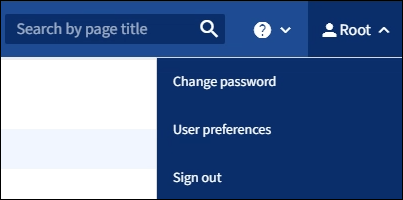

= Grid Manager에서 로그아웃합니다
:allow-uri-read: 
:icons: font
:imagesdir: ../media/

[role="lead"]
그리드 관리자 작업을 마치면 로그아웃하여 권한이 없는 사용자가 StorageGRID 시스템에 액세스할 수 없도록 해야 합니다. 브라우저를 닫아도 브라우저 쿠키 설정에 따라 시스템에서 로그아웃되지 않을 수 있습니다.

.단계
. 오른쪽 위 모서리에서 사용자 이름을 선택합니다.
+

. 로그아웃 * 을 선택합니다.
+
[cols="1a,2a"]
|===
| 옵션을 선택합니다 | 설명 

 a| 
SSO가 사용되지 않습니다
 a| 
관리자 노드에서 로그아웃되었습니다.

그리드 관리자 로그인 페이지가 표시됩니다.

* 참고: * 둘 이상의 관리자 노드에 로그인한 경우 각 노드에서 로그아웃해야 합니다.

 a| 
SSO가 활성화되었습니다
 a| 
액세스 중인 모든 관리 노드에서 로그아웃되었습니다. StorageGRID 로그인 페이지가 표시됩니다. * 그리드 관리자 * 는 * 최근 계정 * 드롭다운에 기본값으로 나열되고 * 계정 ID * 필드는 0으로 표시됩니다.

* 참고: * SSO가 활성화되어 있고 Tenant Manager에도 로그인한 경우, 에도 로그인해야 link:../tenant/signing-out-of-tenant-manager.html["테넌트 계정에서 로그아웃합니다"]합니다link:how-sso-works.html["SSO에서 로그아웃합니다"].

|===

