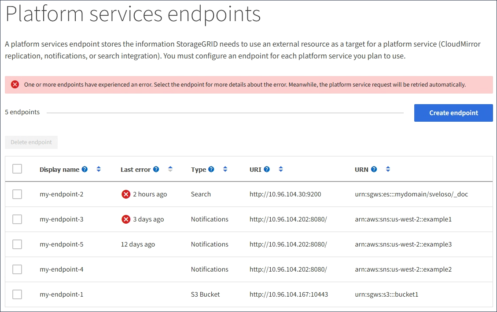

= 플랫폼 서비스 문제 해결
:allow-uri-read: 
:icons: font
:imagesdir: ../media/

[role="lead"]
플랫폼 서비스에 사용되는 엔드포인트는 테넌트 관리자의 테넌트 사용자가 생성 및 유지 관리합니다. 그러나 테넌트에 플랫폼 서비스를 구성하거나 사용하는 데 문제가 있는 경우 Grid Manager를 사용하여 문제를 해결할 수 있습니다.

== 새 끝점에 문제가 있습니다

테넌트가 플랫폼 서비스를 사용하려면 먼저 테넌트 관리자를 사용하여 하나 이상의 엔드포인트를 생성해야 합니다. 각 엔드포인트는 StorageGRID S3 버킷, Amazon Web Services 버킷, Amazon Simple Notification Service 주제, Kafka 주제 또는 로컬 또는 AWS에서 호스팅되는 Elasticsearch 클러스터와 같이 단일 플랫폼 서비스에 대한 외부 대상을 나타냅니다. 각 끝점에는 외부 리소스의 위치와 해당 리소스에 액세스하는 데 필요한 자격 증명이 모두 포함됩니다.

테넌트가 끝점을 만들 때 StorageGRID 시스템은 끝점이 있는지, 그리고 지정된 자격 증명을 사용하여 해당 끝점에 도달할 수 있는지 검증합니다. 엔드포인트에 대한 연결은 각 사이트의 한 노드에서 검증됩니다.

끝점 유효성 검사에 실패하면 끝점 유효성 검사가 실패한 이유를 설명하는 오류 메시지가 표시됩니다. 테넌트 사용자가 문제를 해결한 다음 엔드포인트를 다시 생성해 보십시오.

NOTE: 테넌트 계정에 플랫폼 서비스가 활성화되어 있지 않으면 엔드포인트 생성이 실패합니다.

== 기존 엔드포인트에 문제가 있습니다

StorageGRID가 기존 끝점에 도달하려고 할 때 오류가 발생하면 테넌트 관리자의 대시보드에 메시지가 표시됩니다.

image::../media/tenant_dashboard_endpoint_error.png[대시보드의 끝점 오류 메시지]

테넌트 사용자는 끝점 페이지로 이동하여 각 끝점에 대한 가장 최근의 오류 메시지를 검토하고 오류가 발생한 시간을 확인할 수 있습니다. 마지막 오류 * 열은 각 끝점에 대한 가장 최근 오류 메시지를 표시하고 오류가 발생한 시간을 나타냅니다. 아이콘이 포함된 오류는 image:../media/icon_alert_red_critical.png["빨간색 X 아이콘"]지난 7일 내에 발생했습니다.

NOTE: 마지막 오류 * 열에 있는 일부 오류 메시지에는 괄호 안에 로그 ID가 포함될 수 있습니다. 그리드 관리자 또는 기술 지원에서는 이 ID를 사용하여 bycast.log의 오류에 대한 자세한 정보를 찾을 수 있습니다.

== 프록시 서버와 관련된 문제

스토리지 노드와 플랫폼 서비스 끝점 간에 를 구성한 link:configuring-storage-proxy-settings.html["스토리지 프록시"]경우 프록시 서비스에서 StorageGRID의 메시지를 허용하지 않는 경우 오류가 발생할 수 있습니다. 이러한 문제를 해결하려면 프록시 서버의 설정을 확인하여 플랫폼 서비스 관련 메시지가 차단되지 않았는지 확인합니다.

== 오류가 발생했는지 확인합니다

지난 7일 이내에 엔드포인트 오류가 발생한 경우 테넌트 관리자의 대시보드에 경고 메시지가 표시됩니다. 끝점 페이지로 이동하여 오류에 대한 자세한 정보를 볼 수 있습니다.

== 클라이언트 작업이 실패했습니다

일부 플랫폼 서비스 문제로 인해 S3 버킷의 클라이언트 작업이 실패할 수 있습니다. 예를 들어 RSM(Internal Replicated State Machine) 서비스가 중지되거나 너무 많은 플랫폼 서비스 메시지가 배달 대기 중인 경우 S3 클라이언트 작업이 실패합니다.

서비스 상태를 확인하려면

. 지원 * > * 도구 * > * 그리드 토폴로지 * 를 선택합니다.
. site_ * > *_Storage Node_ * > * SSM * > * Services * 를 선택합니다.

== 복구할 수 없는 끝점 오류입니다

엔드포인트가 생성된 후 다양한 이유로 플랫폼 서비스 요청 오류가 발생할 수 있습니다. 일부 오류는 사용자 개입으로 복구할 수 있습니다. 예를 들어 다음과 같은 이유로 복구 가능한 오류가 발생할 수 있습니다.

* 사용자의 자격 증명이 삭제되었거나 만료되었습니다.
* 대상 버킷이 없습니다.
* 알림을 전송할 수 없습니다.

StorageGRID에서 복구 가능한 오류가 발생하면 성공할 때까지 플랫폼 서비스 요청이 재시도됩니다.

다른 오류는 복구할 수 없습니다. 예를 들어, 끝점이 삭제되면 복구할 수 없는 오류가 발생합니다.

StorageGRID에서 복구할 수 없는 끝점 오류가 발생하는 경우:

* Grid Manager에서 * 지원 * > * 툴 * > * 메트릭 * > * Grafana * > * 플랫폼 서비스 개요 * 로 이동하여 오류 세부 정보를 확인하십시오.
* 테넌트 관리자에서 * 스토리지(S3) * > * 플랫폼 서비스 엔드포인트 * 로 이동하여 오류 세부 정보를 확인합니다.
* 에 `/var/local/log/bycast-err.log` 관련된 오류가 있는지 확인합니다. ADC 서비스가 있는 스토리지 노드에는 이 로그 파일이 포함되어 있습니다.

== 플랫폼 서비스 메시지를 전달할 수 없습니다

대상에 플랫폼 서비스 메시지를 수락하지 못하는 문제가 발생하면 버킷에 대한 클라이언트 작업은 성공하지만 플랫폼 서비스 메시지는 전달되지 않습니다. 예를 들어, StorageGRID가 더 이상 대상 서비스에 인증할 수 없도록 대상에서 자격 증명이 업데이트되는 경우 이 오류가 발생할 수 있습니다.

관련 경고를 확인합니다.

== 플랫폼 서비스 요청에 대한 성능 저하

요청이 전송되는 속도가 대상 엔드포인트에서 요청을 수신할 수 있는 속도를 초과하는 경우 StorageGRID 소프트웨어는 버킷에 대한 수신 S3 요청을 스로틀할 수 있습니다. 임계치 조절은 대상 끝점으로 보내려고 기다리는 요청의 백로그가 있는 경우에만 발생합니다.

단, 들어오는 S3 요청의 실행 시간이 더 오래 걸린다는 점을 알 수 있습니다. 속도가 현저히 느린 성능을 감지하기 시작하는 경우 수집 속도를 줄이거나 용량이 더 큰 엔드포인트를 사용해야 합니다. 요청 백로그가 계속 증가하는 경우 PUT 요청과 같은 클라이언트 S3 작업이 결국 실패합니다.

CloudMirror 요청은 일반적으로 검색 통합 또는 이벤트 알림 요청보다 더 많은 데이터 전송을 포함하므로 대상 엔드포인트의 성능에 영향을 받을 가능성이 더 높습니다.

== 플랫폼 서비스 요청에 실패했습니다

플랫폼 서비스에 대한 요청 실패율을 보려면

. 노드 * 를 선택합니다.
. __site_ * > * 플랫폼 서비스 * 를 선택합니다.
. 요청 오류율 차트를 봅니다.
+
image::../media/nodes_page_site_level_platform_services.gif[노드 페이지 사이트 레벨 플랫폼 서비스]

== 플랫폼 서비스를 사용할 수 없음 경고

플랫폼 서비스 사용 불가 * 경고는 RSM 서비스가 실행 중이거나 사용 가능한 스토리지 노드가 너무 적어서 사이트에서 플랫폼 서비스 작업을 수행할 수 없음을 나타냅니다.

RSM 서비스는 플랫폼 서비스 요청이 각 끝점으로 전송되도록 합니다.

이 경고를 해결하려면 사이트에서 RSM 서비스를 포함하는 스토리지 노드를 확인합니다. (RSM 서비스는 ADC 서비스도 포함하는 스토리지 노드에 있습니다.) 그런 다음 이러한 스토리지 노드 중 일부만 실행되고 사용 가능한지 확인합니다.

NOTE: 사이트에서 RSM 서비스를 포함하는 스토리지 노드가 두 개 이상 장애가 발생하면 해당 사이트에 대한 보류 중인 플랫폼 서비스 요청이 손실됩니다.

== 플랫폼 서비스 끝점에 대한 추가 문제 해결 지침

자세한 내용은 을 link:../tenant/troubleshooting-platform-services-endpoint-errors.html["테넌트 계정 및 GT 사용, 플랫폼 서비스 끝점 문제 해결"]참조하십시오.

.관련 정보
link:../troubleshoot/index.html["StorageGRID 시스템 문제를 해결합니다"]
