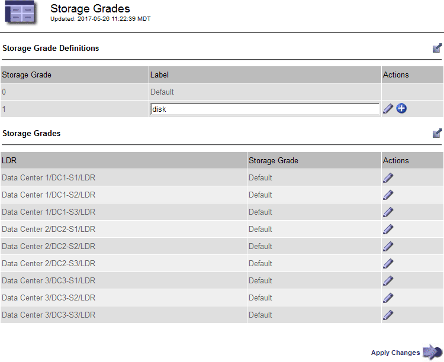

= 저장 점수를 생성하고 할당합니다
:allow-uri-read: 
:icons: font
:imagesdir: ../media/

[role="lead"]
스토리지 등급은 스토리지 노드에서 사용하는 스토리지 유형을 식별합니다. ILM 규칙을 사용하여 특정 스토리지 노드에 특정 객체를 배치하려는 경우 스토리지 성적을 생성할 수 있습니다.

.시작하기 전에
* 을 사용하여 그리드 관리자에 로그인되어 있습니다.link:../admin/web-browser-requirements.html["지원되는 웹 브라우저"]
* 있습니다. link:../admin/admin-group-permissions.html["특정 액세스 권한"]

.이 작업에 대해
StorageGRID를 처음 설치하면 * 기본 * 스토리지 등급이 시스템의 모든 스토리지 노드에 자동으로 할당됩니다. 필요에 따라 사용자 지정 스토리지 등급을 정의하고 이를 다른 스토리지 노드에 할당할 수 있습니다.

사용자 지정 스토리지 등급을 사용하면 특정 유형의 스토리지 노드만 포함하는 ILM 스토리지 풀을 생성할 수 있습니다. 예를 들어, StorageGRID All-Flash 스토리지 어플라이언스 와 같이 가장 빠른 스토리지 노드에 특정 오브젝트를 저장할 수 있습니다.

NOTE: 설치 중에 객체 데이터 및 메타데이터("결합된" 스토리지 노드), 객체 메타데이터만 포함하거나 객체 데이터만 포함하도록 스토리지 노드를 구성할 수 있습니다. 메타데이터 전용 스토리지 노드는 스토리지 등급을 할당할 수 없습니다. 자세한 내용은 을 link:../primer/what-storage-node-is.html#types-of-storage-nodes["스토리지 노드 유형"]참조하십시오.

스토리지 등급이 중요하지 않은 경우(예: 모든 스토리지 노드가 동일함) 이 절차를 건너뛰고 스토리지 등급에 대한 * 모든 스토리지 등급 포함 * 선택을 사용할 수 link:creating-storage-pool.html["스토리지 풀을 생성합니다"]있습니다. 이 선택 항목을 사용하면 스토리지 등급에 관계없이 스토리지 풀에 사이트의 모든 스토리지 노드가 포함됩니다.

NOTE: 필요한 것보다 더 많은 저장 점수를 생성하지 마십시오. 예를 들어, 각 스토리지 노드에 대한 스토리지 등급을 생성하지 마십시오. 대신 각 스토리지 등급을 2개 이상의 노드에 할당합니다. 한 노드에만 할당된 스토리지 등급은 해당 노드를 사용할 수 없게 될 경우 ILM 백로그를 유발할 수 있습니다.

.단계
. ILM * > * 스토리지 등급 * 을 선택합니다.
. 사용자 정의 저장 평점 정의:
+
.. 추가할 각 사용자 지정 스토리지 등급에 대해 * Insert * 를 선택하여 image:../media/icon_nms_insert.gif["삽입 아이콘"]행을 추가합니다.
.. 설명 라벨을 입력합니다.
+

.. Apply Changes * 를 선택합니다.
.. 필요한 경우, 저장된 라벨을 수정해야 하는 경우 * 편집 * 을 image:../media/icon_nms_edit.gif["편집 아이콘"] 선택하고 * 변경 사항 적용 * 을 선택합니다.
+

NOTE: 저장 평점을 삭제할 수 없습니다.

. 스토리지 노드에 새 스토리지 등급 할당:
+
.. LDR 목록에서 스토리지 노드를 찾고 해당 * Edit * 아이콘을 선택합니다image:../media/icon_nms_edit.gif["편집 아이콘"].
.. 목록에서 적절한 스토리지 등급을 선택합니다.
+
image::../media/assigning_storage_grades_to_storage_nodes.gif[보관 등급 페이지]

+

NOTE: 지정된 스토리지 노드에 스토리지 등급을 한 번만 할당합니다. 장애에서 복구된 스토리지 노드는 이전에 할당된 스토리지 등급을 유지합니다. ILM 정책이 활성화된 후에는 이 할당을 변경하지 마십시오. 할당이 변경되면 새 스토리지 등급에 따라 데이터가 저장됩니다.

.. Apply Changes * 를 선택합니다.

