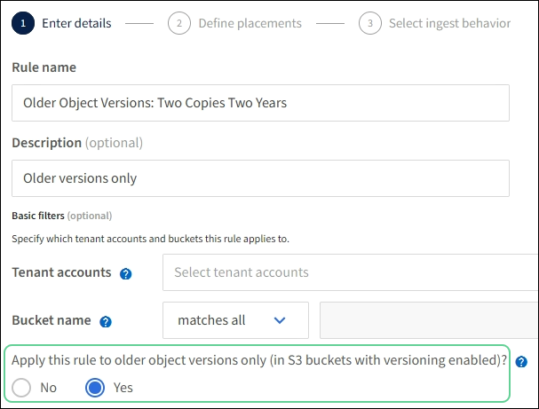

= 예 4: S3 버전 오브젝트에 대한 ILM 규칙 및 정책
:allow-uri-read: 
:icons: font
:imagesdir: ../media/

[role="lead"]
버전 관리가 활성화된 S3 버킷이 있는 경우 ILM 정책에 "비현재 시간"을 참조 시간으로 사용하는 규칙을 포함하여 현재 오브젝트 버전을 관리할 수 있습니다.

CAUTION: 개체에 대해 제한된 보존 시간을 지정하면 해당 기간이 만료된 후에 해당 개체가 영구적으로 삭제됩니다. 개체가 유지되는 기간을 이해해야 합니다.

이 예제에서 볼 수 있듯이 버전이 아닌 개체 버전에 대해 다른 배치 명령을 사용하여 버전이 지정된 개체에서 사용하는 스토리지의 양을 제어할 수 있습니다.

CAUTION: 다음 ILM 규칙 및 정책은 예일 뿐입니다. ILM 규칙을 구성하는 방법은 여러 가지가 있습니다. 새 정책을 활성화하기 전에 시뮬레이션하여 콘텐츠 손실을 방지하기 위한 의도대로 작동하는지 확인합니다.

NOTE: 개체의 현재 버전이 아닌 버전에서 ILM 정책 시뮬레이션을 수행하려면 개체 버전의 UUID 또는 CBID를 알아야 합니다. UUID 및 CBID를 찾으려면 객체가 최신 상태인 동안 를 link:verifying-ilm-policy-with-object-metadata-lookup.html["개체 메타데이터 조회"]사용합니다.

.관련 정보
link:how-objects-are-deleted.html["오브젝트 삭제 방법"]

== 예를 들어 ILM 규칙 1: 10년 동안 복사본 3개를 저장합니다

이 ILM 규칙은 10년 동안 3개의 사이트에 각 개체의 복사본을 저장합니다.

이 규칙은 버전 적용 여부에 관계없이 모든 개체에 적용됩니다.

[cols="1a,2a"]
|===
| 규칙 정의 | 예제 값 

 a| 
지원합니다
 a| 
각각 사이트 1, 사이트 2 및 사이트 3이라는 서로 다른 데이터 센터로 구성된 스토리지 풀 3개

 a| 
규칙 이름
 a| 
10년 동안 3부

 a| 
참조 시간
 a| 
수집 시간

 a| 
배치
 a| 
0일째, 복제된 복사본 3개를 10년(3,652일), 사이트 1에 1개, 사이트 2에 1개, 사이트 3에 1개씩 보관합니다. 10년이 끝나면 개체의 복사본을 모두 삭제합니다.

|===

== 예를 들어 ILM 규칙 2: 2년 동안 비최신 버전의 복사본 2개를 저장합니다

이 ILM 규칙 예에서는 2년 동안 S3 버전 오브젝트에서 2개의 복사본을 저장합니다.

ILM 규칙 1은 개체의 모든 버전에 적용되므로 다른 규칙을 만들어 현재 버전이 아닌 버전을 필터링해야 합니다.

"비현재 시간"을 참조 시간으로 사용하는 규칙을 만들려면 "버전 관리가 활성화된 S3 버킷의 이전 개체 버전에만 이 규칙을 적용하시겠습니까?"라는 질문에 대해 * 예 * 를 선택합니다. ILM 규칙 생성 마법사의 1단계(세부 정보 입력)에서 Yes * 를 선택하면 참조 시간에 대해 _noncurrent time_이 자동으로 선택되며 다른 참조 시간을 선택할 수 없습니다.

이 예제에서는 비최신 버전의 복사본 두 개만 저장되고 이 복사본은 2년 동안 저장됩니다.

[cols="1a,2a"]
|===
| 규칙 정의 | 예제 값 

 a| 
스토리지 풀
 a| 
사이트 1과 사이트 2의 서로 다른 데이터 센터에 각각 2개의 스토리지 풀이 있습니다.

 a| 
규칙 이름
 a| 
비최신 버전: 2부 2년

 a| 
참조 시간
 a| 
현재 시간이 아닙니다

"버전 관리가 활성화된 S3 버킷의 경우 이전 개체 버전에만 이 규칙 적용"에 대해 * 예 * 를 선택하면 자동으로 선택됩니까? ILM 규칙 생성 마법사

 a| 
배치
 a| 
비현재 시간에 상대적인 제0일(즉, 객체 버전이 비최신 버전이 되는 날부터 시작)에서는 2년(730일) 동안 비최신 객체 버전의 복제된 복사본 2개를 사이트 1과 사이트 2의 복제본 1개로 유지합니다. 2년이 끝나면 최신 버전이 아닌 버전을 삭제합니다.

|===

== ILM 정책(예: 4:S3 버전 오브젝트

개체의 이전 버전을 현재 버전과 다르게 관리하려면 "현재 시간"을 참조 시간으로 사용하는 규칙이 현재 개체 버전에 적용되는 규칙 앞에 ILM 정책에 나타나야 합니다.

S3 버전 개체에 대한 ILM 정책에는 다음과 같은 ILM 규칙이 포함될 수 있습니다.

* 버전이 최신 버전이 아닌 날부터 시작하여 각 개체의 이전(비최신) 버전을 2년 동안 유지합니다.
+

NOTE: "비현재 시간" 규칙은 현재 개체 버전에 적용되는 규칙 앞에 정책에서 나타나야 합니다. 그렇지 않으면 현재 개체 버전이 "비현재 시간" 규칙과 일치하지 않습니다.

* 수집 시 3개의 복제 복사본을 생성하고 3개 사이트 각각에 하나의 복사본을 저장합니다. 10년 동안 현재 개체 버전의 복사본을 유지합니다.

예제 정책을 시뮬레이션할 때 테스트 개체는 다음과 같이 평가됩니다.

* 최신 버전이 아닌 개체 버전은 첫 번째 규칙에 따라 일치됩니다. 최신 버전이 아닌 개체 버전이 2년 이상이면 ILM을 통해 영구적으로 삭제됩니다(비최신 버전의 모든 복사본이 그리드에서 제거됨).
* 현재 개체 버전은 두 번째 규칙에 따라 일치됩니다. 현재 개체 버전이 10년 동안 저장된 경우 ILM 프로세스에서 삭제 마커를 현재 개체 버전으로 추가하고 이전 개체 버전을 "비최신"으로 만듭니다. 다음 번에 ILM 평가를 수행할 때 이 비최신 버전은 첫 번째 규칙에 따라 일치합니다. 따라서 사이트 3에서 복사본이 제거되고 사이트 1과 사이트 2의 두 복사본이 2년 더 저장됩니다.

