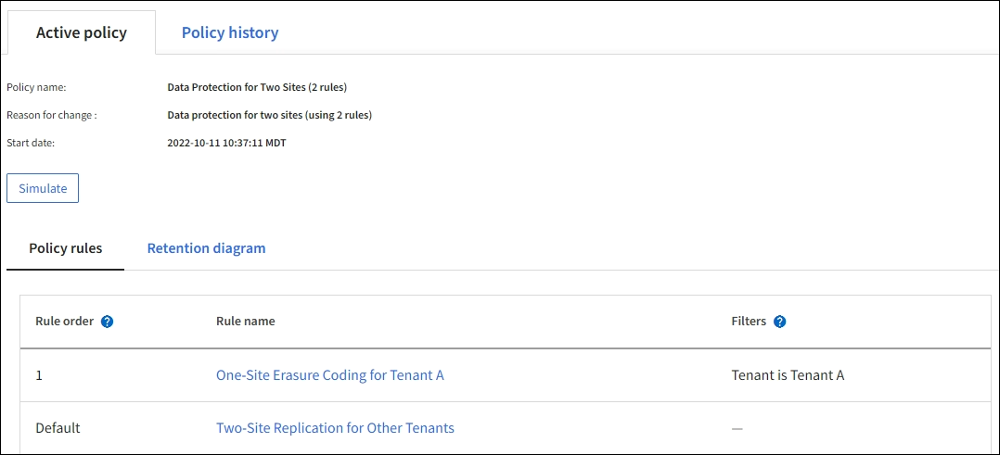

= 예 6: ILM 정책 변경
:allow-uri-read: 
:icons: font
:imagesdir: ../media/

[role="lead"]
데이터 보호를 변경하거나 새 사이트를 추가해야 하는 경우 새 ILM 정책을 만들고 활성화할 수 있습니다.

정책을 변경하기 전에 ILM 배치 변경이 StorageGRID 시스템의 전반적인 성능에 일시적으로 어떤 영향을 미칠 수 있는지 이해해야 합니다.

이 예에서는 새 StorageGRID 사이트가 확장에 추가되었으며 새 사이트에 데이터를 저장하기 위해 새로운 활성 ILM 정책을 구현해야 합니다. 새 활성 정책을 구현하려면 먼저 를 link:creating-ilm-policy.html["정책을 생성합니다"]수행합니다. 그런 다음 link:../ilm/creating-ilm-policy.html#activate-ilm-policy["활성화"]새 정책을 적용해야 link:../ilm/creating-ilm-policy.html#simulate-ilm-policy["시뮬레이션"]합니다.

CAUTION: 다음 ILM 규칙 및 정책은 예일 뿐입니다. ILM 규칙을 구성하는 방법은 여러 가지가 있습니다. 새 정책을 활성화하기 전에 시뮬레이션하여 콘텐츠 손실을 방지하기 위한 의도대로 작동하는지 확인합니다.

== ILM 정책을 변경하면 성능에 미치는 영향

새로운 ILM 정책을 활성화할 때 StorageGRID 시스템의 성능은 일시적으로 영향을 받을 수 있습니다. 특히 새 정책의 배치 명령에 따라 많은 기존 오브젝트를 새 위치로 이동해야 하는 경우에 그렇습니다.

새로운 ILM 정책을 활성화하면 StorageGRID은 이를 사용하여 기존 오브젝트 및 새로 수집된 오브젝트를 포함한 모든 오브젝트를 관리합니다. 새 ILM 정책을 활성화하기 전에 복제된 기존 오브젝트 및 삭제 코딩 오브젝트의 배치에 대한 변경 사항을 검토하십시오. 기존 오브젝트의 위치를 변경하면 새로운 배치가 평가되고 구현될 때 일시적인 리소스 문제가 발생할 수 있습니다.

새 ILM 정책이 복제된 기존 객체 및 삭제 코딩 객체의 배치에 영향을 미치지 않도록 할 수 link:create-ilm-rule-enter-details.html#use-advanced-filters-in-ilm-rules["수집 시간 필터를 사용하여 ILM 규칙을 생성합니다"]있습니다. 예를 들어, * Ingest Time_은 __<date and time>_ * 이거나 그 이후이므로 새 규칙은 지정된 날짜 및 시간 이후에 수집된 개체에만 적용됩니다.

StorageGRID 성능에 일시적으로 영향을 미칠 수 있는 ILM 정책 변경 유형은 다음과 같습니다.

* 기존 삭제 코딩 오브젝트에 다른 삭제 코딩 프로필 적용
+

NOTE: StorageGRID는 각 삭제 코딩 프로필을 고유한 것으로 간주하며 새 프로필을 사용할 때 삭제 코딩 조각을 재사용하지 않습니다.

* 기존 오브젝트에 필요한 복사 유형을 변경합니다. 예를 들어, 복제된 오브젝트의 많은 비율을 삭제 코딩 오브젝트로 변환합니다.
* 기존 오브젝트의 복사본을 전혀 다른 위치로 이동(예: 많은 오브젝트를 Cloud Storage Pool 간에 이동 또는 원격 사이트 간에 이동)

== 활성 ILM 정책(예: 6: 두 사이트의 데이터 보호

이 예에서 활성 ILM 정책은 처음에 2개 사이트 StorageGRID 시스템용으로 설계되었고 두 가지 ILM 규칙을 사용합니다.

이 ILM 정책에서는 테넌트 A에 속하는 객체는 단일 사이트에서 2+1 삭제 코딩으로 보호되며, 다른 모든 테넌트에 속한 객체는 2개 복제본 복제를 사용하여 2개 사이트 간에 보호됩니다.

=== 규칙 1: 테넌트 A에 대한 단일 사이트 삭제 코딩

[cols="1a,2a"]
|===
| 규칙 정의 | 예제 값 

 a| 
규칙 이름
 a| 
테넌트 A에 대한 1개 사이트 삭제 코딩

 a| 
테넌트 계정
 a| 
테넌트 A

 a| 
스토리지 풀
 a| 
사이트 1

 a| 
배치
 a| 
사이트 1의 2 + 1 삭제 코딩이 0일째부터 영원까지

|===

=== 규칙 2: 다른 테넌트를 위한 2개 사이트 복제

[cols="1a,2a"]
|===
| 규칙 정의 | 예제 값 

 a| 
규칙 이름
 a| 
다른 테넌트를 위한 2개 사이트 복제

 a| 
테넌트 계정
 a| 
무시

 a| 
스토리지 풀
 a| 
사이트 1 및 사이트 2

 a| 
배치
 a| 
사이트 1에 복사본 1개와 사이트 2에 복사본 1개로, 복제 복사본을 2일부터 영원히 복제할 수 있습니다.

|===

== 예 6의 ILM 정책: 세 사이트에서 데이터 보호

이 예에서 ILM 정책은 3개 사이트 StorageGRID 시스템에 대한 새 정책으로 대체됩니다.

새 사이트를 추가하기 위해 확장을 수행한 후 그리드 관리자는 두 개의 새 스토리지 풀, 즉 사이트 3의 스토리지 풀과 세 사이트를 모두 포함하는 스토리지 풀(모든 스토리지 노드의 기본 스토리지 풀과 동일하지 않음)을 만들었습니다. 그런 다음 이 관리자는 세 사이트 모두에서 데이터를 보호하도록 설계된 두 가지 새로운 ILM 규칙과 새로운 ILM 정책을 개발했습니다.

이 새로운 ILM 정책이 활성화되면 테넌트 A에 속하는 객체는 3개의 사이트에서 2+1 삭제 코딩으로 보호되며, 다른 테넌트(및 테넌트 A에 속하는 더 작은 객체)에 속하는 객체는 3개의 복제본 복제를 사용하여 3개의 사이트에 걸쳐 보호됩니다.

=== 규칙 1: 테넌트 A의 3개 사이트 삭제 코딩

[cols="1a,2a"]
|===
| 규칙 정의 | 예제 값 

 a| 
규칙 이름
 a| 
테넌트 A의 3개 사이트 삭제 코딩

 a| 
테넌트 계정
 a| 
테넌트 A

 a| 
스토리지 풀
 a| 
3개 사이트 모두(사이트 1, 사이트 2 및 사이트 3 포함)

 a| 
배치
 a| 
3개 사이트 모두에서 2개 이상의 삭제 코딩(0일부터 영구적)을 삭제합니다

|===

=== 규칙 2: 다른 테넌트를 위한 3개 사이트 복제

[cols="1a,2a"]
|===
| 규칙 정의 | 예제 값 

 a| 
규칙 이름
 a| 
다른 테넌트를 위한 3개 사이트 복제

 a| 
테넌트 계정
 a| 
무시

 a| 
스토리지 풀
 a| 
사이트 1, 사이트 2 및 사이트 3

 a| 
배치
 a| 
사이트 1에 복사본 1개, 사이트 2에 복사본 1개, 사이트 3에 복사본 1개로 구성된 복사본을 사이트 0에서 영구적으로 복제하는 3개

|===

== 예를 들어 ILM 정책 활성화 6

새로운 ILM 정책을 활성화하면 신규 또는 업데이트된 규칙의 배치 지침에 따라 기존 오브젝트를 새 위치로 이동하거나 기존 오브젝트에 대한 새 오브젝트 복사본을 생성할 수 있습니다.

CAUTION: ILM 정책의 오류로 인해 복구할 수 없는 데이터 손실이 발생할 수 있습니다. 정책을 활성화하기 전에 정책을 주의 깊게 검토하고 시뮬레이션하여 의도한 대로 작동하도록 확인합니다.

CAUTION: 새로운 ILM 정책을 활성화하면 StorageGRID은 이를 사용하여 기존 오브젝트 및 새로 수집된 오브젝트를 포함한 모든 오브젝트를 관리합니다. 새 ILM 정책을 활성화하기 전에 복제된 기존 오브젝트 및 삭제 코딩 오브젝트의 배치에 대한 변경 사항을 검토하십시오. 기존 오브젝트의 위치를 변경하면 새로운 배치가 평가되고 구현될 때 일시적인 리소스 문제가 발생할 수 있습니다.

=== 삭제 코딩 지침이 변경될 때 수행되는 작업

이 예에 대해 현재 활성화된 ILM 정책에서 테넌트 A에 속하는 객체는 사이트 1에서 2+1 삭제 코딩을 사용하여 보호됩니다. 새로운 ILM 정책에서 테넌트 A에 속하는 개체는 사이트 1, 2 및 3에서 2+1 삭제 코딩을 사용하여 보호됩니다.

새 ILM 정책이 활성화되면 다음 ILM 작업이 수행됩니다.

* 테넌트 A에 의해 수집된 새 객체는 두 개의 데이터 조각으로 분할되고 하나의 패리티 조각이 추가됩니다. 그런 다음 세 개의 각 단편이 다른 사이트에 저장됩니다.
* 현재 진행 중인 ILM 스캔 프로세스 중에 테넌트 A에 속한 기존 객체가 다시 평가됩니다. ILM 배치 지침에서는 새로운 삭제 코딩 프로필을 사용하므로 완전히 새로운 삭제 코딩 조각이 생성되어 세 개의 사이트에 배포됩니다.
+

NOTE: 사이트 1의 기존 2 + 1 조각은 다시 사용되지 않습니다. StorageGRID는 각 삭제 코딩 프로필을 고유한 것으로 간주하며 새 프로필을 사용할 때 삭제 코딩 조각을 재사용하지 않습니다.

=== 복제 지침이 변경될 때 수행되는 작업

이 예의 현재 활성 ILM 정책에서 다른 테넌트에 속한 개체는 사이트 1 및 2의 스토리지 풀에 복제된 복사본 두 개를 사용하여 보호됩니다. 새로운 ILM 정책에서 다른 테넌트에 속한 개체는 사이트 1, 2 및 3의 스토리지 풀에서 복제된 복사본 3개를 사용하여 보호됩니다.

새 ILM 정책이 활성화되면 다음 ILM 작업이 수행됩니다.

* 테넌트 A 이외의 테넌트가 새 객체를 링하면 StorageGRID는 복제본 3개를 생성하고 각 사이트에 복제본 1개를 저장합니다.
* 이러한 다른 테넌트에 속한 기존 객체는 지속적인 ILM 검색 프로세스 중에 재평가됩니다. 사이트 1과 사이트 2의 기존 오브젝트 복사본이 새로운 ILM 규칙의 복제 요구사항을 계속해서 충족하므로 StorageGRID은 사이트 3에 대한 개체의 새 복사본만 만들면 됩니다.

=== 이 정책 활성화의 성능 영향

이 예의 ILM 정책이 활성화되면 이 StorageGRID 시스템의 전반적인 성능에 일시적으로 영향을 미칩니다. 다른 테넌트의 기존 오브젝트에 대해 테넌트 A의 기존 오브젝트와 사이트 3에 새로운 복제된 복제본에 대한 새로운 삭제 코딩 조각을 생성하려면 정상적인 그리드 리소스보다 높은 수준이 필요합니다.

ILM 정책 변경으로 인해 클라이언트 읽기 및 쓰기 요청이 일시적으로 일반 지연 시간보다 길어질 수 있습니다. 그리드 전체에 배치 명령이 완전히 구현된 후 지연 시간은 정상 수준으로 돌아갑니다.

새 ILM 정책을 활성화할 때 리소스 문제를 방지하려면 많은 수의 기존 오브젝트의 위치를 변경할 수 있는 모든 규칙에서 Ingest Time 고급 필터를 사용할 수 있습니다. 기존 개체가 불필요하게 이동되지 않도록 새 정책이 적용되는 대략적인 시간과 같거나 큰 수집 시간을 설정합니다.

NOTE: ILM 정책 변경 이후 개체가 처리되는 속도를 늦추거나 높여야 하는 경우에는 기술 지원 부서에 문의하십시오.
