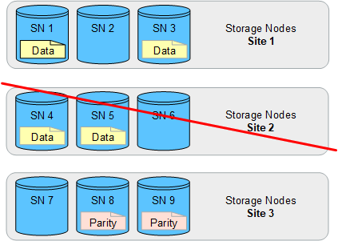

= 사이트 손실 방지
:allow-uri-read: 
:icons: font
:imagesdir: ../media/

[role="lead"]
StorageGRID 구축에 사이트가 두 개 이상 포함된 경우 적절하게 구성된 스토리지 풀과 함께 복제 및 삭제 코딩을 사용하여 사이트 손실을 보호할 수 있습니다.

복제 및 삭제 코딩에 필요한 스토리지 풀 구성은 다음과 같습니다.

* 사이트 손실 보호를 위해 복제를 사용하려면 StorageGRID 설치 중에 자동으로 생성되는 사이트별 스토리지 풀을 사용합니다. 그런 다음 여러 스토리지 풀을 지정하는 ILM 규칙을 생성하여 link:create-ilm-rule-define-placements.html["배치 지침"]각 개체의 복사본을 각 사이트에 배치합니다.
* 사이트 손실 보호를 위해 삭제 link:guidelines-for-creating-storage-pools.html#guidelines-for-storage-pools-used-for-erasure-coded-copies["여러 사이트로 구성된 스토리지 풀을 생성합니다"]코딩을 사용하려면 다음을 수행합니다. 그런 다음 여러 사이트와 사용 가능한 삭제 코딩 스키마로 구성된 스토리지 풀 하나를 사용하는 ILM 규칙을 만듭니다.

CAUTION: 사이트 손실 방지를 위해 StorageGRID 배포를 구성할 때는 및 의 영향도 고려해야 link:data-protection-options-for-ingest.html["수집 옵션"]합니다.link:../s3/consistency-controls.html["정합성"]

== 복제 예

기본적으로 StorageGRID를 설치하는 동안 각 사이트에 대해 하나의 스토리지 풀이 생성됩니다. 한 사이트만으로 구성된 스토리지 풀을 사용하면 사이트 손실 방지를 위해 복제를 사용하는 ILM 규칙을 구성할 수 있습니다. 이 예에서

* 스토리지 풀 1에는 사이트 1가 포함되어 있습니다
* 스토리지 풀 2에는 사이트 2가 포함되어 있습니다
* ILM 규칙에는 두 개의 배치가 포함되어 있습니다.
+
** 사이트 1에서 복사본 1개를 복제하여 객체를 저장합니다
** 사이트 2에서 복사본 1개를 복제하여 개체를 저장합니다

ILM 규칙 배치:

image::../media/ilm_replication_at_2_sites.png[2개 사이트에 각각 1개의 복사본 복제]

image::../media/ilm_replication_make_2_copies_2_pools_2_sites.png[2개의 사이트별 스토리지 풀에서 각각 1개의 복제본을 만듭니다]

한 사이트가 손실되면 다른 사이트에서 개체의 복사본을 사용할 수 있습니다.

== 삭제 코딩 예

스토리지 풀당 둘 이상의 사이트로 구성된 스토리지 풀을 사용하면 사이트 손실 방지를 위해 삭제 코딩을 사용하는 ILM 규칙을 구성할 수 있습니다. 이 예에서

* 스토리지 풀 1에는 사이트 1부터 3까지 포함됩니다
* ILM 규칙에는 배치 하나가 포함되어 있습니다. 세 개의 사이트가 포함된 스토리지 풀 1에서 4+2 EC 스키마를 사용하여 삭제 코딩을 사용하여 오브젝트를 저장합니다

ILM 규칙 배치:

image::../media/ilm_erasure_coding_site_loss_protection_4+2.png[EC 1 스토리지 풀 9 스토리지 노드 3개 사이트]

이 예에서

* ILM 규칙은 4+2 삭제 코딩 스키마를 사용합니다.
* 각 개체는 4개의 동일한 데이터 조각으로 분할되며 두 개의 패리티 조각은 개체 데이터에서 계산됩니다.
* 6개의 각 단편은 3개의 데이터 센터 사이트에서 서로 다른 노드에 저장되어 노드 장애 또는 사이트 손실에 대한 데이터 보호를 제공합니다.

NOTE: 삭제 코딩은 두 개의 사이트를 제외한 모든 수의 사이트가 포함된 스토리지 풀에서 허용됩니다.

4+2 삭제 코딩 체계를 사용하는 ILM 규칙:

image::../media/ec_three_sites_4_plus_2_site_loss_example_template.png[3개 사이트에 4+2 EC 스키마를 사용하여 오브젝트를 삭제 코딩하여 저장합니다]

한 사이트가 손실되어도 데이터를 복구할 수 있습니다.

