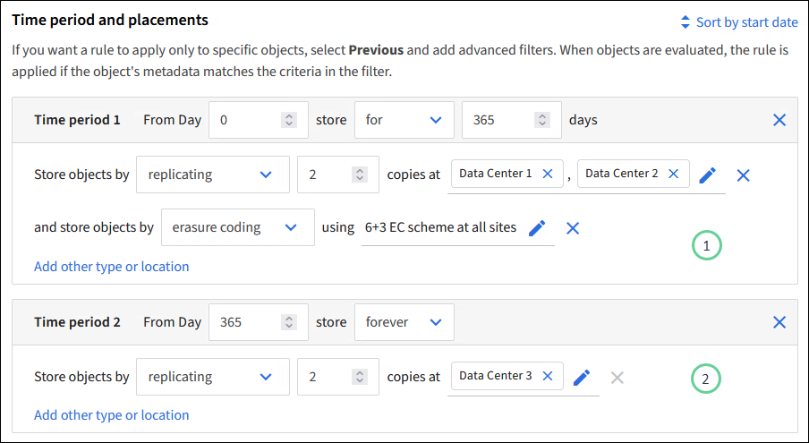

= ILM 규칙을 사용하여 오브젝트를 관리합니다
:allow-uri-read: 
:icons: font
:imagesdir: ../media/

[role="lead"]
개체를 관리하려면 ILM(정보 수명 주기 관리) 규칙 집합을 만들어 ILM 정책으로 구성합니다.

시스템으로 수집된 모든 오브젝트는 활성 정책에 따라 평가됩니다. 정책의 규칙이 개체의 메타데이터와 일치하면 규칙의 지침에 따라 StorageGRID에서 해당 개체를 복사 및 저장하기 위해 수행할 작업이 결정됩니다.

NOTE: 개체 메타데이터는 ILM 규칙에 의해 관리되지 않습니다. 대신 오브젝트 메타데이터는 메타데이터 저장소라고 하는 Cassandra 데이터베이스에 저장됩니다. 데이터가 손실되지 않도록 보호하기 위해 각 사이트에 오브젝트 메타데이터의 복사본 3개가 자동으로 유지됩니다.

== ILM 규칙 요소

ILM 규칙에는 다음 세 가지 요소가 있습니다.

* * 필터링 기준 *: 규칙의 기본 및 고급 필터는 규칙이 적용되는 개체를 정의합니다. 개체가 모든 필터와 일치하면 StorageGRID는 규칙을 적용하고 규칙의 배치 지침에 지정된 개체 복사본을 만듭니다.
* * 배치 지침 *: 규칙의 배치 지침은 개체 사본의 수, 유형 및 위치를 정의합니다. 각 규칙에는 시간에 따라 개체 복사본의 수, 유형 및 위치를 변경하는 배치 지침 시퀀스가 포함될 수 있습니다. 한 배치의 기간이 만료되면 다음 배치의 지침은 다음 ILM 평가에 의해 자동으로 적용됩니다.
* * Ingest Behavior *: 규칙의 수집 동작을 통해 규칙에 의해 필터링된 객체가 수집될 때 보호되는 방식을 선택할 수 있습니다(S3 클라이언트가 객체를 그리드에 저장하는 경우).

== ILM 규칙 필터링

ILM 규칙을 만들 때 규칙이 적용되는 개체를 식별하는 필터를 지정합니다.

가장 간단한 경우 규칙에서 필터를 사용하지 않을 수 있습니다. 필터를 사용하지 않는 규칙은 모든 개체에 적용되므로 ILM 정책의 마지막(기본) 규칙이어야 합니다. 기본 규칙은 다른 규칙의 필터와 일치하지 않는 개체에 대한 저장 지침을 제공합니다.

* 기본 필터를 사용하면 크고 서로 다른 개체 그룹에 다른 규칙을 적용할 수 있습니다. 이러한 필터를 사용하면 특정 테넌트 계정, 특정 S3 버킷 또는 둘 다에 규칙을 적용할 수 있습니다.
+
기본 필터를 사용하면 여러 개체에 다른 규칙을 간단히 적용할 수 있습니다. 예를 들어, 회사의 재무 기록을 규정 요구 사항에 맞게 저장해야 할 수 있고 마케팅 부서의 데이터를 저장하여 일상적인 운영을 용이하게 해야 할 수 있습니다. 각 부서에 대해 별도의 테넌트 계정을 생성하거나 서로 다른 부서의 데이터를 별도의 S3 버킷으로 분리한 후에는 모든 재무 레코드에 적용되는 하나의 규칙과 모든 마케팅 데이터에 적용되는 두 번째 규칙을 쉽게 생성할 수 있습니다.

* 고급 필터를 통해 세밀한 제어가 가능합니다. 필터를 만들어 다음 개체 속성을 기준으로 개체를 선택할 수 있습니다.
+
** 수집 시간
** 마지막 액세스 시간입니다
** 개체 이름의 전체 또는 일부(키)
** 위치 제약 조건(S3만 해당)
** 개체 크기
** 사용자 메타데이터
** 오브젝트 태그(S3만 해당)

매우 구체적인 기준에 따라 개체를 필터링할 수 있습니다. 예를 들어, 병원 영상 촬영 부서에서 저장한 객체는 30일 미만이고 나중에 자주 사용되지 않을 수 있으며, 환자 방문 정보가 포함된 객체는 의료 네트워크 본사의 청구 부서에 복사해야 할 수 있습니다. 오브젝트 이름, 크기, S3 오브젝트 태그 또는 기타 관련 기준을 기반으로 각 오브젝트 유형을 식별하는 필터를 생성한 다음, 각 오브젝트 세트를 적절히 저장하는 별도의 규칙을 생성할 수 있습니다.

필요에 따라 필터를 단일 규칙으로 결합할 수 있습니다. 예를 들어, 마케팅 부서는 큰 이미지 파일을 공급업체 기록과 다르게 저장하기를 원할 수 있으며 인사 부서에서는 특정 지역 및 정책 정보에 직원 레코드를 중앙 집중식으로 저장해야 할 수 있습니다. 이 경우 테넌트 계정을 기준으로 필터링하여 각 부서의 레코드를 분리하는 규칙을 만드는 한편, 각 규칙의 필터를 사용하여 규칙이 적용되는 특정 유형의 개체를 식별할 수 있습니다.

== ILM 규칙 배치 지침

배치 지침은 오브젝트 데이터의 저장 위치, 시기 및 방법을 결정합니다. ILM 규칙에는 하나 이상의 배치 지침이 포함될 수 있습니다. 각 배치 지침은 단일 기간에 적용됩니다.

배치 지침을 작성할 때:

* 시작 시간은 참조 시간을 지정하며, 이 시간은 배치 지침이 시작되는 시점을 결정합니다. 참조 시간은 개체가 수집되거나, 개체에 액세스할 때, 버전이 지정된 개체가 최신 상태가 아니거나, 사용자가 정의한 시간이 될 수 있습니다.
* 그런 다음 참조 시간을 기준으로 배치 적용 시점을 지정합니다. 예를 들어, 오브젝트가 수집된 시점을 기준으로 0일부터 365일 동안 배치가 시작될 수 있습니다.
* 마지막으로 복사본의 유형(복제 또는 삭제 코딩) 및 복사본이 저장되는 위치를 지정합니다. 예를 들어 두 개의 복제된 복사본을 서로 다른 사이트에 저장할 수 있습니다.

각 규칙은 단일 기간에 대해 여러 배치를 정의하고 다른 기간에 대해 여러 배치를 정의할 수 있습니다.

* 단일 기간 동안 여러 위치에 오브젝트를 배치하려면 * 다른 유형 또는 위치 추가 * 를 선택하여 해당 기간에 대해 두 개 이상의 라인을 추가합니다.
* 다른 기간의 다른 위치에 오브젝트를 배치하려면 * 다른 기간 추가 * 를 선택하여 다음 기간을 추가합니다. 그런 다음 기간 내에 하나 이상의 라인을 지정합니다.

이 예에서는 ILM 규칙 생성 마법사의 배치 정의 페이지에 있는 두 가지 배치 지침을 보여 줍니다.

첫 번째 배치 지침에는 image:../media/icon_number_1.png["아이콘 번호 1"]첫 해에 대한 두 줄이 있습니다.

* 첫 번째 줄에서는 두 개의 데이터 센터 사이트에 두 개의 복제된 개체 복사본을 만듭니다.
* 두 번째 줄에서는 모든 데이터 센터 사이트를 사용하여 6+3 삭제 코딩 복사본을 생성합니다.

두 번째 배치 지침에서는 image:../media/icon_number_2.png["아이콘 번호 1"]1년 후에 두 개의 복사본을 만들고 이 복사본을 영구적으로 유지합니다.

규칙에 대한 배치 지침 집합을 정의할 때는 적어도 1개의 배치 지침이 0일차에 시작되는지, 정의한 기간 사이에 간격이 없는지 확인해야 합니다. 그리고 최종 배치 지침은 영구 또는 더 이상 오브젝트 복사본이 필요하지 않을 때까지 계속됩니다.

규칙의 각 기간이 만료되면 다음 기간에 대한 콘텐츠 배치 지침이 적용됩니다. 새 오브젝트 복사본이 생성되고 불필요한 복사본이 삭제됩니다.

== ILM 규칙 수집 동작

수집 동작은 규칙의 지침에 따라 오브젝트 복사본을 즉시 배치할지, 중간 복사본을 만들어 나중에 배치 지침을 적용할지 여부를 제어합니다. ILM 규칙에 대해 다음과 같은 수집 동작을 사용할 수 있습니다.

* * 균형 *: StorageGRID는 수집 시 ILM 규칙에 지정된 모든 복제본을 생성하려고 합니다. 그렇지 않을 경우 중간 복사본이 만들어지고 클라이언트에 성공적으로 반환됩니다. ILM 규칙에 지정된 복사본은 가능한 경우 만들어집니다.
* * Strict * : ILM 규칙에 지정된 모든 사본은 클라이언트에 반환되기 전에 만들어야 합니다.
* * 이중 커밋 *: StorageGRID은 즉시 개체의 임시 복사본을 만들고 클라이언트에 성공을 반환합니다. ILM 규칙에 지정된 복사본은 가능한 경우 만들어집니다.

.관련 정보
* link:data-protection-options-for-ingest.html["수집 옵션"]
* link:advantages-disadvantages-of-ingest-options.html["수집 옵션의 장점, 단점 및 제한 사항"]
* link:../s3/consistency.html#how-consistency-and-ILM-rules-interact["일관성과 ILM 규칙이 데이터 보호에 영향을 미치는 방식"]

== ILM 규칙 예

예를 들어 ILM 규칙에서 다음을 지정할 수 있습니다.

* 테넌트 A에 속하는 객체에만 적용합니다
* 이러한 개체의 복제 복사본을 두 개 만들고 각 복사본을 다른 사이트에 저장합니다.
* 두 개의 복사본을 "영원히" 보존합니다. 즉, StorageGRID에서 자동으로 삭제하지 않습니다. 대신, StorageGRID는 이러한 객체가 클라이언트 삭제 요청에 의해 삭제되거나 버킷 수명 주기가 만료될 때까지 해당 객체를 유지합니다.
* 수집 동작에 균형 옵션을 사용합니다. 필요한 두 복제본을 모두 즉시 생성할 수 없는 경우 테넌트 A가 StorageGRID에 객체를 저장하는 즉시 2개 사이트 배치 명령이 적용됩니다.
+
예를 들어 테넌트 A가 객체를 저장할 때 사이트 2에 연결할 수 없는 경우 StorageGRID는 사이트 1의 스토리지 노드에 두 개의 중간 복제본을 만듭니다. 사이트 2를 사용할 수 있게 되면 StorageGRID는 해당 사이트에서 필요한 복사본을 만듭니다.

.관련 정보
* link:what-storage-pool-is.html["스토리지 풀이란 무엇입니까"]
* link:what-cloud-storage-pool-is.html["클라우드 스토리지 풀이란 무엇입니까"]

