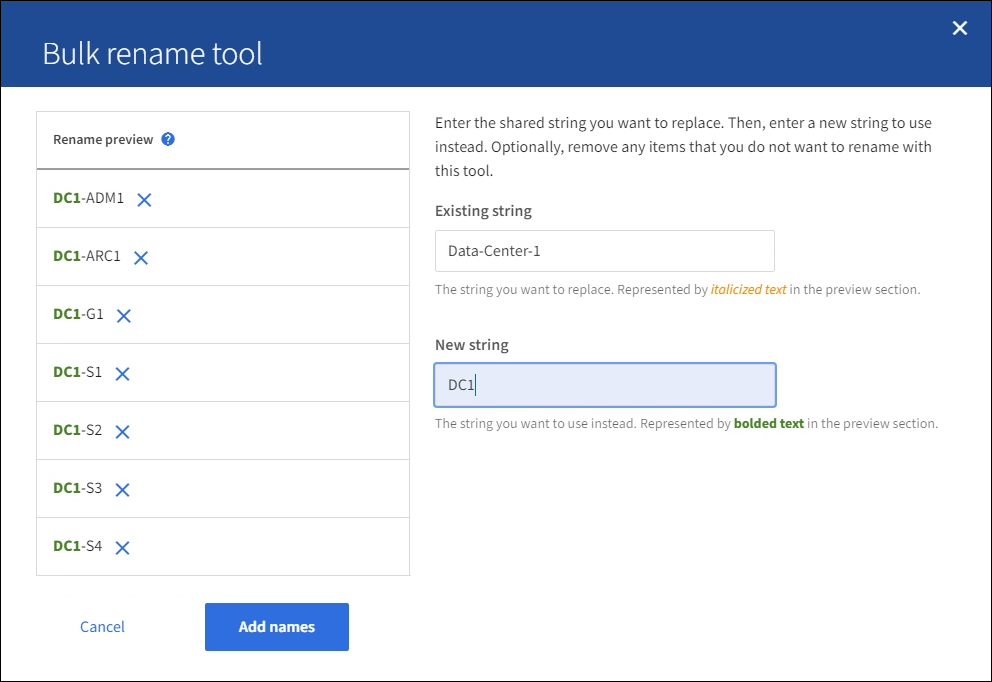

= 표시 이름을 추가하거나 업데이트합니다
:allow-uri-read: 
:icons: font
:imagesdir: ../media/

[role="lead"]
이 절차를 사용하여 그리드, 사이트 및 노드에 사용되는 표시 이름을 추가하거나 업데이트할 수 있습니다. 단일 항목, 여러 항목 또는 모든 항목의 이름을 동시에 변경할 수 있습니다. 표시 이름을 정의하거나 업데이트해도 StorageGRID 작업에는 영향을 주지 않습니다.

.시작하기 전에
* 모든 관리 노드에서 다음을 사용하여 Grid Manager에 로그인합니다.link:../admin/web-browser-requirements.html["지원되는 웹 브라우저"] .
* 이 link:../admin/admin-group-permissions.html["유지 관리 또는 루트 액세스 권한"]있습니다.
* 프로비저닝 암호가 있습니다.
* 표시 이름의 요구사항 및 모범 사례를 이해합니다. 을 link:../maintain/rename-grid-site-node-overview.html["그리드, 사이트 및 노드의 이름을 바꿉니다"]참조하십시오.

== 그리드, 사이트 또는 노드의 이름을 바꾸는 방법

StorageGRID 시스템, 하나 이상의 사이트 또는 하나 이상의 노드 이름을 바꿀 수 있습니다.

이름 바꾸로 인해 표시 이름이나 시스템 이름이 중복되지 않는 한, 다른 노드에서 이전에 사용한 표시 이름을 사용할 수 있습니다.

=== 이름을 바꿀 항목을 선택합니다

시작하려면 이름을 바꿀 항목을 선택합니다.

.단계
. *유지관리* > *작업* > *그리드, 사이트 및 노드 이름 바꾸기*를 선택합니다.
. 이름 선택 * 단계에서 이름을 바꿀 항목을 선택합니다.
+
[cols="1a,2a"]
|===
| 변경할 항목입니다 | 지침 

 a| 
시스템의 모든 이름(또는 거의 모든 이름)입니다
 a| 
.. Select All * 을 선택합니다.
.. 선택적으로 이름을 바꾸지 않을 항목을 지웁니다.

 a| 
그리드의 이름입니다
 a| 
그리드의 확인란을 선택합니다.

 a| 
사이트 이름 및 해당 노드의 일부 또는 전입니다
 a| 
.. 사이트의 표 머리글에서 확인란을 선택합니다.
.. 필요에 따라 이름을 바꾸지 않을 노드의 선택을 취소합니다.

 a| 
사이트의 이름입니다
 a| 
사이트의 확인란을 선택합니다.

 a| 
노드의 이름입니다
 a| 
노드의 확인란을 선택합니다.

|===
. Continue * 를 선택합니다.
. 선택한 항목이 포함된 표를 검토합니다.
+
** 표시 이름 * 열에는 각 항목의 현재 이름이 표시됩니다. 항목의 이름을 바꾼 적이 없으면 표시 이름은 해당 시스템 이름과 같습니다.
** 시스템 이름 * 열에는 설치 중에 각 항목에 입력한 이름이 표시됩니다. 시스템 이름은 내부 StorageGRID 작업에 사용되며 변경할 수 없습니다. 예를 들어 노드의 시스템 이름은 호스트 이름일 수 있습니다.
** Type * 열은 항목의 유형(그리드, 사이트 또는 특정 노드 유형)을 나타냅니다.

=== 새 이름 제안

새 이름 제안 * 단계에서는 각 항목의 표시 이름을 개별적으로 입력하거나 항목 이름을 대량으로 바꿀 수 있습니다.

[role="tabbed-block"]
====
.항목 이름을 개별적으로 변경합니다
--
다음 단계에 따라 이름을 바꾸려는 각 항목의 표시 이름을 입력합니다.

.단계
. 표시 이름 * 필드에 목록의 각 항목에 대해 제안된 표시 이름을 입력합니다.
+
명명 요구 사항에 대한 자세한 내용은 을 link:../maintain/rename-grid-site-node-overview.html["그리드, 사이트 및 노드의 이름을 바꿉니다"]참조하십시오.

. 이름을 바꾸지 않을 항목을 제거하려면 * 목록에서 제거 * 열을 선택합니다image:../media/icon-x-to-remove.png["X 아이콘"].
+
항목의 새 이름을 제안하지 않을 경우에는 테이블에서 해당 이름을 제거해야 합니다.

. 테이블의 모든 항목에 대해 새 이름을 제안했으면 * Rename * 을 선택합니다.
+
성공 메시지가 나타납니다. 이제 그리드 관리자 전체에서 새 표시 이름이 사용됩니다.

--
.항목 이름을 대량으로 변경합니다
--
항목 이름이 다른 문자열로 바꿀 공통 문자열을 공유하는 경우 일괄 이름 바꾸기 도구를 사용합니다.

.단계
. 새 이름 제안 * 단계에서 * 대량 이름 바꾸기 도구 사용 * 을 선택합니다.
+
이름 바꾸기 미리 보기 * 에는 * 새 이름 제안 * 단계에 대해 표시된 모든 항목이 포함됩니다. 미리 보기를 사용하여 공유 문자열을 교체한 후 표시 이름이 어떻게 표시되는지 확인할 수 있습니다.

. 기존 문자열 * 필드에 바꾸려는 공유 문자열을 입력합니다. 예를 들어, 바꾸려는 문자열이 인 `Data-Center-1` 경우 * Data-Center-1 * 을 입력합니다.
+
입력할 때 텍스트는 왼쪽 이름에 있는 모든 위치에 강조 표시됩니다.

. 이 도구로 이름을 바꾸지 않을 항목을 제거하려면 선택합니다image:../media/icon-x-to-remove.png["X 아이콘"].
+
예를 들어 문자열을 포함하는 모든 노드의 이름을 바꾸지만 사이트 자체의 이름을 바꾸지 않으려는 `Data-Center-1` 경우를 가정해 `Data-Center-1` 봅니다. 이름 바꾸기 미리 보기에서 사이트를 제거하려면 선택합니다image:../media/icon-x-to-remove.png["X 아이콘"].

+
image::../media/rename-bulk-rename-tool.png[이전에 대량 이름 바꾸기 도구]

. 새 문자열 * 필드에 대신 사용할 대체 문자열을 입력합니다. 예를 들어 * DC1 * 을 입력합니다.
+
명명 요구 사항에 대한 자세한 내용은 을 link:../maintain/rename-grid-site-node-overview.html["그리드, 사이트 및 노드의 이름을 바꿉니다"]참조하십시오.

+
대체 문자열을 입력하면 왼쪽에 있는 이름이 업데이트되므로 새 이름이 올바른지 확인할 수 있습니다.

+

. 미리 보기에 표시된 이름이 만족스러우면 * 이름 추가 * 를 선택하여 * 새 이름 제안 * 단계에 대한 이름을 테이블에 추가합니다.
. 필요한 항목을 추가로 변경하거나 image:../media/icon-x-to-remove.png["X 아이콘"]이름을 바꾸지 않을 항목을 모두 제거합니다.
. 테이블의 모든 항목의 이름을 바꿀 준비가 되면 * Rename * 을 선택합니다.
+
성공 메시지가 표시됩니다. 이제 그리드 관리자 전체에서 새 표시 이름이 사용됩니다.

--
====

=== [[download-recovery-package]]복구 패키지를 다운로드하세요

항목 이름 변경이 끝나면 새로운 복구 패키지를 다운로드하여 저장하세요.  이름을 바꾼 항목의 새 표시 이름은 다음에 포함됩니다. `Passwords.txt` 파일.

.단계
. 프로비저닝 암호를 입력합니다.
. 복구 패키지 다운로드 * 를 선택합니다.
+
다운로드가 즉시 시작됩니다.

. 다운로드가 완료되면 파일을 열어 `Passwords.txt` 모든 노드의 서버 이름과 이름이 바뀐 노드의 표시 이름을 확인합니다.
.  `sgws-recovery-package-_id-revision_.zip`파일을 안전하고 안전한 두 개의 별도 위치에 복사합니다.
+

CAUTION: 복구 패키지 파일은 StorageGRID 시스템에서 데이터를 얻는 데 사용할 수 있는 암호화 키와 비밀번호가 포함되어 있으므로 보호되어야 합니다.

. 첫 번째 단계로 돌아가려면 * 마침 * 을 선택합니다.

== 표시 이름을 시스템 이름으로 되돌립니다

이름이 바뀐 그리드, 사이트 또는 노드를 원래 시스템 이름으로 되돌릴 수 있습니다. 항목을 시스템 이름으로 되돌리면 그리드 관리자 페이지 및 기타 StorageGRID 위치에 해당 항목의 * 표시 이름 * 이 더 이상 표시되지 않습니다. 항목의 시스템 이름만 표시됩니다.

.단계
. *유지관리* > *작업* > *그리드, 사이트 및 노드 이름 바꾸기*를 선택합니다.
. 이름 선택 * 단계에서 시스템 이름으로 되돌리려는 항목을 선택합니다.
. Continue * 를 선택합니다.
. 새 이름 제안 * 단계에서는 표시 이름을 개별적으로 또는 대량으로 시스템 이름으로 되돌립니다.
+
[role="tabbed-block"]
====
.시스템 이름으로 개별적으로 되돌립니다
--
.. 각 항목의 원래 시스템 이름을 복사하여 * 표시 이름 * 필드에 붙여 넣거나, 되돌리지 않을 항목을 제거하려면 선택합니다image:../media/icon-x-to-remove.png["X 아이콘"].
+
표시 이름을 되돌리려면 시스템 이름이 * 표시 이름 * 필드에 나타나야 하지만 이름은 대소문자를 구분하지 않습니다.

.. 이름 바꾸기 * 를 선택합니다.
+
성공 메시지가 나타납니다. 이러한 항목의 표시 이름은 더 이상 사용되지 않습니다.

--
.시스템 이름으로 일괄 되돌리기
--
.. 새 이름 제안 * 단계에서 * 대량 이름 바꾸기 도구 사용 * 을 선택합니다.
.. 기존 문자열 * 필드에 바꿀 표시 이름 문자열을 입력합니다.
.. 새 문자열 * 필드에 대신 사용할 시스템 이름 문자열을 입력합니다.
.. 새 이름 제안 * 단계에 대한 이름을 테이블에 추가하려면 * 이름 추가 * 를 선택합니다.
.. Display name* 필드의 각 항목이 * System name* 필드의 이름과 일치하는지 확인합니다. 변경하거나 되돌리지 않을 항목을 제거하려면 선택합니다image:../media/icon-x-to-remove.png["X 아이콘"].
+
표시 이름을 되돌리려면 시스템 이름이 * 표시 이름 * 필드에 나타나야 하지만 이름은 대소문자를 구분하지 않습니다.

.. 이름 바꾸기 * 를 선택합니다.
+
성공 메시지가 표시됩니다. 이러한 항목의 표시 이름은 더 이상 사용되지 않습니다.

--
====
. <<download-recovery-package,새로운 복구 패키지를 다운로드하고 저장하세요>> .
+
되돌린 항목의 표시 이름은 더 이상 파일에 포함되지 `Passwords.txt` 않습니다.

