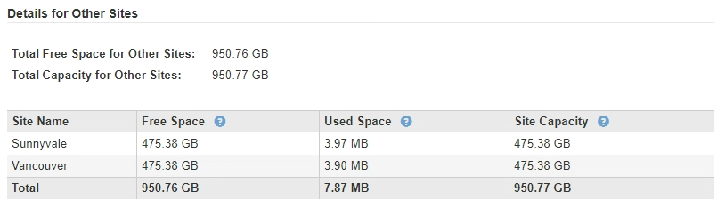

= 2단계: 세부 정보 보기
:allow-uri-read: 
:icons: font
:imagesdir: ../media/

[role="lead"]
서비스 해제 사이트 마법사의 2단계(세부 정보 보기)에서 사이트에 포함된 노드를 검토하고 각 스토리지 노드에서 사용된 공간의 양을 확인하고 그리드의 다른 사이트에서 사용 가능한 여유 공간의 양을 평가할 수 있습니다.

.시작하기 전에
사이트를 해제하기 전에 사이트에 있는 개체 데이터의 양을 검토해야 합니다.

* 연결된 사이트 파기 작업을 수행하는 경우 ILM을 업데이트하기 전에 현재 사이트에 있는 개체 데이터의 양을 이해해야 합니다. 사이트 용량과 데이터 보호 요구사항에 따라 새로운 ILM 규칙을 생성하여 데이터를 다른 사이트로 이동하거나 사이트에서 오브젝트 데이터를 삭제할 수 있습니다.
* 가능한 경우 서비스 해제 절차를 시작하기 전에 필요한 스토리지 노드 확장을 수행합니다.
* 연결이 끊긴 사이트를 사용 중지하는 경우 사이트를 제거할 때 개체 데이터에 영구적으로 액세스할 수 없게 되는 양을 이해해야 합니다.

CAUTION: 연결이 끊긴 사이트를 사용 중지하는 경우 ILM은 개체 데이터를 이동하거나 삭제할 수 없습니다. 사이트에 남아 있는 데이터는 모두 손실됩니다. 하지만 ILM 정책을 통해 단일 사이트의 손실로부터 보호할 수 있었던 경우 오브젝트 데이터 복사본은 나머지 사이트에 여전히 존재합니다. 을 link:../ilm/using-multiple-storage-pools-for-cross-site-replication.html["사이트 손실 방지"]참조하십시오.

.단계
. 2단계(세부 정보 보기)에서 제거하려는 사이트와 관련된 경고를 검토합니다.
+
image::../media/decommission_site_step_2_site_warnings.png[사이트 서비스 해제 2단계 사이트 경고]

+
다음과 같은 경우 경고가 나타납니다.

+
** 이 사이트에는 게이트웨이 노드가 포함되어 있습니다. S3 클라이언트가 현재 이 노드에 접속하는 경우 다른 사이트에서 해당 노드를 구성해야 합니다. 서비스 해제 절차를 계속하기 전에 클라이언트가 교체 노드에 연결할 수 있는지 확인하십시오.
** 사이트에는 연결된 노드()와 분리된 노드(image:../media/icon_alarm_gray_administratively_down.png["아이콘 알람 회색(관리자 아래"]또는image:../media/icon_alarm_blue_unknown.png["아이콘 경보 파란색 알 수 없음"])가 혼합되어image:../media/icon_alert_green_checkmark.png["아이콘 경고 녹색 확인 표시"] 있습니다. 이 사이트를 제거하려면 먼저 오프라인 노드를 모두 다시 온라인 상태로 전환해야 합니다.

. 제거하려는 사이트에 대한 세부 정보를 검토합니다.
+
image::../media/decommission_site_step_2_view_details.png[사이트 서비스 해제 2단계 세부 정보 보기]

+
선택한 사이트에 대해 다음 정보가 포함됩니다.

+
** 노드 수
** 사이트에 있는 모든 스토리지 노드의 총 사용 공간, 사용 가능한 공간 및 용량입니다.
+
*** 연결된 사이트 서비스 해제의 경우 * Used Space * 값은 다른 사이트로 이동하거나 ILM을 통해 삭제해야 하는 개체 데이터의 양을 나타냅니다.
*** 연결이 끊어진 사이트의 경우 * Used Space * 값은 사이트를 제거할 때 액세스할 수 없는 개체 데이터의 양을 나타냅니다.

** 노드 이름, 유형 및 연결 상태:
+
*** image:../media/icon_alert_green_checkmark.png["아이콘 경고 녹색 확인 표시"] (연결됨)
*** image:../media/icon_alarm_gray_administratively_down.png["아이콘 알람 회색(관리자 아래"] (사용자 중단)
*** image:../media/icon_alarm_blue_unknown.png["아이콘 경보 파란색 알 수 없음"] (알 수 없음)

** 각 노드에 대한 세부 정보:
+
*** 각 스토리지 노드에 대해 오브젝트 데이터에 사용된 공간의 양입니다.
*** 관리 노드 및 게이트웨이 노드의 경우 노드가 현재 고가용성(HA) 그룹에서 사용되고 있는지 여부를 나타냅니다. HA 그룹에서 사용되는 관리 노드 또는 게이트웨이 노드는 서비스 해제할 수 없습니다. 서비스 해제를 시작하기 전에 HA 그룹을 편집하여 사이트의 모든 노드를 제거하거나, 이 사이트의 노드만 포함하는 HA 그룹을 제거하십시오. 자세한 내용은 을 link:../admin/managing-high-availability-groups.html["고가용성(HA) 그룹 관리"]참조하십시오.

. 페이지의 다른 사이트에 대한 세부 정보 섹션에서 그리드의 다른 사이트에서 사용 가능한 공간을 평가합니다.
+

+
연결된 사이트를 사용 중지하고 ILM을 사용하여 선택한 사이트에서 오브젝트 데이터를 이동하려는 경우(삭제만 하는 것이 아니라) 다른 사이트의 용량이 이동된 데이터를 수용할 수 있을 만큼 충분한지, 그리고 향후 성장을 위해 적절한 용량이 남아 있는지 확인해야 합니다.

+

NOTE: 제거하려는 사이트의 * 사용된 공간 * 이 * 다른 사이트의 총 여유 공간 * 보다 큰 경우 경고가 나타납니다. 사이트를 제거한 후 적절한 스토리지 용량을 사용할 수 있도록 하려면 이 절차를 수행하기 전에 확장을 수행해야 할 수 있습니다.

. 다음 * 을 선택합니다.
+
3단계(ILM 정책 수정)가 나타납니다.

