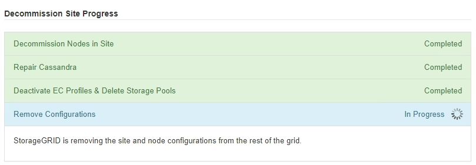
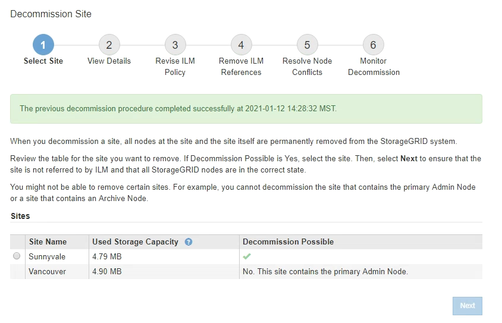

= 6단계: 서비스 해제 모니터링
:allow-uri-read: 
:icons: font
:imagesdir: ../media/

[role="lead"]
서비스 해제 사이트 페이지 마법사의 6단계(서비스 해제 모니터링)에서 사이트가 제거될 때 진행 상황을 모니터링할 수 있습니다.

.이 작업에 대해
StorageGRID에서 연결된 사이트를 제거하면 다음 순서로 노드가 제거됩니다.

. 게이트웨이 노드
. 관리자 노드
. 스토리지 노드

StorageGRID에서 연결이 끊긴 사이트를 제거하면 다음 순서로 노드가 제거됩니다.

. 게이트웨이 노드
. 스토리지 노드
. 관리자 노드

각 게이트웨이 노드 또는 관리 노드를 제거하는 데 몇 분 또는 1시간이 소요될 수 있지만 스토리지 노드는 며칠 또는 몇 주가 걸릴 수 있습니다.

.단계
. 새 복구 패키지가 생성되는 즉시 파일을 다운로드합니다.
+
image::../media/decommission_site_step_6_recovery_package.png[사이트 서비스 해제 단계 6 복구 패키지]

+

NOTE: 서비스 해제 절차 중 문제가 발생한 경우 그리드를 복구할 수 있도록 가능한 한 빨리 복구 패키지를 다운로드합니다.

+
.. 메시지에서 링크를 선택하거나 * 유지보수 * > * 시스템 * > * 복구 패키지 * 를 선택합니다.
..  `.zip`파일을 다운로드합니다.
+
의 지침을 link:downloading-recovery-package.html["복구 패키지를 다운로드하는 중입니다"]참조하십시오.

+

NOTE: 복구 패키지 파일은 StorageGRID 시스템에서 데이터를 가져오는 데 사용할 수 있는 암호화 키 및 암호가 포함되어 있으므로 안전하게 보호해야 합니다.

. 데이터 이동 차트를 사용하여 이 사이트에서 다른 사이트로 개체 데이터의 이동을 모니터링합니다.
+
3단계에서 새로운 ILM 정책을 활성화했을 때 데이터 이동이 시작되었습니다(ILM 정책 수정). 서비스 해제 절차 중에 데이터 이동이 발생합니다.

+
image::../media/decommission_site_step_6_data_movement.png[사이트 서비스 해제 6단계 데이터 이동]

. 페이지의 노드 진행 섹션에서 노드가 제거될 때 서비스 해제 절차의 진행 상황을 모니터링합니다.
+
스토리지 노드를 제거하면 각 노드가 일련의 단계를 거칩니다. 이러한 단계의 대부분은 신속하게 또는 심지어 눈에 띄지 않게 발생하지만 이동해야 할 데이터의 양에 따라 다른 단계가 완료될 때까지 며칠 또는 몇 주를 기다려야 할 수 있습니다. 삭제 코딩 데이터를 관리하고 ILM을 재평가하기 위해 추가 시간이 필요합니다.

+
image::../media/decommission_site_step_6_storage_node.png[사이트 서비스 해제 6단계 스토리지 노드]

+
연결된 사이트 서비스 해제의 진행률을 모니터링하는 경우 이 표를 참조하여 스토리지 노드의 서비스 해제 단계를 파악할 수 있습니다.

+
[cols="1a,2a"]
|===
| 단계 | 예상 기간 

 a| 
보류 중
 a| 
분 이하

 a| 
잠금 대기
 a| 
분

 a| 
작업 준비
 a| 
분 이하

 a| 
LDR 사용 중지 표시
 a| 
분

 a| 
복제 및 삭제 해제 - 코드 데이터
 a| 
데이터 양을 기준으로 한 시간, 일 또는 주

* 참고 *: 다른 유지보수 활동을 수행해야 하는 경우 이 단계 동안 사이트 파기를 일시 중지할 수 있습니다.

 a| 
LDR 설정 상태
 a| 
분

 a| 
감사 대기열 플러시
 a| 
메시지 수 및 네트워크 대기 시간을 기준으로 분~시간

 a| 
완료
 a| 
분

|===
+
연결이 끊긴 사이트 서비스 해제의 진행률을 모니터링하는 경우 이 표를 참조하여 스토리지 노드의 서비스 해제 단계를 파악할 수 있습니다.

+
[cols="1a,1a"]
|===
| 단계 | 예상 기간 

 a| 
보류 중
 a| 
분 이하

 a| 
잠금 대기
 a| 
분

 a| 
작업 준비
 a| 
분 이하

 a| 
외부 서비스를 비활성화합니다
 a| 
분

 a| 
인증서 해지
 a| 
분

 a| 
노드 등록 취소
 a| 
분

 a| 
스토리지 등급 등록 취소
 a| 
분

 a| 
스토리지 그룹 제거
 a| 
분

 a| 
도면요소 제거
 a| 
분

 a| 
완료
 a| 
분

|===
. 모든 노드가 완료 단계에 도달한 후 나머지 사이트 서비스 해제 작업이 완료될 때까지 기다립니다.
+
** Cassandra * 복구 단계 중, StorageGRID은 귀사의 그리드에 남아 있는 Cassandra 클러스터를 수정합니다. 그리드에 남아 있는 스토리지 노드 수에 따라 이러한 복구에는 며칠 이상이 걸릴 수 있습니다.
+
image::../media/decommission_site_step_6_repair_cassandra.png[사이트 서비스 해제 6단계 Cassandra 복구]

** EC 프로파일 비활성화 및 스토리지 풀 삭제 * 단계에서 다음 ILM이 변경됩니다.
+
*** 사이트를 참조한 모든 삭제 코딩 프로필이 비활성화됩니다.
*** 사이트를 참조하는 모든 스토리지 풀이 삭제됩니다.
+

NOTE: 모든 스토리지 노드 스토리지 풀(StorageGRID 11.6 이하)은 모든 사이트 사이트를 사용하므로 제거됩니다.

** 마지막으로, * 구성 제거 * 단계에서 사이트 및 해당 노드에 대한 나머지 참조는 그리드의 나머지 부분에서 제거됩니다.
+

. 서비스 해제 절차가 완료되면 서비스 해제 사이트 페이지에 성공 메시지가 표시되고 제거된 사이트가 더 이상 표시되지 않습니다.
+

.작업을 마친 후
사이트 서비스 해제 절차를 완료한 후 다음 작업을 완료합니다.

* 해체된 사이트에 있는 모든 스토리지 노드의 드라이브가 깨끗하게 지워졌는지 확인합니다. 상용 데이터 삭제 도구 또는 서비스를 사용하여 드라이브에서 데이터를 영구적으로 안전하게 제거합니다.
* 사이트에 하나 이상의 관리 노드가 포함되어 있고 StorageGRID 시스템에 SSO(Single Sign-On)가 설정되어 있는 경우 AD FS(Active Directory Federation Services)에서 사이트에 대한 모든 신뢰할 수 있는 상대 트러스트를 제거합니다.
* 연결된 사이트 서비스 해제 절차의 일부로 노드의 전원이 자동으로 정상적으로 꺼진 후 연결된 가상 머신을 제거합니다.

