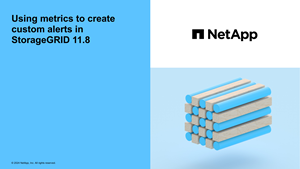

= 알림을 관리합니다
:allow-uri-read: 
:icons: font
:imagesdir: ../media/

[role="lead"]
이 경고 시스템은 StorageGRID 작동 중에 발생할 수 있는 문제를 감지, 평가 및 해결하기 위한 사용이 간편한 인터페이스를 제공합니다.

알림은 알림 규칙 조건이 true로 평가될 때 특정 심각도 수준에서 트리거됩니다. 경고가 트리거되면 다음 작업이 수행됩니다.

* 그리드 관리자의 대시보드에 경고 심각도 아이콘이 표시되고 현재 경고의 수가 증가합니다.
* 이 알림은 * nodes * 요약 페이지와 * nodes * > *_node_ * > * Overview * 탭에 표시됩니다.
* SMTP 서버를 구성하고 수신자에 대한 이메일 주소를 제공한 경우 이메일 알림이 전송됩니다.
* StorageGRID SNMP 에이전트를 구성한 경우 SNMP(Simple Network Management Protocol) 알림이 전송됩니다.

사용자 지정 알림을 생성하고, 알림을 편집 또는 비활성화하고, 경고 알림을 관리할 수 있습니다.

자세한 내용:

* 비디오 검토: https://netapp.hosted.panopto.com/Panopto/Pages/Viewer.aspx?id=2eea81c5-8323-417f-b0a0-b1ff008506c1["비디오: 경고 개요"^]
+
[link=https://netapp.hosted.panopto.com/Panopto/Pages/Viewer.aspx?id=2eea81c5-8323-417f-b0a0-b1ff008506c1]
image::../media/video-screenshot-alert-overview-118.png[비디오: 경고 개요]

* 비디오 검토: https://netapp.hosted.panopto.com/Panopto/Pages/Viewer.aspx?id=54af90c4-9a38-4136-9621-b1ff008604a3["비디오: 사용자 지정 경고"^]
+
[link=https://netapp.hosted.panopto.com/Panopto/Pages/Viewer.aspx?id=54af90c4-9a38-4136-9621-b1ff008604a3]

* 를 link:alerts-reference.html["경고 참조"]참조하십시오.

