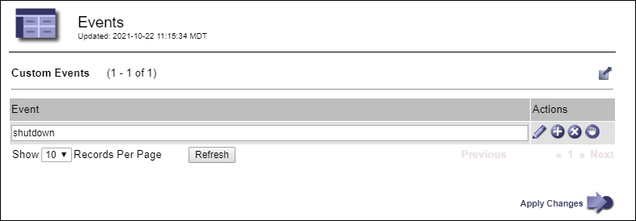

= 이벤트를 모니터링합니다
:allow-uri-read: 
:icons: font
:imagesdir: ../media/

[role="lead"]
syslog 서버에 기록된 이벤트를 추적하기 위해 만든 사용자 지정 이벤트를 포함하여 그리드 노드에서 감지한 이벤트를 모니터링할 수 있습니다. 가장 최근의 이벤트에 대한 자세한 내용은 그리드 관리자에 표시된 마지막 이벤트 메시지를 참조하십시오.

이벤트 메시지는 로그 파일에도 `/var/local/log/bycast-err.log` 표시됩니다. 를 link:logs-files-reference.html["로그 파일 참조"]참조하십시오.

SMTT(Total events) 알람은 네트워크 문제, 정전 또는 업그레이드와 같은 문제로 인해 반복적으로 발생할 수 있습니다. 이 섹션에서는 이러한 알람이 발생한 이유를 보다 잘 이해할 수 있도록 이벤트 조사에 대한 정보를 제공합니다. 알려진 문제로 인해 이벤트가 발생한 경우 이벤트 카운터를 다시 설정하는 것이 안전합니다.

.단계
. 각 그리드 노드에 대한 시스템 이벤트를 검토합니다.
+
.. 지원 * > * 도구 * > * 그리드 토폴로지 * 를 선택합니다.
.. site_ * > *_GRID node_ * > * SSM * > * Events * > * Overview * > * Main * 을 선택합니다.

. 이전 이벤트 메시지의 목록을 생성하여 이전에 발생한 문제를 격리할 수 있습니다.
+
.. 지원 * > * 도구 * > * 그리드 토폴로지 * 를 선택합니다.
.. site_ * > *_GRID node_ * > * SSM * > * Events * > * Reports * 를 선택합니다.
.. 텍스트 * 를 선택합니다.
+
마지막 이벤트 * 속성은 에 표시되지 link:using-charts-and-reports.html["차트 보기"]않습니다. 보기:

.. 속성 * 을 * 마지막 이벤트 * 로 변경합니다.
.. 필요에 따라 * 빠른 쿼리 * 의 기간을 선택합니다.
.. Update * 를 선택합니다.
+
image::../media/events_report.gif[이벤트 페이지]

== 사용자 지정 syslog 이벤트를 생성합니다

사용자 지정 이벤트를 사용하면 syslog 서버에 기록된 모든 커널, 데몬, 오류 및 중요한 수준 사용자 이벤트를 추적할 수 있습니다. 사용자 지정 이벤트는 시스템 로그 메시지(네트워크 보안 이벤트 및 하드웨어 장애)의 발생을 모니터링하는 데 유용할 수 있습니다.

.이 작업에 대해
반복되는 문제를 모니터링하려면 사용자 지정 이벤트를 만드는 것이 좋습니다. 사용자 지정 이벤트에는 다음 고려 사항이 적용됩니다.

* 사용자 지정 이벤트가 생성되면 이벤트가 발생할 때마다 모니터링됩니다.
* 파일의 키워드를 기반으로 사용자 지정 이벤트를 생성하려면 `/var/local/log/messages` 해당 파일의 로그는 다음과 같아야 합니다.
+
** 커널에 의해 생성됩니다
** 오류 또는 위험 수준에서 데몬 또는 사용자 프로그램에 의해 생성됩니다

*참고:* 파일의 모든 항목이 위에 명시된 요구 사항을 충족하지 않는 한 일치하지는 않습니다 `/var/local/log/messages`.

.단계
. 지원 * > * 알람(레거시) * > * 사용자 정의 이벤트 * 를 선택합니다.
. Edit *  (또는 첫 번째 이벤트가 아닌 경우 * Insert *image:../media/icon_nms_insert.gif["더하기 아이콘"])를 클릭합니다image:../media/icon_nms_edit.gif["연필 아이콘"].
. shutdown 과 같은 사용자 지정 이벤트 문자열을 입력합니다
+

. Apply Changes * 를 선택합니다.
. 지원 * > * 도구 * > * 그리드 토폴로지 * 를 선택합니다.
. grid node_ * > * ssm * > * Events * 를 선택합니다.
. Events 테이블에서 Custom Events 항목을 찾아 * Count * 에 대한 값을 모니터링합니다.
+
개수가 증가하면 모니터링 중인 사용자 지정 이벤트가 해당 그리드 노드에서 트리거됩니다.

+
image::../media/custom_events_count.png[SSM > 이벤트 > 개요 페이지]

== 사용자 지정 이벤트 수를 0으로 재설정합니다

사용자 지정 이벤트에 대해서만 카운터를 재설정하려면 지원 메뉴의 그리드 토폴로지 페이지를 사용해야 합니다.

카운터를 재설정하면 다음 이벤트에 의해 알람이 트리거됩니다. 반면, 알람을 확인할 때 해당 알람은 다음 임계값 수준에 도달한 경우에만 다시 트리거됩니다.

.단계
. 지원 * > * 도구 * > * 그리드 토폴로지 * 를 선택합니다.
. grid node_ * > * ssm * > * Events * > * Configuration * > * Main * 을 선택합니다.
. 사용자 지정 이벤트의 * 재설정 * 확인란을 선택합니다.
+
image::../media/custom_events_reset.gif[SSM > 이벤트 > 구성 > 주 의 스크린샷]

. Apply Changes * 를 선택합니다.

