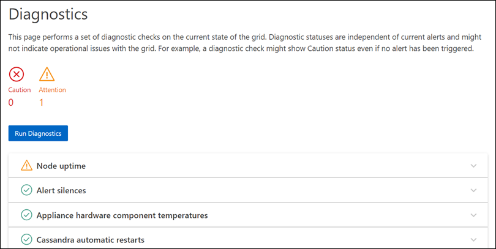

= 진단 유틸리티를 실행합니다
:allow-uri-read: 
:icons: font
:imagesdir: ../media/

[role="lead"]
문제를 해결할 때 기술 지원 부서의 도움을 받을 수 있습니다. StorageGRID 시스템에서 진단 프로그램을 실행하고 결과를 검토할 수 있습니다.

* link:reviewing-support-metrics.html["지원 메트릭을 검토합니다"]
* link:commonly-used-prometheus-metrics.html["일반적으로 사용되는 Prometheus 메트릭입니다"]

.시작하기 전에
* 을 사용하여 그리드 관리자에 로그인되어 있습니다.link:../admin/web-browser-requirements.html["지원되는 웹 브라우저"]
* 있습니다. link:../admin/admin-group-permissions.html["특정 액세스 권한"]

.이 작업에 대해
진단 페이지는 그리드의 현재 상태에 대한 진단 검사 집합을 수행합니다. 각 진단 점검에는 다음 세 가지 상태 중 하나가 있을 수 있습니다.

* image:../media/icon_alert_green_checkmark.png["아이콘 경고 녹색 확인 표시"] * 정상 *: 모든 값이 정상 범위 내에 있습니다.
* image:../media/icon_alert_yellow_minor.png["아이콘 경고 노란색이 경미합니다"] *주의*: 하나 이상의 값이 정상 범위를 벗어났습니다.
* image:../media/icon_alert_red_critical.png["아이콘 경고 빨간색 위험"] * 주의 *: 하나 이상의 값이 정상 범위를 상당히 벗어났습니다.

진단 상태는 현재 알림과 독립적이며, 그리드에 작동 문제를 나타내지 않을 수 있습니다. 예를 들어, 경고가 트리거되지 않았더라도 진단 점검에 주의 상태가 표시될 수 있습니다.

.단계
. 지원 * > * 도구 * > * 진단 * 을 선택합니다.
+
진단 페이지가 나타나고 각 진단 점검의 결과가 나열됩니다. 결과는 심각도(주의, 주의 및 정상)별로 정렬됩니다. 각 심각도 내에서는 결과가 알파벳순으로 정렬됩니다.

+
이 예에서 모든 진단 유틸리티는 정상 상태입니다.

+

. 특정 진단에 대한 자세한 내용을 보려면 행의 아무 곳이나 클릭합니다.
+
진단 및 현재 결과에 대한 세부 정보가 나타납니다. 다음 세부 정보가 나열됩니다.

+
** * 상태 *: 이 진단의 현재 상태: 정상, 주의 또는 주의.
** * Prometheus query *: 진단용으로 사용된 경우 상태 값을 생성하는 데 사용된 Prometheus 식입니다. (Prometheus 표현식은 일부 진단에는 사용되지 않습니다.)
** * 임계값 *: 진단에 사용할 수 있는 경우 각 비정상적인 진단 상태에 대한 시스템 정의 임계값입니다. (일부 진단 유틸리티에는 임계값이 사용되지 않습니다.)
+

NOTE: 이러한 임계값은 변경할 수 없습니다.

** * 상태 값 *: StorageGRID 시스템 전체에서 진단 상태 및 값을 보여주는 표. 이 예에서는 StorageGRID 시스템의 모든 노드에 대한 현재 CPU 활용률이 표시됩니다. 모든 노드 값이 주의 및 주의 임계값 미만이므로 진단의 전체 상태는 정상입니다.

+
image::../media/support_diagnostics_cpu_utilization.png[진단 CPU 사용률을 지원합니다]

. * 선택 사항 *: 이 진단과 관련된 Grafana 차트를 보려면 * Grafana 대시보드 * 링크를 클릭하십시오.
+
이 링크는 일부 진단 유틸리티에는 표시되지 않습니다.

+
관련 Grafana 대시보드가 나타납니다. 이 예에서 노드 대시보드는 이 노드에 대한 CPU 사용률 및 해당 노드에 대한 다른 Grafana 차트를 보여 줍니다.

+

NOTE: 지원 * > * 도구 * > * 메트릭 * 페이지의 Grafana 섹션에서 사전 구성된 Grafana 대시보드에 액세스할 수도 있습니다.

+
image::../media/grafana_dashboard_nodes.png[Grafana 대시보드 노드]

. * 선택 사항 *: Prometheus 표현식의 차트를 보려면 * Prometheus * 에서 보기 를 클릭합니다.
+
진단에서 사용되는 표현식의 Prometheus 그래프가 나타납니다.

+
image::../media/support_diagnostics_prometheus_png.png[지원 진단 Prometheus 페이지]

