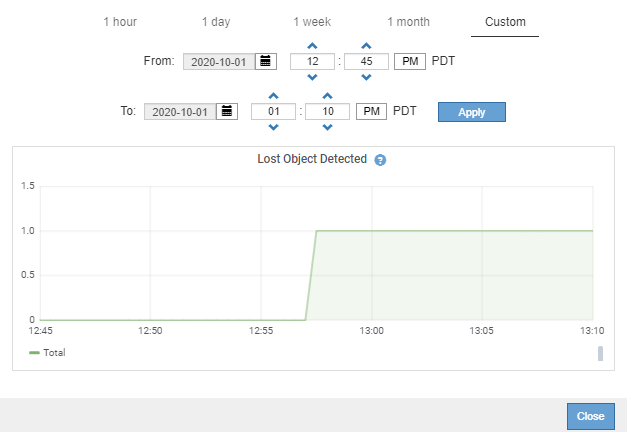

= 차트와 그래프를 사용합니다
:allow-uri-read: 
:icons: font
:imagesdir: ../media/

[role="lead"]
차트와 보고서를 사용하여 StorageGRID 시스템의 상태를 모니터링하고 문제를 해결할 수 있습니다.

NOTE: Grid Manager는 각 릴리스와 함께 업데이트되며 이 페이지의 예제 스크린샷과 일치하지 않을 수 있습니다.

== 차트 종류

차트와 그래프에는 특정 StorageGRID 메트릭 및 특성의 값이 요약되어 있습니다.

Grid Manager 대시보드에는 그리드 및 각 사이트에 사용할 수 있는 저장소를 요약하는 카드가 포함되어 있습니다.

image::../media/dashboard_data_and_metadata_space_usage_breakdown.png[대시보드 데이터 및 메타데이터 공간 사용량 분석]

Tenant Manager 대시보드의 Storage usage 패널에 표시되는 내용은 다음과 같습니다.

* 테넌트를 위해 가장 큰 버킷(S3) 또는 컨테이너(Swift)의 목록입니다
* 가장 큰 버킷 또는 컨테이너의 상대적 크기를 나타내는 막대 차트
* 사용된 총 공간 및 할당량이 설정된 경우 남은 공간의 양과 백분율이 표시됩니다

image::../media/tenant_dashboard_with_buckets.png[테넌트 대시보드]

또한 노드 페이지 및 * 지원 * > * 도구 * > * 그리드 토폴로지 * 페이지에서 StorageGRID 메트릭 및 속성이 시간에 따라 변경되는 방식을 보여 주는 그래프입니다.

그래프에는 네 가지 유형이 있습니다.

* * Grafana 차트 *: 노드 페이지에 표시된 Grafana 차트는 시간의 경과에 따라 Prometheus 메트릭의 값을 플롯하는 데 사용됩니다. 예를 들어, 스토리지 노드의 * 노드 * > * 네트워크 * 탭에는 네트워크 트래픽에 대한 Grafana 차트가 들어 있습니다.
+
image::../media/nodes_page_network_tab.png[노드 페이지 네트워크 탭]

+

NOTE: Grafana 차트는 * 지원 * > * 도구 * > * 메트릭 * 페이지에서 사용할 수 있는 사전 구성된 대시보드에도 포함되어 있습니다.

* * 라인 그래프 *: 노드 페이지와 * 지원 * > * 도구 * > * 그리드 토폴로지 * 페이지(데이터 값 뒤의 차트 아이콘 선택)에서 사용할 수 있는 image:../media/icon_chart_new_for_11_5.png["아이콘 차트(신규)"]라인 그래프는 단위 값이 있는 StorageGRID 속성 값(예: NTP 주파수 오프셋, ppm)을 플로팅하는 데 사용됩니다. 값의 변경 내용은 시간 경과에 따른 정규 데이터 간격(빈)으로 표시됩니다.
+
image::../media/line_graph.gif[선 그래프]

* * 영역 그래프 *: 노드 페이지 및 * 지원 * > * 도구 * > * 그리드 토폴로지 * 페이지(데이터 값 뒤에 차트 아이콘 선택)에서 사용할 수 image:../media/icon_chart_new_for_11_5.png["아이콘 차트(신규)"]있으며 영역 그래프는 오브젝트 수 또는 서비스 로드 값과 같은 체적 특성 수량을 플롯하는 데 사용됩니다. 영역 그래프는 선 그래프와 비슷하지만 선 아래에 밝은 갈색 음영을 포함합니다. 값의 변경 내용은 시간 경과에 따른 정규 데이터 간격(빈)으로 표시됩니다.
+
image::../media/area_graph.gif[영역 그래프]

* 일부 그래프는 다른 유형의 차트 아이콘으로 image:../media/icon_chart_new_for_11_5.png["차트 아이콘"] 표시되며 형식이 다릅니다.
+

* * 상태 그래프 *: * support * > * Tools * > * Grid topology * 페이지(데이터 값 뒤의 차트 아이콘 선택image:../media/icon_chart_new_for_11_5.png["아이콘 차트(신규)"]), 상태 그래프는 온라인, 대기 또는 오프라인일 수 있는 서비스 상태와 같은 고유한 상태를 나타내는 특성 값을 플롯하는 데 사용됩니다. 상태 그래프는 선 그래프와 유사하지만 전이는 불연속입니다. 즉, 값이 한 상태 값에서 다른 상태 값으로 이동합니다.
+
image::../media/state_graph.gif[상태 그래프]

.관련 정보
* link:viewing-nodes-page.html["노드 페이지를 봅니다"]
* link:viewing-grid-topology-tree.html["그리드 토폴로지 트리를 봅니다"]
* link:reviewing-support-metrics.html["지원 메트릭을 검토합니다"]

== 차트 범례

차트를 그리는 데 사용되는 선과 색상은 특정한 의미를 갖습니다.

[cols="1a,3a"]
|===
| 예 | 의미 

 a| 
image:../media/dark_green_chart_line.gif["어두운 녹색 선을 보여 주는 스크린샷"]
 a| 
보고된 속성 값은 진한 녹색 선으로 표시됩니다.

 a| 
image:../media/light_green_chart_line.gif["데이터 비닝을 나타내는 음영을 보여 주는 스크린샷"]
 a| 
진한 초록색 선 주위의 연한 녹색 음영은 해당 시간 범위의 실제 값이 변하고 빠른 플로팅을 위해 "비닝"되었음을 나타냅니다. 어두운 선은 가중 평균을 나타냅니다. 녹색으로 표시된 범위는 입력 용지함 내의 최대 및 최소 값을 나타냅니다. 밝은 갈색 음영은 체적 데이터를 나타내는 영역 그래프에 사용됩니다.

 a| 
image:../media/no_data_plotted_chart.gif["플롯 라인의 빈 영역을 보여주는 스크린샷"]
 a| 
빈 영역(표시된 데이터 없음)은 속성 값을 사용할 수 없음을 나타냅니다. 배경은 속성을 보고하는 서비스의 상태에 따라 파란색, 회색 또는 회색과 파란색이 혼합되어 있을 수 있습니다.

 a| 
image:../media/light_blue_chart_shading.gif["결정되지 않은 값을 나타내는 연한 파란색 음영을 보여주는 스크린샷"]
 a| 
연한 파란색 음영은 해당 시점의 속성 값 중 일부 또는 모두가 결정되지 않았음을 나타냅니다. 서비스가 알 수 없는 상태이기 때문에 특성이 값을 보고하지 않았습니다.

 a| 
image:../media/gray_chart_shading.gif["알 수 없는 값으로 인해 회색 음영이 표시된 스크린샷"]
 a| 
회색 음영은 속성을 보고하는 서비스가 관리상 중단되었기 때문에 해당 시점의 일부 또는 모든 속성 값을 알 수 없음을 나타냅니다.

 a| 
image:../media/gray_blue_chart_shading.gif["결정되지 않은 값과 알 수 없는 값의 조합을 보여 주는 스크린샷"]
 a| 
회색 음영과 파란색 음영이 혼합되어 있으면 해당 시점의 일부 속성 값이 불확정(서비스가 알 수 없는 상태였기 때문)인 반면, 속성을 보고하는 서비스가 관리상 다운되었기 때문에 다른 속성 값은 알 수 없습니다.

|===

== 차트와 그래프를 표시합니다

노드 페이지에는 스토리지 용량 및 처리량과 같은 속성을 모니터링하기 위해 정기적으로 액세스해야 하는 차트와 그래프가 포함되어 있습니다. 경우에 따라, 특히 기술 지원 작업을 할 때 * 지원 * > * 도구 * > * 그리드 토폴로지 * 페이지를 사용하여 추가 차트에 액세스할 수 있습니다.

.시작하기 전에
을 사용하여 그리드 관리자에 로그인해야 link:../admin/web-browser-requirements.html["지원되는 웹 브라우저"]합니다.

.단계
. 노드 * 를 선택합니다. 그런 다음 노드, 사이트 또는 전체 그리드를 선택합니다.
. 정보를 보려는 탭을 선택합니다.
+
일부 탭에는 한 개 이상의 Grafana 차트가 포함되어 있으며, 이 차트는 시간의 경과에 따른 Prometheus 메트릭의 값을 플롯하는 데 사용됩니다. 예를 들어, 노드의 * 노드 * > * 하드웨어 * 탭에는 두 개의 Grafana 차트가 들어 있습니다.

+
image::../media/nodes_page_hardware_tab_graphs.png[노드 페이지 하드웨어 탭 그래프]

. 필요에 따라 특정 시점에 대한 보다 자세한 값을 보려면 차트 위에 커서를 놓습니다.
+
image::../media/nodes_page_memory_usage_details.png[노드 페이지 메모리 사용 세부 정보]

. 필요에 따라 특정 특성 또는 메트릭에 대한 차트를 표시할 수 있습니다. 노드 페이지의 테이블에서 속성 이름 오른쪽에 있는 차트 아이콘을 선택합니다image:../media/icon_chart_new_for_11_5.png["차트 아이콘"].
+

NOTE: 일부 메트릭 및 특성에는 차트를 사용할 수 없습니다.

+
* 예제 1 *: 스토리지 노드의 객체 탭에서 차트 아이콘을 선택하면 image:../media/icon_chart_new_for_11_5.png["차트 아이콘"]스토리지 노드에 대해 성공한 총 메타데이터 저장소 쿼리 수를 볼 수 있습니다.

+
image::../media/nodes_page_objects_successful_metadata_queries.png[메타데이터 쿼리가 성공했습니다]

+
image::../media/nodes_page-objects_chart_successful_metadata_queries.png[성공한 메타데이터 쿼리 차트]

+
* 예제 2 *: 스토리지 노드의 개체 탭에서 차트 아이콘을 선택하면 image:../media/icon_chart_new_for_11_5.png["차트 아이콘"]시간이 지남에 따라 감지된 손실된 개체 수의 그래파나 그래프가 표시됩니다.

+
image::../media/object_count_table.png[개체 수 표]

+

. 노드 페이지에 표시되지 않은 특성에 대한 차트를 표시하려면 * 지원 * > * 도구 * > * 그리드 토폴로지 * 를 선택합니다.
. grid node_ * > * _component 또는 service_ * > * Overview * > * Main * 을 선택합니다.
+
image::../media/nms_chart.gif[주변 텍스트로 설명된 스크린샷]

. 속성 옆에 있는 차트 아이콘을 image:../media/icon_chart_new_for_11_5.png["차트 아이콘"]선택합니다.
+
그러면 * Reports * > * Charts * 페이지가 자동으로 변경됩니다. 차트는 지난 하루 동안의 특성 데이터를 표시합니다.

== 차트를 생성합니다

차트는 특성 데이터 값의 그래픽 표현을 표시합니다. 데이터 센터 사이트, 그리드 노드, 구성 요소 또는 서비스에 대해 보고할 수 있습니다.

.시작하기 전에
* 을 사용하여 그리드 관리자에 로그인해야 link:../admin/web-browser-requirements.html["지원되는 웹 브라우저"]합니다.
* 있습니다. link:../admin/admin-group-permissions.html["특정 액세스 권한"]

.단계
. 지원 * > * 도구 * > * 그리드 토폴로지 * 를 선택합니다.
. grid node_ * > * _component 또는 service_ * > * Reports * > * Charts * 를 선택합니다.
. 특성 * 드롭다운 목록에서 보고할 특성을 선택합니다.
. Y축을 0에서 시작하려면 * 수직 배율 * 확인란의 선택을 취소합니다.
. 값을 전체 정밀도로 표시하려면 * Raw Data * 확인란을 선택하거나 값을 최대 3자리(예: 비율로 보고된 속성)로 반올림하려면 * Raw Data * 확인란의 선택을 취소합니다.
. 빠른 쿼리 * 드롭다운 목록에서 보고할 기간을 선택합니다.
+
사용자 지정 쿼리 옵션을 선택하여 특정 시간 범위를 선택합니다.

+
잠시 후에 차트가 나타납니다. 긴 시간 범위의 표 형성을 위해 몇 분 정도 기다립니다.

. 사용자 지정 쿼리를 선택한 경우 * 시작 날짜 * 와 * 종료 날짜 * 를 입력하여 차트의 기간을 사용자 지정합니다.
+
현지 시간으로 형식을 `_YYYY/MM/DDHH:MM:SS_` 사용합니다. 형식과 일치시키려면 맨 앞에 0이 있어야 합니다. 예를 들어, 2017/4/6 7:30:00은 검증에 실패합니다. 올바른 형식은 2017/04/06 07:30:00입니다.

. Update * 를 선택합니다.
+
차트가 몇 초 후에 생성됩니다. 긴 시간 범위의 표 형성을 위해 몇 분 정도 기다립니다. 쿼리에 대해 설정된 시간에 따라 원시 텍스트 보고서 또는 집계 텍스트 보고서가 표시됩니다.

