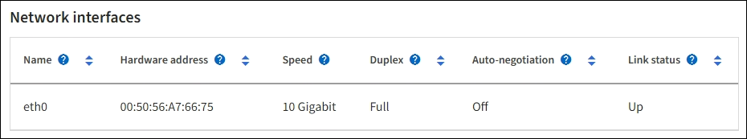

= 하드웨어 탭을 봅니다
:allow-uri-read: 
:icons: font
:imagesdir: ../media/

[role="lead"]
하드웨어 탭에는 각 노드의 CPU 사용률 및 메모리 사용량, 어플라이언스에 대한 추가 하드웨어 정보가 표시됩니다.

NOTE: Grid Manager는 각 릴리스와 함께 업데이트되며 이 페이지의 예제 스크린샷과 일치하지 않을 수 있습니다.

모든 노드에 대해 하드웨어 탭이 표시됩니다.

image::../media/nodes_page_hardware_tab_graphs.png[노드 페이지 하드웨어 탭]

다른 시간 간격을 표시하려면 차트 또는 그래프 위에 있는 컨트롤 중 하나를 선택합니다. 1시간, 1일, 1주 또는 1개월 간격으로 사용 가능한 정보를 표시할 수 있습니다. 날짜 및 시간 범위를 지정할 수 있는 사용자 지정 간격을 설정할 수도 있습니다.

CPU 사용률 및 메모리 사용량에 대한 세부 정보를 보려면 각 그래프 위에 커서를 놓습니다.

image::../media/nodes_page_memory_usage_details.png[노드 페이지 > 하드웨어 > 메모리 사용량 세부 정보]

노드가 어플라이언스 노드인 경우 이 탭에는 어플라이언스 하드웨어에 대한 자세한 정보가 있는 섹션도 포함되어 있습니다.

== 어플라이언스 스토리지 노드에 대한 정보를 봅니다

노드 페이지에는 서비스 상태에 대한 정보와 각 어플라이언스 스토리지 노드의 모든 컴퓨팅, 디스크 디바이스 및 네트워크 리소스에 대한 정보가 나열됩니다. 또한 메모리, 스토리지 하드웨어, 컨트롤러 펌웨어 버전, 네트워크 리소스, 네트워크 인터페이스, 네트워크 주소, 데이터 수신 및 전송

.단계
. 노드 페이지에서 어플라이언스 스토리지 노드를 선택합니다.
. 개요 * 를 선택합니다.
+
개요 탭의 노드 정보 섹션에는 노드의 이름, 유형, ID 및 연결 상태와 같은 노드에 대한 요약 정보가 표시됩니다. IP 주소 목록에는 다음과 같이 각 주소에 대한 인터페이스 이름이 포함됩니다.

+
** * eth *: 그리드 네트워크, 관리자 네트워크 또는 클라이언트 네트워크.
** * hic *: 어플라이언스에 있는 물리적 10GbE, 25 또는 100GbE 포트 중 하나입니다. 이러한 포트는 함께 연결되어 StorageGRID 그리드 네트워크(eth0) 및 클라이언트 네트워크(eth2)에 연결할 수 있습니다.
** * MTC *: 어플라이언스에 있는 물리적 1GbE 포트 중 하나입니다. 하나 이상의 MTC 인터페이스가 StorageGRID 관리 네트워크 인터페이스(eth1)를 형성하도록 연결됩니다. 다른 MTC 인터페이스를 데이터 센터 내 기술자의 임시 로컬 연결에 사용할 수 있도록 둘 수 있습니다.
+
image::../media/nodes_page_overview_tab_extended.png[노드 페이지 개요 확장]

+
개요 탭의 경고 섹션에는 노드에 대한 활성 경고가 표시됩니다.

. 어플라이언스에 대한 자세한 내용을 보려면 * 하드웨어 * 를 선택하십시오.
+
.. CPU Utilization(CPU 사용률) 및 Memory(메모리) 그래프를 보고 시간에 따른 CPU 및 메모리 사용량 비율을 확인합니다. 다른 시간 간격을 표시하려면 차트 또는 그래프 위에 있는 컨트롤 중 하나를 선택합니다. 1시간, 1일, 1주 또는 1개월 간격으로 사용 가능한 정보를 표시할 수 있습니다. 날짜 및 시간 범위를 지정할 수 있는 사용자 지정 간격을 설정할 수도 있습니다.
+
image::../media/nodes_page_hardware_tab_graphs.png[하드웨어 그래프]

.. 아래로 스크롤하여 제품의 구성 요소 표를 봅니다. 이 표에는 어플라이언스의 모델 이름, 컨트롤러 이름, 일련 번호 및 IP 주소, 각 구성요소의 상태와 같은 정보가 포함되어 있습니다.
+

NOTE: 컴퓨팅 컨트롤러 BMC IP 및 컴퓨팅 하드웨어와 같은 일부 필드는 해당 기능이 있는 어플라이언스에 대해서만 나타납니다.

+
스토리지 쉘프의 구성요소 및 설치 시 확장 쉘프가 어플라이언스 테이블 아래의 개별 테이블에 표시됩니다.

+
image::../media/nodes_page_hardware_tab_for_appliance.png[어플라이언스의 노드 페이지 하드웨어 탭]

+
[cols="1a,2a"]
|===
| Appliance 테이블의 필드 | 설명 

 a| 
어플라이언스 모델
 a| 
이 StorageGRID 어플라이언스의 모델 번호는 SANtricity OS에 나와 있습니다.

 a| 
스토리지 컨트롤러 이름입니다
 a| 
SANtricity OS에 표시된 이 StorageGRID 어플라이언스의 이름입니다.

 a| 
스토리지 컨트롤러 A 관리 IP
 a| 
스토리지 컨트롤러 A의 관리 포트 1의 IP 주소. 이 IP를 사용하여 SANtricity OS에 액세스하여 스토리지 문제를 해결할 수 있습니다.

 a| 
스토리지 컨트롤러 B 관리 IP
 a| 
스토리지 컨트롤러 B의 관리 포트 1에 대한 IP 주소입니다. 스토리지 문제를 해결하기 위해 이 IP를 사용하여 SANtricity OS에 액세스합니다.

일부 어플라이언스 모델에는 스토리지 컨트롤러 B가 없습니다

 a| 
스토리지 컨트롤러 WWID입니다
 a| 
SANtricity OS에 표시되는 스토리지 컨트롤러의 전 세계적 식별자입니다.

 a| 
스토리지 어플라이언스 섀시 일련 번호입니다
 a| 
어플라이언스의 섀시 일련 번호입니다.

 a| 
스토리지 컨트롤러 펌웨어 버전입니다
 a| 
이 어플라이언스에 대한 스토리지 컨트롤러의 펌웨어 버전입니다.

 a| 
스토리지 컨트롤러 SANtricity OS 버전입니다
 a| 
스토리지 컨트롤러 A의 SANtricity OS 버전입니다

 a| 
스토리지 컨트롤러 NVSRAM 버전입니다
 a| 
SANtricity System Manager에서 보고한 스토리지 컨트롤러의 NVSRAM 버전입니다.

SG6060 및 SG6160의 경우 두 컨트롤러 간에 NVSRAM 버전이 일치하지 않으면 컨트롤러 A 버전이 표시됩니다. 컨트롤러 A가 설치되지 않았거나 작동하지 않으면 컨트롤러 B 버전이 표시됩니다.

 a| 
스토리지 하드웨어
 a| 
스토리지 컨트롤러 하드웨어의 전체 상태입니다. SANtricity System Manager에서 스토리지 하드웨어에 대한 Needs Attention(주의 필요) 상태를 보고하는 경우 StorageGRID 시스템도 이 값을 보고합니다.

상태가 "주의 필요"인 경우 먼저 SANtricity OS를 사용하여 스토리지 컨트롤러를 확인합니다. 그런 다음 컴퓨팅 컨트롤러에 적용되는 다른 경고가 없는지 확인합니다.

 a| 
스토리지 컨트롤러의 드라이브 수가 실패했습니다
 a| 
최적의 드라이브 수가 아닙니다.

 a| 
스토리지 컨트롤러 A
 a| 
스토리지 컨트롤러 A의 상태입니다

 a| 
스토리지 컨트롤러 B
 a| 
스토리지 컨트롤러 B의 상태입니다. 일부 어플라이언스 모델에는 스토리지 컨트롤러 B가 없습니다

 a| 
스토리지 컨트롤러 전원 공급 장치 A
 a| 
스토리지 컨트롤러의 전원 공급 장치 A의 상태입니다.

 a| 
스토리지 컨트롤러 전원 공급 장치 B
 a| 
스토리지 컨트롤러의 전원 공급 장치 B의 상태입니다.

 a| 
스토리지 데이터 드라이브 유형입니다
 a| 
HDD(하드 드라이브) 또는 SSD(Solid State Drive)와 같은 어플라이언스의 드라이브 유형입니다.

 a| 
스토리지 데이터 드라이브 크기입니다
 a| 
하나의 데이터 드라이브의 유효 크기입니다.

SG6160의 경우 캐시 드라이브의 크기도 표시됩니다.

* 참고 *: 확장 셸프가 있는 노드의 경우 대신 를 <<shelf_data_drive_size,각 쉘프의 데이터 드라이브 크기입니다>>사용하십시오. 유효 드라이브 크기는 쉘프마다 다를 수 있습니다.

 a| 
스토리지 RAID 모드
 a| 
어플라이언스에 대해 구성된 RAID 모드입니다.

 a| 
스토리지 연결
 a| 
스토리지 접속 상태입니다.

 a| 
전체 전원 공급 장치
 a| 
어플라이언스에 대한 모든 전원 공급 장치의 상태입니다.

 a| 
컨트롤러 BMC IP를 계산합니다
 a| 
컴퓨팅 컨트롤러에 있는 BMC(베이스보드 관리 컨트롤러) 포트의 IP 주소입니다. 이 IP를 사용하여 BMC 인터페이스에 연결하여 어플라이언스 하드웨어를 모니터링하고 진단합니다.

BMC가 포함되지 않은 어플라이언스 모델에는 이 필드가 표시되지 않습니다.

 a| 
컴퓨팅 컨트롤러 일련 번호입니다
 a| 
컴퓨팅 컨트롤러의 일련 번호입니다.

 a| 
컴퓨팅 하드웨어
 a| 
컴퓨팅 컨트롤러 하드웨어의 상태입니다. 별도의 컴퓨팅 하드웨어와 스토리지 하드웨어가 없는 어플라이언스 모델에는 이 필드가 표시되지 않습니다.

 a| 
컨트롤러 CPU 온도를 계산합니다
 a| 
컴퓨팅 컨트롤러의 CPU의 온도 상태입니다.

 a| 
컨트롤러 섀시 온도를 계산합니다
 a| 
컴퓨팅 컨트롤러의 온도 상태입니다.

|===
+
[cols="1a,2a"]
|===
| 열을 클릭합니다 | 설명 

 a| 
쉘프 섀시 일련 번호입니다
 a| 
스토리지 쉘프 섀시의 일련 번호입니다.

 a| 
쉘프 ID입니다
 a| 
스토리지 쉘프의 숫자 식별자입니다.

*** 99:스토리지 컨트롤러 쉘프
*** 0:첫 번째 확장 쉘프
*** 1초 확장 쉘프

*참고:* 확장 셸프는 SG6060 및 SG6160에만 적용됩니다.

 a| 
쉘프 상태입니다
 a| 
스토리지 쉘프의 전체 상태입니다.

 a| 
IOM 상태입니다
 a| 
확장 셸프의 입출력 모듈(IOM)의 상태입니다. 해당 없음 - 확장 쉘프가 아닌 경우.

 a| 
전원 공급 장치 상태입니다
 a| 
스토리지 쉘프의 전원 공급 장치의 전체 상태입니다.

 a| 
문서함 상태입니다
 a| 
스토리지 쉘프에 있는 드로어의 상태입니다. 해당 없음 - 선반에 서랍이 없는 경우

 a| 
팬 상태입니다
 a| 
스토리지 쉘프에 있는 냉각 팬의 전체 상태입니다.

 a| 
드라이브 슬롯
 a| 
스토리지 쉘프의 총 드라이브 슬롯 수입니다.

 a| 
데이터 드라이브
 a| 
스토리지 쉘프의 드라이브 수로, 데이터 스토리지에 사용됩니다.

 a| 
[[shelf_data_drive_size]] 데이터 드라이브 크기
 a| 
스토리지 쉘프에 있는 데이터 드라이브 1개의 유효 크기입니다.

 a| 
캐시 드라이브
 a| 
캐시로 사용되는 스토리지 쉘프의 드라이브 수입니다.

 a| 
캐시 드라이브 크기입니다
 a| 
스토리지 쉘프에서 가장 작은 캐시 드라이브의 크기입니다. 일반적으로 캐시 드라이브는 모두 크기가 같습니다.

 a| 
구성 상태입니다
 a| 
스토리지 셸프의 구성 상태입니다.

|===
.. 모든 상태가 "공칭"인지 확인합니다.
+
상태가 "공칭"이 아닌 경우 현재 경고를 검토합니다. SANtricity 시스템 관리자를 사용하여 이러한 하드웨어 값 중 일부에 대해 자세히 알아볼 수도 있습니다. 제품 설치 및 유지 관리 지침을 참조하십시오.

. 각 네트워크에 대한 정보를 보려면 * Network * 를 선택하십시오.
+
네트워크 트래픽 그래프는 전체 네트워크 트래픽에 대한 요약을 제공합니다.

+
image::../media/nodes_page_network_traffic_graph.png[노드 페이지 네트워크 트래픽 그래프]

+
.. 네트워크 인터페이스 섹션을 검토합니다.
+

+
네트워크 인터페이스 테이블의 * Speed * 열에 있는 값을 사용하여 어플라이언스의 10/25-GbE 네트워크 포트가 액티브/백업 모드 또는 LACP 모드를 사용하도록 구성되었는지 확인하십시오.

+

NOTE: 표에 표시된 값은 4개의 링크가 모두 사용된다고 가정합니다.

+
[cols="1a,1a,1a,1a"]
|===
| 링크 모드 | 본드 모드 | 개별 HIC 링크 속도(hic1, hic2, hic3, hic4) | 예상 그리드/클라이언트 네트워크 속도(eth0, eth2) 

 a| 
집계
 a| 
LACP
 a| 
25
 a| 
100

 a| 
고정
 a| 
LACP
 a| 
25
 a| 
50

 a| 
고정
 a| 
Active/Backup(활성/백업)
 a| 
25
 a| 
25

 a| 
집계
 a| 
LACP
 a| 
10
 a| 
40

 a| 
고정
 a| 
LACP
 a| 
10
 a| 
20

 a| 
고정
 a| 
Active/Backup(활성/백업)
 a| 
10
 a| 
10

|===
+
10/25-GbE 포트 구성에 대한 자세한 내용은 을 https://docs.netapp.com/us-en/storagegrid-appliances/installconfig/configuring-network-links.html["네트워크 링크를 구성합니다"^] 참조하십시오.

.. 네트워크 통신 섹션을 검토합니다.
+
Receive 및 Transmit 테이블은 각 네트워크를 통해 수신 및 전송된 바이트 및 패킷의 수와 기타 수신 및 전송 메트릭을 보여줍니다.

+
image::../media/nodes_page_network_communication.png[노드 페이지 네트워크 통신]

. 스토리지 * 를 선택하면 객체 데이터 및 객체 메타데이터에 대해 시간에 따른 스토리지 사용율과 디스크 디바이스, 볼륨 및 객체 저장소에 대한 정보를 보여주는 그래프를 볼 수 있습니다.
+
image::../media/nodes_page_storage_used_object_data.png[사용된 스토리지 - 오브젝트 데이터]

+
image::../media/storage_used_object_metadata.png[사용된 스토리지 - 오브젝트 메타데이터]

+
.. 아래로 스크롤하여 각 볼륨 및 오브젝트 저장소에서 사용 가능한 스토리지 양을 확인합니다.
+
각 디스크의 전 세계 이름은 SANtricity OS(어플라이언스의 스토리지 컨트롤러에 연결된 관리 소프트웨어)에서 표준 볼륨 속성을 볼 때 나타나는 볼륨 WWID(World-Wide Identifier)와 일치합니다.

+
볼륨 마운트 지점과 관련된 디스크 읽기 및 쓰기 통계를 해석하려면 디스크 장치 테이블의 * 이름 * 열에 표시된 이름(즉, _sdc_, _SDD_, _SDE_ 등)의 첫 번째 부분이 볼륨 테이블의 * 장치 * 열에 표시된 값과 일치합니다.

+
image::../media/nodes_page_storage_tables.png[노드 페이지 스토리지 테이블]

== 어플라이언스 관리 노드 및 게이트웨이 노드에 대한 정보를 봅니다

노드 페이지에는 서비스 상태에 대한 정보와 관리 노드 또는 게이트웨이 노드로 사용되는 각 서비스 어플라이언스에 대한 모든 컴퓨팅, 디스크 디바이스 및 네트워크 리소스에 대한 정보가 나열됩니다. 또한 메모리, 스토리지 하드웨어, 네트워크 리소스, 네트워크 인터페이스, 네트워크 주소, 데이터를 수신하고 전송합니다.

.단계
. 노드 페이지에서 어플라이언스 관리 노드 또는 어플라이언스 게이트웨이 노드를 선택합니다.
. 개요 * 를 선택합니다.
+
개요 탭의 노드 정보 섹션에는 노드의 이름, 유형, ID 및 연결 상태와 같은 노드에 대한 요약 정보가 표시됩니다. IP 주소 목록에는 다음과 같이 각 주소에 대한 인터페이스 이름이 포함됩니다.

+
** * adllb * 및 * adlli *: 관리 네트워크 인터페이스에 활성/백업 본딩을 사용하는 경우에 표시됩니다
** * eth *: 그리드 네트워크, 관리자 네트워크 또는 클라이언트 네트워크.
** * hic *: 어플라이언스에 있는 물리적 10GbE, 25 또는 100GbE 포트 중 하나입니다. 이러한 포트는 함께 연결되어 StorageGRID 그리드 네트워크(eth0) 및 클라이언트 네트워크(eth2)에 연결할 수 있습니다.
** * MTC *: 어플라이언스에 있는 물리적 1GbE 포트 중 하나입니다. 하나 이상의 MTC 인터페이스가 관리 네트워크 인터페이스(eth1)를 형성하도록 연결됩니다. 다른 MTC 인터페이스를 데이터 센터 내 기술자의 임시 로컬 연결에 사용할 수 있도록 둘 수 있습니다.
+
image::../media/nodes_page_overview_tab_services_appliance.png[서비스 어플라이언스에 대한 노드 페이지 개요 탭]

+
개요 탭의 경고 섹션에는 노드에 대한 활성 경고가 표시됩니다.

. 어플라이언스에 대한 자세한 내용을 보려면 * 하드웨어 * 를 선택하십시오.
+
.. CPU Utilization(CPU 사용률) 및 Memory(메모리) 그래프를 보고 시간에 따른 CPU 및 메모리 사용량 비율을 확인합니다. 다른 시간 간격을 표시하려면 차트 또는 그래프 위에 있는 컨트롤 중 하나를 선택합니다. 1시간, 1일, 1주 또는 1개월 간격으로 사용 가능한 정보를 표시할 수 있습니다. 날짜 및 시간 범위를 지정할 수 있는 사용자 지정 간격을 설정할 수도 있습니다.
+
image::../media/nodes_page_hardware_tab_graphs_services_appliance.png[노드 페이지 서비스 어플라이언스에 대한 하드웨어 탭 그래프]

.. 아래로 스크롤하여 제품의 구성 요소 표를 봅니다. 이 표에는 모델 이름, 일련 번호, 컨트롤러 펌웨어 버전 및 각 구성 요소의 상태와 같은 정보가 포함되어 있습니다.
+
image::../media/nodes_page_hardware_tab_services_appliance.png[노드 페이지 서비스 어플라이언스에는 하드웨어 탭이 있습니다]

+
[cols="1a,2a"]
|===
| Appliance 테이블의 필드 | 설명 

 a| 
어플라이언스 모델
 a| 
이 StorageGRID 어플라이언스의 모델 번호입니다.

 a| 
스토리지 컨트롤러의 드라이브 수가 실패했습니다
 a| 
최적의 드라이브 수가 아닙니다.

 a| 
스토리지 데이터 드라이브 유형입니다
 a| 
HDD(하드 드라이브) 또는 SSD(Solid State Drive)와 같은 어플라이언스의 드라이브 유형입니다.

 a| 
스토리지 데이터 드라이브 크기입니다
 a| 
하나의 데이터 드라이브의 유효 크기입니다.

 a| 
스토리지 RAID 모드
 a| 
어플라이언스의 RAID 모드입니다.

 a| 
전체 전원 공급 장치
 a| 
어플라이언스에 있는 모든 전원 공급 장치의 상태입니다.

 a| 
컨트롤러 BMC IP를 계산합니다
 a| 
컴퓨팅 컨트롤러에 있는 BMC(베이스보드 관리 컨트롤러) 포트의 IP 주소입니다. 이 IP를 사용하여 BMC 인터페이스에 연결하여 어플라이언스 하드웨어를 모니터링하고 진단할 수 있습니다.

BMC가 포함되지 않은 어플라이언스 모델에는 이 필드가 표시되지 않습니다.

 a| 
컴퓨팅 컨트롤러 일련 번호입니다
 a| 
컴퓨팅 컨트롤러의 일련 번호입니다.

 a| 
컴퓨팅 하드웨어
 a| 
컴퓨팅 컨트롤러 하드웨어의 상태입니다.

 a| 
컨트롤러 CPU 온도를 계산합니다
 a| 
컴퓨팅 컨트롤러의 CPU의 온도 상태입니다.

 a| 
컨트롤러 섀시 온도를 계산합니다
 a| 
컴퓨팅 컨트롤러의 온도 상태입니다.

|===
.. 모든 상태가 "공칭"인지 확인합니다.
+
상태가 "공칭"이 아닌 경우 현재 경고를 검토합니다.

. 각 네트워크에 대한 정보를 보려면 * Network * 를 선택하십시오.
+
네트워크 트래픽 그래프는 전체 네트워크 트래픽에 대한 요약을 제공합니다.

+
image::../media/nodes_page_network_traffic_graph.png[노드 페이지 네트워크 트래픽 그래프]

+
.. 네트워크 인터페이스 섹션을 검토합니다.
+
image::../media/nodes_page_hardware_tab_network_services_appliance.png[노드 페이지 하드웨어 탭 네트워크 서비스 어플라이언스]

+
네트워크 인터페이스 테이블의 * Speed * 열에 있는 값을 사용하여 어플라이언스의 40개/100GbE 네트워크 포트 4개가 액티브/백업 모드 또는 LACP 모드를 사용하도록 구성되었는지 확인하십시오.

+

NOTE: 표에 표시된 값은 4개의 링크가 모두 사용된다고 가정합니다.

+
[cols="1a,1a,1a,1a"]
|===
| 링크 모드 | 본드 모드 | 개별 HIC 링크 속도(hic1, hic2, hic3, hic4) | 예상 그리드/클라이언트 네트워크 속도(eth0, eth2) 

 a| 
집계
 a| 
LACP
 a| 
100
 a| 
400

 a| 
고정
 a| 
LACP
 a| 
100
 a| 
200

 a| 
고정
 a| 
Active/Backup(활성/백업)
 a| 
100
 a| 
100

 a| 
집계
 a| 
LACP
 a| 
40
 a| 
160

 a| 
고정
 a| 
LACP
 a| 
40
 a| 
80

 a| 
고정
 a| 
Active/Backup(활성/백업)
 a| 
40
 a| 
40

|===
.. 네트워크 통신 섹션을 검토합니다.
+
Receive 및 Transmit 테이블은 각 네트워크에서 수신 및 전송된 바이트 및 패킷의 수와 기타 수신 및 전송 메트릭을 보여줍니다.

+
image::../media/nodes_page_network_communication.png[노드 페이지 네트워크 통신]

. 서비스 어플라이언스의 디스크 장치 및 볼륨에 대한 정보를 보려면 * Storage * 를 선택합니다.
+
image::../media/nodes_page_storage_tab_services_appliance.png[노드 페이지 스토리지 탭 서비스 어플라이언스]

