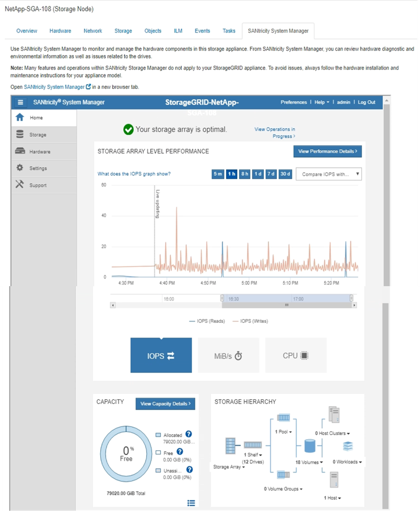

= SANtricity System Manager 탭 보기(E-Series만 해당)
:allow-uri-read: 
:icons: font
:imagesdir: ../media/

[role="lead"]
SANtricity 시스템 관리자 탭을 사용하면 스토리지 어플라이언스의 관리 포트를 구성하거나 연결하지 않고도 SANtricity 시스템 관리자에 액세스할 수 있습니다. 이 탭을 사용하여 하드웨어 진단 및 환경 정보와 드라이브 관련 문제를 검토할 수 있습니다.

CAUTION: 그리드 관리자에서 SANtricity 시스템 관리자에 액세스하는 것은 일반적으로 어플라이언스 하드웨어를 모니터링하고 E-Series AutoSupport를 구성하는 것만을 의미합니다. 펌웨어 업그레이드와 같은 SANtricity System Manager 내의 많은 기능과 작업은 StorageGRID 어플라이언스 모니터링에는 적용되지 않습니다. 문제를 방지하려면 항상 어플라이언스에 대한 하드웨어 유지 관리 지침을 따르십시오. SANtricity 펌웨어를 업그레이드하려면 사용 중인 스토리지 어플라이언스에 대한 를 https://docs.netapp.com/us-en/storagegrid-appliances/landing-maintain-hdwr/index.html["유지보수 구성 절차"^] 참조하십시오.

NOTE: SANtricity System Manager 탭은 E-Series 하드웨어를 사용하는 스토리지 어플라이언스 노드에 대해서만 표시됩니다.

SANtricity 시스템 관리자를 사용하여 다음을 수행할 수 있습니다.

* 스토리지 어레이 레벨 성능, I/O 지연 시간, 스토리지 컨트롤러 CPU 활용률, 처리량과 같은 성능 데이터를 봅니다.
* 하드웨어 구성 요소 상태를 확인합니다.
* 진단 데이터 보기 및 E-Series AutoSupport 구성과 같은 지원 기능을 수행합니다.
+

NOTE: SANtricity System Manager를 사용하여 E-Series AutoSupport에 대한 프록시를 구성하려면 를 참조하십시오.link:../admin/sending-eseries-autosupport-messages-through-storagegrid.html["StorageGRID를 통해 E-Series AutoSupport 패키지를 전송합니다"]

그리드 관리자를 통해 SANtricity 시스템 관리자에 액세스하려면 이 있어야 link:../admin/admin-group-permissions.html["스토리지 어플라이언스 관리자 또는 루트 액세스 권한"]합니다.

NOTE: 그리드 관리자를 사용하여 SANtricity 시스템 관리자에 액세스하려면 SANtricity 펌웨어 8.70 이상이 있어야 합니다.

이 탭에는 SANtricity 시스템 관리자의 홈 페이지가 표시됩니다.

NOTE: SANtricity 시스템 관리자 링크를 사용하여 새 브라우저 창에서 SANtricity 시스템 관리자를 열어 보다 쉽게 볼 수 있습니다.

스토리지 어레이 레벨 성능 및 용량 사용량에 대한 세부 정보를 보려면 각 그래프 위에 커서를 놓습니다.

SANtricity System Manager 탭에서 액세스할 수 있는 정보를 보는 방법에 대한 자세한 내용은 를 참조하십시오. https://docs.netapp.com/us-en/e-series-family/index.html["NetApp E-Series 및 SANtricity 문서"^]
