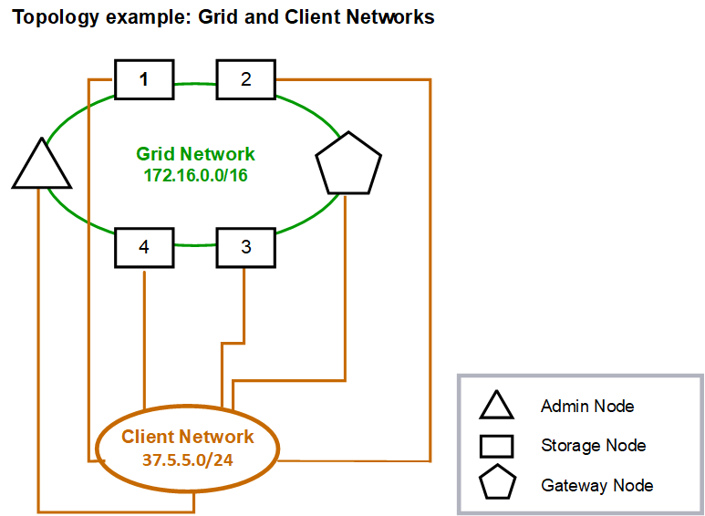

= 클라이언트 네트워크 토폴로지
:allow-uri-read: 
:icons: font
:imagesdir: ../media/

[role="lead"]
클라이언트 네트워크 보유는 선택 사항입니다. 클라이언트 네트워크를 사용하면 클라이언트 네트워크 트래픽(예: S3)을 그리드 내부 트래픽과 분리할 수 있으므로 그리드 네트워킹의 보안이 더욱 강화됩니다. 관리 네트워크가 구성되지 않은 경우 클라이언트 또는 그리드 네트워크에서 관리 트래픽을 처리할 수 있습니다.

클라이언트 네트워크를 구성할 때 구성된 노드의 eth2 인터페이스에 대한 호스트 IP 주소, 서브넷 마스크 및 게이트웨이 IP 주소를 설정합니다. 각 노드의 클라이언트 네트워크는 다른 노드의 클라이언트 네트워크와 독립할 수 있습니다.

설치 중에 노드에 대한 클라이언트 네트워크를 구성하는 경우 설치가 완료되면 노드의 기본 게이트웨이가 그리드 네트워크 게이트웨이에서 클라이언트 네트워크 게이트웨이로 전환됩니다. 나중에 클라이언트 네트워크를 추가하면 노드의 기본 게이트웨이가 같은 방식으로 전환됩니다.

이 예에서 클라이언트 네트워크는 S3 클라이언트 요청 및 관리 기능에 사용되고 그리드 네트워크는 내부 객체 관리 작업에 사용됩니다.

image::../media/grid_client_networks_ips.png[그리드 클라이언트 네트워크 IP]

.관련 정보
link:../maintain/changing-nodes-network-configuration.html["노드 네트워크 구성을 변경합니다"]
