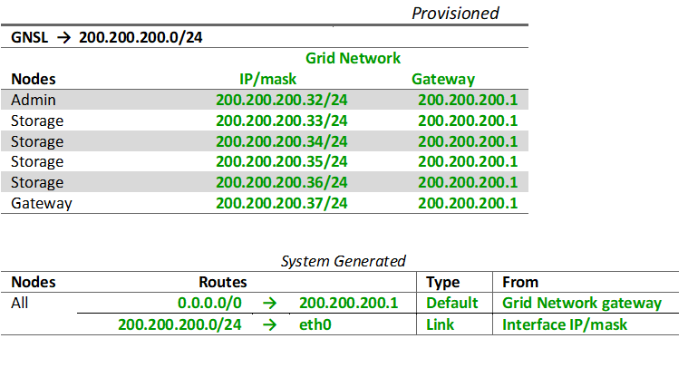

= StorageGRID용 그리드 네트워크 토폴로지
:allow-uri-read: 
:icons: font
:imagesdir: ../media/

[role="lead"]
가장 간단한 네트워크 토폴로지는 그리드 네트워크만 구성하여 만듭니다.

그리드 네트워크를 구성할 때 각 그리드 노드에 대한 eth0 인터페이스에 대한 호스트 IP 주소, 서브넷 마스크 및 게이트웨이 IP 주소를 설정합니다.

구성 중에 모든 그리드 네트워크 서브넷을 그리드 네트워크 서브넷 목록(GNSL)에 추가해야 합니다. 이 목록에는 모든 사이트에 대한 모든 서브넷이 포함되며 NTP, DNS 또는 LDAP와 같은 중요한 서비스에 대한 액세스를 제공하는 외부 서브넷도 포함될 수 있습니다.

설치 시 Grid Network 인터페이스는 GNSL에 있는 모든 서브넷에 대한 정적 라우트를 적용하고, 구성된 경우 노드의 기본 라우트를 Grid Network 게이트웨이로 설정합니다. 클라이언트 네트워크가 없고 그리드 네트워크 게이트웨이가 노드의 기본 경로인 경우에는 GNSL이 필요하지 않습니다. 그리드의 다른 모든 노드에 대한 호스트 라우트도 생성됩니다.

이 예에서는 S3 클라이언트 요청, 관리 및 유지보수 기능과 관련된 트래픽을 포함하여 모든 트래픽이 동일한 네트워크를 공유합니다.

NOTE: 이 토폴로지는 외부에서 사용할 수 없거나 개념 증명 또는 테스트 배포가 불가능한 단일 사이트 배포나 타사 로드 밸런서가 클라이언트 액세스 경계 역할을 하는 경우에 적합합니다. 가능한 경우 그리드 네트워크는 내부 트래픽에만 사용해야 합니다. 관리 네트워크와 클라이언트 네트워크 모두 내부 서비스에 대한 외부 트래픽을 차단하는 추가 방화벽 제한이 있습니다. 외부 클라이언트 트래픽에 그리드 네트워크 사용이 지원되지만, 이러한 사용은 보호 계층의 수를 줄입니다.

image::../media/grid_network.png[그리드 네트워크]

