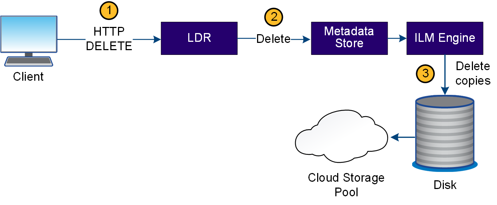

= 데이터 흐름을 삭제합니다
:allow-uri-read: 
:icons: font
:imagesdir: ../media/

[role="lead"]
클라이언트가 삭제 작업을 수행하거나 개체의 수명이 만료되면 StorageGRID 시스템에서 모든 개체 복사본이 제거되어 자동 제거가 트리거됩니다. 개체 삭제에 대해 정의된 데이터 흐름이 있습니다.

== 삭제 계층

StorageGRID 개체가 보존되거나 삭제되는 시기를 제어하는 여러 가지 방법을 제공합니다. 객체는 클라이언트 요청에 의해 또는 자동으로 삭제될 수 있습니다. StorageGRID는 항상 S3 오브젝트 잠금 설정의 우선 순위를 클라이언트 삭제 요청보다 우선적으로 지정합니다. 이 요청은 S3 버킷 수명 주기 및 ILM 배치 지침보다 우선적으로 적용됩니다.

* * S3 오브젝트 잠금 *: 그리드에 글로벌 S3 오브젝트 잠금 설정이 활성화된 경우 S3 클라이언트는 S3 오브젝트 잠금이 활성화된 버킷을 생성한 다음 S3 REST API를 사용하여 해당 버킷에 추가된 각 오브젝트 버전에 대한 보관 기한 및 법적 보류 설정을 지정할 수 있습니다.
+
** 법적 증거 자료 보관 중인 개체 버전은 어떤 방법으로도 삭제할 수 없습니다.
** 개체 버전의 보존 기한 에 도달하기 전에 어떤 방법으로도 해당 버전을 삭제할 수 없습니다.
** S3 오브젝트 잠금이 설정된 버킷의 오브젝트는 ILM이 "영구"로 유지합니다. 그러나 보존 기한에 도달한 후에는 클라이언트 요청 또는 버킷 라이프사이클의 만료에 의해 오브젝트 버전을 삭제할 수 있습니다.
** S3 클라이언트가 버킷에 기본 보존 종료 날짜를 적용할 경우 각 오브젝트에 대해 보존 종료 날짜를 지정할 필요가 없습니다.

* * 클라이언트 삭제 요청 *: S3 클라이언트가 객체 삭제 요청을 실행할 수 있습니다. 클라이언트가 개체를 삭제하면 개체의 모든 복사본이 StorageGRID 시스템에서 제거됩니다.
* * 버킷에서 오브젝트 삭제 *: 테넌트 관리자 사용자는 이 옵션을 사용하여 StorageGRID 시스템에서 선택한 버킷에 있는 오브젝트 및 오브젝트 버전의 모든 복제본을 영구적으로 제거할 수 있습니다.
* * S3 버킷 수명 주기 *: S3 클라이언트는 만료 작업을 지정하는 버킷에 수명 주기 구성을 추가할 수 있습니다. 버킷 라이프사이클이 있는 경우, 클라이언트가 먼저 오브젝트를 삭제하지 않는 한, StorageGRID은 만료 작업에 지정된 날짜 또는 일 수가 충족될 때 오브젝트의 모든 복사본을 자동으로 삭제합니다.
* * ILM 배치 지침 *: 버킷에 S3 오브젝트 잠금이 활성화되어 있지 않고 버킷 라이프사이클이 없다고 가정할 때, StorageGRID은 ILM 규칙의 마지막 기간이 끝나고 해당 오브젝트에 대해 지정된 추가 배치가 없을 때 오브젝트를 자동으로 삭제합니다.
+

NOTE: S3 버킷 라이프사이클이 구성된 경우 라이프사이클 만료 작업이 라이프사이클 필터와 일치하는 오브젝트에 대한 ILM 정책을 재정의합니다. 따라서 개체를 배치하기 위한 ILM 명령이 만료된 후에도 개체가 그리드에 유지될 수 있습니다.

자세한 내용은 을 link:../ilm/how-objects-are-deleted.html["오브젝트 삭제 방법"] 참조하십시오.

== 클라이언트 삭제에 대한 데이터 흐름

. LDR 서비스는 클라이언트 응용 프로그램에서 삭제 요청을 받습니다.
. LDR 서비스는 개체가 클라이언트 요청에 대해 삭제된 것으로 표시되도록 메타데이터 저장소를 업데이트하고 ILM 엔진에 개체 데이터의 모든 복사본을 제거하도록 지시합니다.
. 객체가 시스템에서 제거됩니다. 메타데이터 저장소가 업데이트되어 개체 메타데이터를 제거합니다.

== ILM의 데이터 흐름은 삭제됩니다

image::../media/automatic_deletion_data_flow.png[자동 삭제 데이터 흐름]

. ILM 엔진이 개체를 삭제해야 한다고 결정합니다.
. ILM 엔진이 메타데이터 저장소에 알립니다. 메타데이터 저장소는 객체가 클라이언트 요청에 대해 삭제된 것으로 표시되도록 객체 메타데이터를 업데이트합니다.
. ILM 엔진은 개체의 모든 복사본을 제거합니다. 메타데이터 저장소가 업데이트되어 개체 메타데이터를 제거합니다.

