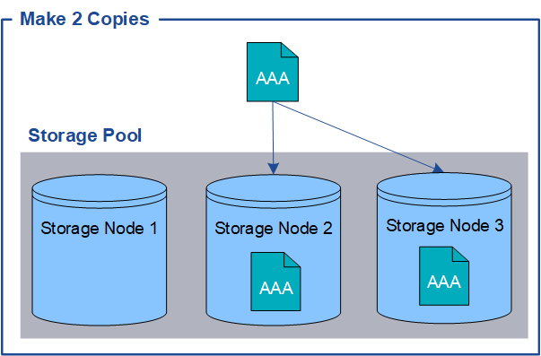

= 개체란 무엇입니까
:allow-uri-read: 
:icons: font
:imagesdir: ../media/

[role="lead"]
오브젝트 스토리지의 경우, 스토리지 단위는 파일 또는 블록이 아닌 오브젝트입니다. 파일 시스템 또는 블록 스토리지의 트리와 같은 계층구조와 달리 오브젝트 스토리지는 데이터를 구조화되지 않은 단순 레이아웃으로 구성합니다.

오브젝트 스토리지는 데이터의 물리적 위치를 해당 데이터를 저장하고 검색하는 데 사용되는 메서드에서 분리합니다.

오브젝트 기반 스토리지 시스템의 각 오브젝트에는 오브젝트 데이터와 오브젝트 메타데이터의 두 부분이 있습니다.

image::../media/object_conceptual_drawing.png[오브젝트]

== 오브젝트 데이터란?

오브젝트 데이터는 사진, 동영상 또는 의료 기록 등의 무엇이든 될 수 있습니다.

== 오브젝트 메타데이터란?

개체 메타데이터는 개체를 설명하는 정보입니다. StorageGRID는 오브젝트 메타데이터를 사용하여 그리드 전체의 모든 오브젝트의 위치를 추적하고 각 오브젝트의 라이프사이클 관리를 제공합니다.

오브젝트 메타데이터에는 다음과 같은 정보가 포함됩니다.

* 각 오브젝트의 고유 ID(UUID), 오브젝트 이름, S3 버킷의 이름, 테넌트 계정 이름 또는 ID, 오브젝트의 논리적 크기, 오브젝트를 처음 생성한 날짜와 시간, 오브젝트를 마지막으로 수정한 날짜와 시간이 포함된 시스템 메타데이터
* 각 오브젝트 복사본 또는 삭제 코딩 조각의 현재 스토리지 위치입니다.
* 오브젝트와 연결된 모든 사용자 메타데이터

개체 메타데이터는 사용자 지정이 가능하며 확장이 가능하므로 응용 프로그램에서 유연하게 사용할 수 있습니다.

StorageGRID에서 오브젝트 메타데이터를 저장하는 방법과 위치에 대한 자세한 내용은 를 참조하십시오link:../admin/managing-object-metadata-storage.html["오브젝트 메타데이터 스토리지 관리"].

== 오브젝트 데이터는 어떻게 보호됩니까?

StorageGRID 시스템은 오브젝트 데이터의 손실로부터 보호하기 위한 복제 및 삭제 코딩의 두 가지 메커니즘을 제공합니다.

=== 복제

StorageGRID가 복제된 복사본을 생성하도록 구성된 정보 라이프사이클 관리(ILM) 규칙과 일치하는 오브젝트가 있으면 시스템은 오브젝트 데이터의 정확한 복사본을 생성하고 이 복사본을 스토리지 노드 또는 클라우드 스토리지 풀에 저장합니다. ILM 규칙에 따라 생성된 복사본 수, 복사본이 저장되는 위치 및 시스템에 의해 복사본 보관되는 시간이 결정됩니다. 예를 들어, 스토리지 노드의 손실로 인해 복제본이 손실되어도 StorageGRID 시스템의 다른 위치에 복제본을 생성할 경우 객체를 계속 사용할 수 있습니다.

다음 예에서는 복제본 2개 만들기 규칙에 따라 각 객체의 복제된 복제본 2개가 스토리지 노드 3개가 포함된 스토리지 풀에 배치되도록 지정합니다.

=== 삭제 코딩

StorageGRID가 오브젝트를 삭제 코딩 복사본을 만들도록 구성된 ILM 규칙과 일치시키는 경우 오브젝트 데이터를 데이터 조각으로 슬라이스하고, 추가 패리티 조각을 계산하고, 각 조각을 다른 스토리지 노드에 저장합니다. 개체에 액세스하면 저장된 조각을 사용하여 다시 조립됩니다. 데이터 또는 패리티 조각이 손상되거나 손실될 경우 삭제 코딩 알고리즘이 나머지 데이터 및 패리티 조각의 일부를 사용하여 해당 조각을 다시 생성할 수 있습니다. 사용되는 삭제 코딩 체계는 ILM 규칙과 삭제 코딩 프로필에 따라 결정됩니다.

다음 예제에서는 오브젝트의 데이터에서 삭제 코딩을 사용하는 방법을 보여 줍니다. 이 예제에서 ILM 규칙은 4+2 삭제 코딩 체계를 사용합니다. 각 개체는 4개의 동일한 데이터 조각으로 분할되며 두 개의 패리티 조각은 개체 데이터에서 계산됩니다. 6개의 각 조각은 3개의 데이터 센터 전반에 걸쳐 서로 다른 스토리지 노드에 저장되어 노드 장애 또는 사이트 손실에 대한 데이터 보호 기능을 제공합니다.

image::../media/ec_three_sites_4_plus_2.png[삭제 코딩 3개 사이트 4 플러스 2]

.관련 정보
* link:../ilm/index.html["ILM을 사용하여 개체를 관리합니다"]
* link:using-information-lifecycle-management.html["정보 수명 주기 관리를 사용합니다"]

