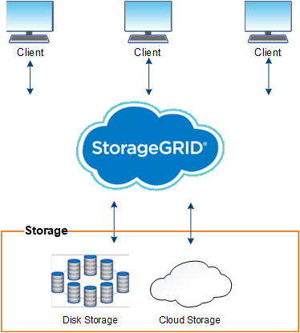

= StorageGRID란 무엇입니까?
:allow-uri-read: 
:icons: font
:imagesdir: ../media/

[role="lead"]
NetApp ® StorageGRID ® 는 퍼블릭, 프라이빗 및 하이브리드 멀티 클라우드 환경에서 다양한 사용 사례를 지원하는 소프트웨어 정의 오브젝트 스토리지 제품군입니다. StorageGRID은 Amazon S3 API를 기본적으로 지원하며 자동화된 라이프사이클 관리와 같은 업계 최고의 혁신 기능을 제공하여 비정형 데이터를 장기적으로 비용 효율적으로 저장, 보호 및 보존합니다.

StorageGRID는 비정형 데이터를 대규모로 저장할 수 있는 안전하고 내구성 있는 스토리지를 제공합니다. 메타데이터 중심의 통합 라이프사이클 관리 정책은 라이프사이클 전반에서 데이터 위치를 최적화합니다. 콘텐츠가 적절한 위치에 적시에 적절한 스토리지 계층에 배치되어 비용을 절감합니다.

StorageGRID는 지리적으로 분산된 이중화, 이기종 노드로 구성되며, 기존 및 차세대 클라이언트 애플리케이션과 모두 통합할 수 있습니다.

NOTE: 아카이브 노드에 대한 지원이 제거되었습니다. S3 API를 통해 아카이브 노드에서 외부 아카이브 스토리지 시스템으로 오브젝트를 이동하는 것은 가 link:../ilm/what-cloud-storage-pool-is.html["ILM 클라우드 스토리지 풀"]더 많은 기능을 제공하는 것으로 대체되었습니다.

== StorageGRID의 이점

StorageGRID 시스템의 장점은 다음과 같습니다.

* 비정형 데이터를 위해 지리적으로 분산된 데이터 저장소를 대규모로 확장 및 사용하기 쉽습니다.
* 표준 오브젝트 스토리지 프로토콜:
+
** Amazon Web Services S3(Simple Storage Service)
** OpenStack Swift
+

NOTE: Swift 클라이언트 응용 프로그램에 대한 지원은 더 이상 사용되지 않으며 향후 릴리스에서 제거될 예정입니다.

* 하이브리드 클라우드 지원: 정책 기반 ILM(정보 라이프사이클 관리)은 AWS(Amazon Web Services) 및 Microsoft Azure를 비롯한 퍼블릭 클라우드에 오브젝트를 저장합니다. StorageGRID 플랫폼 서비스를 사용하면 퍼블릭 클라우드에 저장된 개체를 콘텐츠 복제, 이벤트 알림 및 메타데이터에서 검색할 수 있습니다.
* 내구성과 가용성을 보장하는 유연한 데이터 보호 복제 및 계층적 삭제 코딩을 사용하여 데이터를 보호할 수 있습니다. 사용되지 않는 데이터와 사용 중인 데이터를 검증하여 장기간 보존에 대한 무결성을 보장합니다.
* 동적 데이터 라이프사이클 관리: 스토리지 비용 관리를 지원합니다. 오브젝트 수준에서 데이터 라이프사이클을 관리하는 ILM 규칙을 생성하여 데이터 인접성, 내구성, 성능, 비용, 사용자 정의 도움이 됩니다.
* StorageGRID 리소스 전체에서 데이터 로드를 최적화하기 위한 통합 로드 밸런싱으로 데이터 스토리지 및 일부 관리 기능의 고가용성 제공
* 여러 스토리지 테넌트 계정을 지원하여 시스템에 저장된 객체를 다른 엔터티로 분리할 수 있습니다.
* 포괄적인 알림 시스템, 그래픽 대시보드, 모든 노드 및 사이트에 대한 자세한 상태 등을 비롯하여 StorageGRID 시스템의 상태를 모니터링하는 다양한 툴이 제공됩니다.
* 소프트웨어 또는 하드웨어 기반 구축 지원 다음 중 한 가지 방법으로 StorageGRID를 구축할 수 있습니다.
+
** VMware에서 실행 중인 가상 시스템
** Linux 호스트의 컨테이너 엔진
** StorageGRID 엔지니어링 어플라이언스:
+
*** 스토리지 어플라이언스는 오브젝트 스토리지를 제공합니다.
*** 서비스 어플라이언스는 그리드 관리 및 로드 밸런싱 서비스를 제공합니다.

* 다음 규정에 따른 스토리지 요구사항 준수:
+
** 17 CFR § 240.17a-4(f)의 증권거래위원회(SEC)로 교환 회원, 중개인 또는 딜러를 규제합니다.
** SEC Rule 17a-4(f)의 형식 및 미디어 요구 사항을 방어하는 금융 산업 규제 기관(FINRA) 규칙 4511(c).
** CFTC(Commodity Futures Trading Commission): 17 CFR § 1.31(c) - (d) 규제로 상품 선물거래를 규제합니다.

* 무중단 업그레이드 및 유지보수 운영: 업그레이드, 확장, 서비스 해제 및 유지보수 절차 중에도 내용에 대한 액세스 유지
* 통합 ID 관리. 사용자 인증을 위해 Active Directory, OpenLDAP 또는 Oracle Directory Service와 통합됩니다. SAML 2.0(Security Assertion Markup Language 2.0) 표준을 사용하여 StorageGRID와 AD FS(Active Directory Federation Services) 간에 인증 및 권한 부여 데이터를 교환하는 SSO(Single Sign-On)를 지원합니다.

