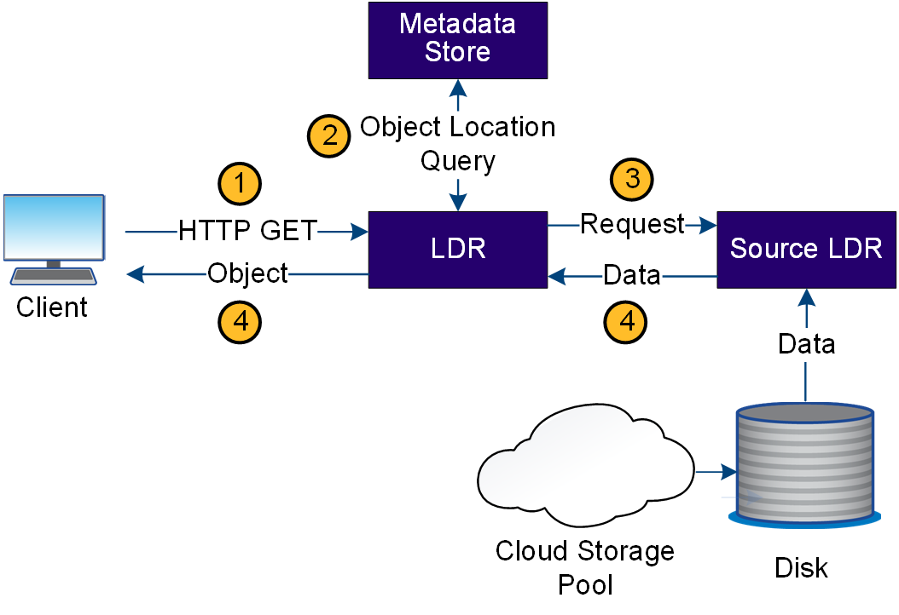

= StorageGRID에서 객체 검색을 처리하는 방법
:allow-uri-read: 
:icons: font
:imagesdir: ../media/

[role="lead"]
검색 작업은 StorageGRID 시스템과 클라이언트 간에 정의된 데이터 흐름으로 구성됩니다. 시스템은 특성을 사용하여 스토리지 노드 또는 필요한 경우 클라우드 스토리지 풀에서 객체 검색을 추적합니다.

스토리지 노드의 LDR 서비스는 메타데이터 저장소에서 오브젝트 데이터의 위치를 쿼리하고 소스 LDR 서비스에서 이를 검색합니다. 우선, 검색은 스토리지 노드에서 이루어집니다. 객체를 스토리지 노드에서 사용할 수 없는 경우 검색 요청이 클라우드 스토리지 풀로 전달됩니다.

NOTE: 오브젝트 복사본만 AWS Glacier 스토리지 또는 Azure Archive 계층에 있는 경우 클라이언트 애플리케이션은 S3 RestoreObject 요청을 발행하여 검색 가능한 복사본을 클라우드 스토리지 풀에 복원해야 합니다.

. LDR 서비스는 클라이언트 응용 프로그램에서 검색 요청을 받습니다.
. LDR 서비스는 개체 데이터 위치 및 메타데이터에 대한 메타데이터 저장소를 쿼리합니다.
. LDR 서비스는 검색 요청을 원본 LDR 서비스로 전달합니다.
. 소스 LDR 서비스는 쿼리된 LDR 서비스의 개체 데이터를 반환하고 시스템은 개체를 클라이언트 응용 프로그램으로 반환합니다.

