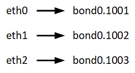

= 노드 컨테이너 마이그레이션 요구 사항(Linux)
:allow-uri-read: 
:icons: font
:imagesdir: ../media/

[role="lead"]
노드 마이그레이션 기능을 사용하면 노드를 한 호스트에서 다른 호스트로 수동으로 이동할 수 있습니다. 일반적으로 두 호스트는 동일한 물리적 데이터 센터에 있습니다.

NOTE: "Linux"는 RHEL, Ubuntu 또는 Debian 배포를 의미합니다.  지원되는 버전 목록은 다음을 참조하세요. https://imt.netapp.com/matrix/#welcome["NetApp 상호 운용성 매트릭스 툴(IMT)"^] .

노드 마이그레이션을 통해 그리드 작업을 중단하지 않고 물리적 호스트 유지 관리를 수행할 수 있습니다. 물리적 호스트를 오프라인으로 전환하기 전에 한 번에 하나씩 모든 StorageGRID 노드를 다른 호스트로 이동합니다. 노드를 마이그레이션하려면 각 노드의 다운타임만 짧고 그리드 서비스의 운영 또는 가용성에 영향을 미치지 않아야 합니다.

StorageGRID 노드 마이그레이션 기능을 사용하려면 배포가 추가 요구 사항을 충족해야 합니다.

* 단일 물리적 데이터 센터의 호스트 전반에서 일관된 네트워크 인터페이스 이름
* 단일 물리적 데이터 센터의 모든 호스트에서 액세스할 수 있는 StorageGRID 메타데이터 및 오브젝트 저장소 볼륨을 위한 공유 스토리지입니다. 예를 들어, NetApp E-Series 스토리지 어레이를 사용할 수 있습니다.

가상 호스트를 사용 중이고 기본 하이퍼바이저 계층에서 VM 마이그레이션을 지원하는 경우 StorageGRID의 노드 마이그레이션 기능 대신 이 기능을 사용할 수 있습니다. 이 경우 이러한 추가 요구 사항을 무시할 수 있습니다.

마이그레이션 또는 하이퍼바이저 유지 보수를 수행하기 전에 노드를 정상적으로 종료합니다. 의 지침을 link:../maintain/shutting-down-grid-node.html["그리드 노드 종료"]참조하십시오.

== VMware Live Migration은 지원되지 않습니다

VMware VM에서 베어 메탈 설치를 수행할 때 OpenStack Live Migration 및 VMware Live vMotion을 사용하면 가상 머신 클록 시간이 증가하며 어떠한 유형의 그리드 노드에서도 지원되지 않습니다. 드물지만 잘못된 클럭 시간으로 인해 데이터 또는 구성 업데이트가 손실될 수 있습니다.

콜드 마이그레이션이 지원됩니다. 콜드 마이그레이션에서는 StorageGRID 노드를 호스트 간에 마이그레이션하기 전에 종료해야 합니다. 의 지침을 link:../maintain/shutting-down-grid-node.html["그리드 노드 종료"]참조하십시오.

== 일관된 네트워크 인터페이스 이름

한 호스트에서 다른 호스트로 노드를 이동하려면 StorageGRID 호스트 서비스가 노드가 현재 위치에 있는 외부 네트워크 연결을 새 위치에서 복제할 수 있다는 확신을 가져야 합니다. 호스트에서 일관된 네트워크 인터페이스 이름을 사용하면 이러한 자신감을 얻을 수 있습니다.

예를 들어 호스트 1에서 실행되는 StorageGRID NodeA가 다음과 같은 인터페이스 매핑으로 구성되었다고 가정합니다.

화살표의 왼쪽 면은 StorageGRID 컨테이너 내에서 보는 기존 인터페이스(즉, 그리드, 관리자 및 클라이언트 네트워크 인터페이스)에 해당합니다. 화살표의 오른쪽은 동일한 물리적 인터페이스 결합에 종속된 세 개의 VLAN 인터페이스인 이러한 네트워크를 제공하는 실제 호스트 인터페이스에 해당합니다.

이제 NodeA를 Host2로 마이그레이션한다고 가정해 보겠습니다. Host2에 bond0.1001, bond0.1002 및 bond0.1003이라는 인터페이스도 있는 경우 시스템은 Host1에서와 같이 같은 이름의 인터페이스가 Host2에서 동일한 연결을 제공한다고 가정하여 이동을 허용합니다. 호스트 2에 동일한 이름의 인터페이스가 없으면 이동이 허용되지 않습니다.

여러 호스트 간에 일관된 네트워크 인터페이스 이름을 지정하는 방법은 여러 가지가 있습니다. 몇 가지 예는 를 참조하십시오.link:configuring-host-network.html["호스트 네트워크를 구성합니다"]

== 공유 스토리지

오버헤드가 낮은 노드를 신속하게 마이그레이션하기 위해 StorageGRID 노드 마이그레이션 기능은 노드 데이터를 물리적으로 이동하지 않습니다. 대신 노드 마이그레이션은 다음과 같이 한 쌍의 엑스포트 및 임포트 작업으로 수행됩니다.

* "노드 내보내기" 작업 중에 HostA에서 실행 중인 노드 컨테이너에서 소량의 영구 상태 데이터가 추출되고 해당 노드의 시스템 데이터 볼륨에 캐시됩니다. 그런 다음 HostA의 노드 컨테이너가 인스턴스화됩니다.
* "노드 가져오기" 작업 중에 HostA에 적용된 동일한 네트워크 인터페이스와 블록 스토리지 매핑을 사용하는 HostB의 노드 컨테이너가 인스턴스화됩니다. 그런 다음 캐시된 영구 상태 데이터가 새 인스턴스에 삽입됩니다.

이 작업 모드가 주어지면 마이그레이션을 허용하고 작동하기 위해서는 노드의 모든 시스템 데이터와 객체 스토리지 볼륨을 HostA와 HostB에서 액세스할 수 있어야 합니다. 또한 HostA 및 HostB에서 동일한 LUN을 참조하도록 보장된 이름을 사용하여 노드에 매핑되어야 합니다.

다음 예에서는 StorageGRID 스토리지 노드에 대한 블록 디바이스 매핑 솔루션 중 하나를 보여 줍니다. 이 경우 DM 다중 경로가 호스트에서 사용되고 별칭 필드는 모든 호스트에서 사용할 수 있는 일관되고 알기 쉬운 블록 디바이스 이름을 제공하기 위해 에 `/etc/multipath.conf` 사용되었습니다.

image::../media/block_device_mapping_rhel.gif[블록 장치 매핑]
