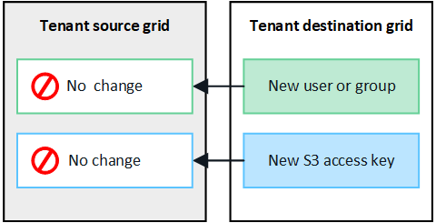

= 클론 테넌트 그룹 및 사용자
:allow-uri-read: 
:icons: font
:imagesdir: ../media/

[role="lead"]
그리드 페더레이션 연결을 사용하도록 테넌트를 만들거나 편집한 경우 해당 테넌트는 한 StorageGRID 시스템(소스 테넌트)에서 다른 StorageGRID 시스템(복제본 테넌트)으로 복제됩니다. 테넌트가 복제되면 소스 테넌트에 추가된 모든 그룹 및 사용자가 복제본 테넌트에 클론됩니다.

테넌트가 처음 생성된 StorageGRID 시스템은 테넌트의 _source GRID_입니다. 테넌트가 복제되는 StorageGRID 시스템은 테넌트의_destination GRID_입니다. 두 테넌트 계정 모두 동일한 계정 ID, 이름, 설명, 스토리지 할당량 및 할당된 권한이 있습니다. 그러나 대상 테넌트는 처음에 루트 사용자 암호를 가지고 있지 않습니다. 자세한 내용은  및 을 link:../admin/grid-federation-what-is-account-clone.html["계정 클론이란 무엇입니까"]link:../admin/grid-federation-manage-tenants.html["허용된 테넌트 관리"]참조하십시오.

버킷 객체의 경우 테넌트 계정 정보의 복제가 link:../admin/grid-federation-what-is-cross-grid-replication.html["교차 그리드 복제"]필요합니다. 두 그리드에 동일한 테넌트 그룹 및 사용자가 있으면 양쪽 그리드의 해당 버킷 및 오브젝트에 액세스할 수 있습니다.

== 계정 클론에 대한 테넌트 워크플로우

테넌트 계정에 * 그리드 페더레이션 연결 사용 * 권한이 있는 경우 워크플로 다이어그램을 검토하여 그룹, 사용자 및 S3 액세스 키를 복제하는 단계를 확인합니다.

image::../media/grid-federation-account-clone-workflow-tm.png[계정 클론에 대한 테넌트의 워크플로입니다. 단계는 다음 텍스트에 설명되어 있습니다.]

워크플로의 주요 단계는 다음과 같습니다.

.image:https://raw.githubusercontent.com/NetAppDocs/common/main/media/number-1.png["1개"] 테넌트에 로그인합니다
[role="quick-margin-para"]
소스 그리드(테넌트가 처음 생성된 그리드)에서 테넌트 계정에 로그인합니다.

.image:https://raw.githubusercontent.com/NetAppDocs/common/main/media/number-2.png["2개"] 필요한 경우 ID 페더레이션을 구성합니다
[role="quick-margin-para"]
테넌트 계정에 통합 그룹 및 사용자를 사용할 수 있는 * 고유 ID 소스 사용 * 권한이 있는 경우 소스 및 대상 테넌트 계정 모두에 대해 동일한 ID 소스(동일한 설정 사용)를 구성합니다. 두 그리드에서 동일한 ID 소스를 사용하고 있지 않으면 통합 그룹과 사용자를 복제할 수 없습니다. 자세한 내용은 을 link:using-identity-federation.html["ID 페더레이션을 사용합니다"]참조하십시오.

.image:https://raw.githubusercontent.com/NetAppDocs/common/main/media/number-3.png["세 가지"] 그룹 및 사용자를 생성합니다
[role="quick-margin-para"]
그룹 및 사용자를 생성할 때는 항상 테넌트의 소스 그리드에서 시작합니다. 새 그룹을 추가하면 StorageGRID에서 자동으로 대상 그리드에 클론을 생성합니다.

[role="quick-margin-list"]
* 전체 StorageGRID 시스템 또는 테넌트 계정에 대해 ID 페더레이션이 구성된 경우 ID 소스에서 페더레이션 link:creating-groups-for-s3-tenant.html["새 테넌트 그룹을 생성합니다"] 그룹을 가져옵니다.

[role="quick-margin-list"]
* ID 페더레이션을 사용하지 않는 경우link:creating-groups-for-s3-tenant.html["새 로컬 그룹을 생성합니다"]link:managing-local-users.html["로컬 사용자를 생성합니다"]

.image:https://raw.githubusercontent.com/NetAppDocs/common/main/media/number-4.png["네"] S3 액세스 키를 생성합니다
[role="quick-margin-para"]
소스 그리드 또는 대상 그리드에서 또는 로 link:creating-another-users-s3-access-keys.html["다른 사용자의 액세스 키를 생성합니다"]이동하여 해당 그리드의 버킷을 액세스할 수 link:creating-your-own-s3-access-keys.html["사용자 고유의 액세스 키를 생성합니다"]있습니다.

.image:https://raw.githubusercontent.com/NetAppDocs/common/main/media/number-5.png["다섯"] 필요한 경우 S3 액세스 키를 클론 복제합니다
[role="quick-margin-para"]
두 그리드에 동일한 액세스 키가 있는 버킷에 액세스해야 하는 경우 소스 그리드에 액세스 키를 생성한 다음 테넌트 관리자 API를 사용하여 수동으로 대상 그리드에 클론을 생성합니다. 자세한 내용은 을 link:../tenant/grid-federation-clone-keys-with-api.html["API를 사용하여 S3 액세스 키의 클론을 생성합니다"]참조하십시오.

== 그룹, 사용자 및 S3 액세스 키의 클론을 생성하는 방법은 무엇입니까?

이 섹션을 검토하여 테넌트 소스 그리드와 테넌트 대상 그리드 간에 그룹, 사용자 및 S3 액세스 키의 클론 생성 방법을 이해합니다.

=== 소스 그리드에 생성된 로컬 그룹이 복제됩니다

테넌트 계정이 생성되어 대상 그리드에 복제된 후 StorageGRID는 테넌트의 소스 그리드에 추가한 모든 로컬 그룹을 테넌트의 대상 그리드에 자동으로 복제합니다.

원래 그룹과 해당 클론 모두에 동일한 액세스 모드, 그룹 권한 및 S3 그룹 정책이 있습니다. 자세한 내용은 을 link:creating-groups-for-s3-tenant.html["S3 테넌트용 그룹을 생성합니다"]참조하십시오.

image::../media/grid-federation-account-clone.png[로컬 그룹이 소스 그리드에서 대상 그리드로 클론되었음을 보여 주는 이미지입니다]

NOTE: 소스 그리드에 로컬 그룹을 생성할 때 선택한 사용자는 그룹이 대상 그리드에 클론될 때 포함되지 않습니다. 따라서 그룹을 만들 때 사용자를 선택하지 마십시오. 대신 사용자를 생성할 때 그룹을 선택합니다.

=== 소스 그리드에 생성된 로컬 사용자의 클론이 생성됩니다

소스 그리드에 새 로컬 사용자를 생성하면 StorageGRID는 해당 사용자를 대상 그리드에 자동으로 복제합니다. 원래 사용자와 해당 클론 모두에 동일한 전체 이름, 사용자 이름 및 * 액세스 거부 * 설정이 있습니다. 두 사용자 모두 동일한 그룹에 속해 있습니다. 자세한 내용은 을 link:managing-local-users.html["로컬 사용자를 관리합니다"]참조하십시오.

보안상의 이유로 로컬 사용자 암호는 대상 그리드에 복제되지 않습니다. 로컬 사용자가 대상 그리드의 테넌트 관리자에 액세스해야 하는 경우 테넌트 계정의 루트 사용자는 대상 그리드에 해당 사용자의 암호를 추가해야 합니다. 자세한 내용은 을 link:managing-local-users.html["로컬 사용자를 관리합니다"]참조하십시오.

image::../media/grid-federation-local-user-clone.png[소스 그리드에서 대상 그리드로 로컬 사용자의 클론이 생성되었음을 보여 주는 이미지입니다]

=== 소스 그리드에 생성된 연합 그룹이 클론됩니다

에서 계정 클론을 사용하기 위한 요구 사항이 충족되었다고 가정할 때 link:../admin/grid-federation-what-is-account-clone.html#account-clone-sso["SSO(Single Sign-On)"] link:../admin/grid-federation-what-is-account-clone.html#account-clone-identity-federation["ID 제휴"]소스 그리드에서 테넌트에 대해 생성(가져오기)한 페더레이션 그룹이 대상 그리드의 테넌트에 자동으로 복제됩니다.

두 그룹 모두 동일한 액세스 모드, 그룹 권한 및 S3 그룹 정책을 가집니다.

소스 테넌트의 통합 그룹이 생성되고 대상 테넌트에 클론이 생성되면 통합 사용자는 두 그리드 중 하나에서 테넌트에 로그인할 수 있습니다.

image::../media/grid-federation-federated-group-clone.png[통합 그룹이 소스 그리드에서 대상 그리드로 클론되었음을 보여 주는 이미지입니다]

=== S3 액세스 키를 수동으로 복제할 수 있습니다

StorageGRID는 각 그리드에 서로 다른 키를 추가하여 보안을 강화하기 때문에 S3 액세스 키를 자동으로 복제하지 않습니다.

두 그리드에서 액세스 키를 관리하려면 다음 중 하나를 수행합니다.

* 각 그리드에 대해 동일한 키를 사용할 필요가 없는 경우 또는 link:creating-another-users-s3-access-keys.html["다른 사용자의 액세스 키를 생성합니다"]각 그리드에서 사용할 수 link:creating-your-own-s3-access-keys.html["사용자 고유의 액세스 키를 생성합니다"]있습니다.
* 두 그리드 모두에서 동일한 키를 사용해야 하는 경우 소스 그리드에 키를 생성한 다음 Tenant Manager API를 사용하여 대상 그리드로 수동으로  이동할 수 link:../tenant/grid-federation-clone-keys-with-api.html["키를 복제합니다"]있습니다.

image::../media/grid-federation-s3-access-key.png[S3 액세스 키를 소스 그리드에서 대상 그리드로 선택적으로 복제할 수 있는 이미지를 표시합니다]

NOTE: 통합 사용자의 S3 액세스 키를 클론하면 사용자 및 S3 액세스 키가 모두 대상 테넌트에 복제됩니다.

=== 대상 그리드에 추가된 그룹 및 사용자는 클론이 생성되지 않습니다

클론 생성은 테넌트의 소스 그리드에서 테넌트의 대상 그리드로만 이루어집니다. 테넌트의 대상 그리드에 그룹 및 사용자를 생성하거나 가져오는 경우 StorageGRID는 이러한 항목을 테넌트의 소스 그리드에 다시 복제하지 않습니다.

=== 편집 또는 삭제된 그룹, 사용자 및 액세스 키는 복제되지 않습니다

클론 생성은 새 그룹 및 사용자를 생성할 때만 발생합니다.

두 눈금 중 하나에서 그룹, 사용자 또는 액세스 키를 편집하거나 삭제하면 변경 내용이 다른 눈금에 복제되지 않습니다.

image::../media/grid-federation-account-clone-edit-delete.png[편집 또는 삭제된 세부 정보가 표시되지 않는 이미지입니다]
