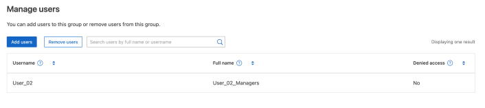

= 그룹을 관리합니다
:allow-uri-read: 
:icons: font
:imagesdir: ../media/

[role="lead"]
필요에 따라 테넌트 그룹을 관리하여 그룹 보기, 편집 또는 복제 등을 수행할 수 있습니다.

.시작하기 전에
* 를 사용하여 테넌트 관리자에 로그인되어 link:../admin/web-browser-requirements.html["지원되는 웹 브라우저"]있습니다.
* 이 있는 사용자 그룹에 속해 link:tenant-management-permissions.html["루트 액세스 권한"]있습니다.

== 그룹을 보거나 편집합니다

각 그룹의 기본 정보와 세부 정보를 보고 편집할 수 있습니다.

.단계
. 액세스 관리 * > * 그룹 * 을 선택합니다.
. 그룹 페이지에 제공된 정보를 검토하여 이 테넌트 계정의 모든 로컬 및 통합 그룹에 대한 기본 정보를 나열합니다.
+
테넌트 계정에 * Use GRID Federation Connection * 권한이 있고 테넌트의 소스 그리드에서 그룹을 보고 있는 경우:

+
** 그룹을 편집하거나 제거하면 변경 내용이 다른 그리드와 동기화되지 않음을 나타내는 배너 메시지가 표시됩니다.
** 필요에 따라 대상 그리드의 테넌트에 그룹이 복제되지 않았는지 여부를 나타내는 배너 메시지가 표시됩니다. 하지만 <<clone-groups,그룹 클론을 재시도하십시오>>실패했어요.

. 그룹 이름을 변경하려면:
+
.. 그룹의 확인란을 선택합니다.
.. Actions * > * Edit group name * 을 선택합니다.
.. 새 이름을 입력합니다.
.. 변경 사항 저장 * 을 선택합니다

. 자세한 내용을 보거나 추가로 편집하려면 다음 중 하나를 수행합니다.
+
** 그룹 이름을 선택합니다.
** 그룹의 확인란을 선택하고 * Actions * > * View group details * 를 선택합니다.

. 각 그룹에 대해 다음 정보를 보여 주는 개요 섹션을 검토합니다.
+
** 표시 이름
** 고유한 이름입니다
** 유형
** 액세스 모드
** 권한
** S3 정책
** 이 그룹의 사용자 수입니다
** 테넌트 계정에 * 그리드 페더레이션 연결 사용 * 권한이 있고 테넌트의 소스 격자에서 그룹을 보고 있는 경우 추가 필드:
+
*** 복제 상태, * 성공 * 또는 * 실패 *
*** 이 그룹을 편집하거나 삭제하면 변경 내용이 다른 눈금과 동기화되지 않음을 나타내는 파란색 배너입니다.

. 필요에 따라 그룹 설정을 편집합니다. 입력할 항목에 대한 자세한 내용은 link:creating-groups-for-s3-tenant.html["S3 테넌트에 대한 그룹을 생성합니다"] 및 link:creating-groups-for-swift-tenant.html["Swift 테넌트의 그룹을 생성합니다"]을 참조하십시오.
+
.. 개요 섹션에서 이름이나 편집 아이콘을 선택하여 표시 이름을 변경합니다image:../media/icon_edit_tm.png["편집 아이콘"].
.. 그룹 권한 * 탭에서 권한을 업데이트하고 * 변경 사항 저장 * 을 선택합니다.
.. 그룹 정책 * 탭에서 변경을 수행하고 * 변경 사항 저장 * 을 선택합니다.
+
*** S3 그룹을 편집하는 경우 필요에 따라 다른 S3 그룹 정책을 선택하거나 사용자 지정 정책의 JSON 문자열을 입력합니다.
*** Swift 그룹을 편집 중인 경우 * Swift 관리자 * 확인란을 선택하거나 선택 취소합니다.

. 그룹에 기존 로컬 사용자를 하나 이상 추가하려면 다음을 수행합니다.
+
.. 사용자 탭을 선택합니다.
+

.. 사용자 추가 * 를 선택합니다.
.. 추가할 기존 사용자를 선택하고 * 사용자 추가 * 를 선택합니다.
+
오른쪽 위에 성공 메시지가 나타납니다.

. 그룹에서 로컬 사용자 제거하기:
+
.. 사용자 탭을 선택합니다.
.. 사용자 제거 * 를 선택합니다.
.. 제거할 사용자를 선택하고 * 사용자 제거 * 를 선택합니다.
+
오른쪽 위에 성공 메시지가 나타납니다.

. 변경한 각 섹션에 대해 * 변경 사항 저장 * 을 선택했는지 확인합니다.

== 그룹이 중복되었습니다

기존 그룹을 복제하여 새 그룹을 더 빠르게 만들 수 있습니다.

NOTE: 테넌트 계정에 * 그리드 페더레이션 연결 사용 * 권한이 있고 테넌트의 소스 그리드에서 그룹을 복제하는 경우 복제된 그룹은 테넌트의 대상 그리드에 복제됩니다.

.단계
. 액세스 관리 * > * 그룹 * 을 선택합니다.
. 복제할 그룹의 확인란을 선택합니다.
. Actions * > * Duplicate group * 을 선택합니다.
. 입력할 항목에 대한 자세한 내용은 link:creating-groups-for-s3-tenant.html["S3 테넌트에 대한 그룹을 생성합니다"] 또는 link:creating-groups-for-swift-tenant.html["Swift 테넌트의 그룹을 생성합니다"]을 참조하십시오.
. Create group * 을 선택합니다.

== [[clone-groups]] 그룹 클론을 다시 시도하십시오

실패한 클론을 재시도하려면 다음을 수행합니다.

. 그룹 이름 아래에 _ (클론 생성 실패) _ 을(를) 나타내는 각 그룹을 선택합니다.
. Actions * > * Clone groups * 를 선택합니다.
. 클론 생성 중인 각 그룹의 세부 정보 페이지에서 클론 작업의 상태를 봅니다.

자세한 내용은 를 참조하십시오link:grid-federation-account-clone.html["클론 테넌트 그룹 및 사용자"].

== 하나 이상의 그룹을 삭제합니다

하나 이상의 그룹을 삭제할 수 있습니다. 삭제된 그룹에만 속하는 사용자는 더 이상 테넌트 관리자에 로그인하거나 테넌트 계정을 사용할 수 없습니다.

NOTE: 테넌트 계정에 * 그리드 페더레이션 연결 사용 * 권한이 있고 그룹을 삭제하는 경우 StorageGRID는 다른 그리드에서 해당 그룹을 삭제하지 않습니다. 이 정보를 동기화해야 하는 경우 두 그리드에서 동일한 그룹을 삭제해야 합니다.

.단계
. 액세스 관리 * > * 그룹 * 을 선택합니다.
. 삭제할 각 그룹의 확인란을 선택합니다.
. Actions * > * Delete group * 또는 * Actions * > * Delete groups * 를 선택합니다.
+
확인 대화 상자가 나타납니다.

. 그룹 삭제 * 또는 * 그룹 삭제 * 를 선택합니다.

