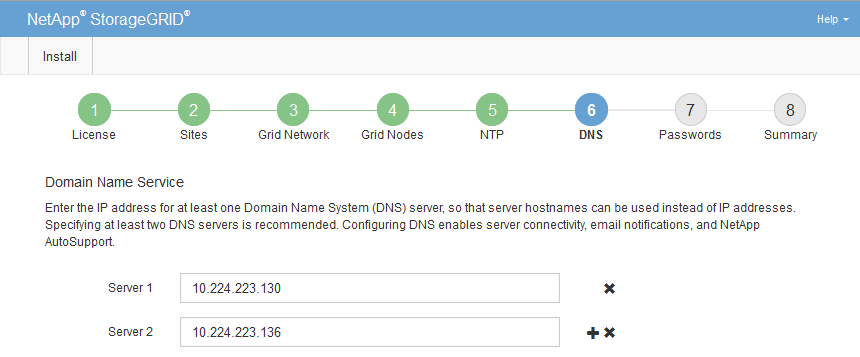

= DNS 서버 정보를 지정합니다
:allow-uri-read: 
:icons: font
:imagesdir: ../media/

[role="lead"]
IP 주소 대신 호스트 이름을 사용하여 외부 서버에 액세스할 수 있도록 StorageGRID 시스템에 대한 DNS 정보를 지정해야 합니다.

.이 작업에 대해
를 https://docs.netapp.com/us-en/storagegrid-appliances/commonhardware/checking-dns-server-configuration.html["DNS 서버 정보입니다"^] 지정하면 이메일 알림 및 AutoSupport에 IP 주소 대신 FQDN(정규화된 도메인 이름) 호스트 이름을 사용할 수 있습니다.

제대로 작동하려면 DNS 서버를 두 대 또는 세 대 지정합니다. 3개 이상을 지정하면 일부 플랫폼의 알려진 OS 제한 때문에 3개만 사용할 수 있습니다. 사용자 환경에 라우팅 제한이 있는 경우 개별 노드(일반적으로 사이트의 모든 노드)에서 최대 3개의 DNS 서버로 구성된 다른 세트를 사용할 수 link:../maintain/modifying-dns-configuration-for-single-grid-node.html["DNS 서버 목록을 사용자 지정합니다"]있습니다.

가능한 경우 각 사이트에서 로컬로 액세스할 수 있는 DNS 서버를 사용하여 isfan 사이트가 외부 대상의 FQDN을 확인할 수 있도록 합니다.

.단계
. Server 1 * 텍스트 상자에 하나 이상의 DNS 서버에 대한 IPv4 주소를 지정합니다.
. 필요한 경우 마지막 항목 옆에 있는 더하기 기호를 선택하여 추가 서버 항목을 추가합니다.
+

+
가장 좋은 방법은 DNS 서버를 두 개 이상 지정하는 것입니다. 최대 6개의 DNS 서버를 지정할 수 있습니다.

. 다음 * 을 선택합니다.

